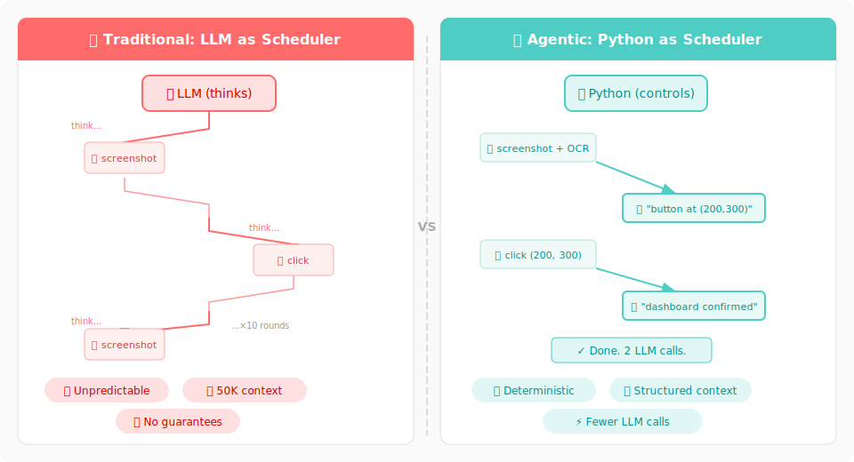

<p align="center">
  <h1 align="center">🧬 Agentic Programming</h1>
  <p align="center">
    <strong>Python functions that think.</strong><br>
    A programming paradigm where Python and LLM co-execute functions.
  </p>
  <p align="center">
    <a href="#quick-start">Quick Start</a> •
    <a href="#how-it-works">How It Works</a> •
    <a href="#api">API</a> •
    <a href="docs/API.md">Docs</a> •
    <a href="examples/">Examples</a>
  </p>
  <p align="center">
    <a href="docs/README_CN.md">🇨🇳 中文</a>
  </p>
</p>

> 🚀 **This is a paradigm proposal.** We're sharing a new way to think about LLM-powered programming. The code here is a reference implementation — we'd love to see you take these ideas and build your own version, in any language, for any use case.

---

## The Problem

<p align="center">
  
</p>

Today's LLM agents work like this:

```
🧠 LLM: "I need to find the login button"
   ↓ calls screenshot tool
🧠 LLM: "I see a button at (200, 300). Let me click it"
   ↓ calls click tool
🧠 LLM: "Did it work? Let me check"
   ↓ calls screenshot tool again
🧠 LLM: "Hmm, nothing happened. Maybe I should try..."
   ↓ calls click tool with different coordinates
   ... (10 more rounds)
```

**The LLM is the scheduler.** It decides what to do, when, and how. This creates real problems:

- 🎰 **Unpredictable** — You design a workflow (A → B → C), but the LLM might skip B, repeat A, or invent step D. Skills, prompts, and system messages can't *force* it to follow a path.
- 📈 **Context explosion** — Every round-trip adds to the conversation. By step 10, the LLM is reading 50K tokens of history just to decide the next click.
- 🎯 **No guarantees** — Need JSON output? The LLM might add markdown. Need exactly 3 steps? It might do 7. The LLM *interprets* your instructions, it doesn't *execute* them.

The core issue: **the LLM controls the flow.** You're asking a reasoning engine to also be a scheduler, a state machine, and a format enforcer. That's not what it's good at.

## The Idea

**Give the flow back to Python. Let the LLM focus on reasoning.**

```
🐍 Python: "Step 1: take screenshot + OCR"
   ↓ deterministic code, instant
🧠 LLM: "I see a login button at (200, 300)"       ← reasoning only
   ↓
🐍 Python: "Step 2: click (200, 300)"
   ↓ deterministic code, instant
🧠 LLM: "Login successful, I see the dashboard"    ← reasoning only
   Done. 2 LLM calls instead of 10.
```

Python handles scheduling, loops, error handling, and data flow. The LLM only answers questions.

```python
@agentic_function
def observe(task):
    """Look at the screen and describe what you see."""
    
    img = take_screenshot()       # Python: deterministic
    ocr = run_ocr(img)            # Python: deterministic
    
    return runtime.exec(content=[ # LLM: reasoning
        {"type": "text", "text": f"Task: {task}\nOCR: {ocr}"},
        {"type": "image", "path": img},
    ])
```

**Docstring = Prompt.** Change the docstring, change the behavior. Everything else is Python.

---

## Quick Start

```bash
pip install -e .
```

```python
from agentic import agentic_function, Runtime

runtime = Runtime(call=my_llm, model="sonnet")

@agentic_function
def greet(name):
    """Greet someone in a creative way."""
    return runtime.exec(content=[
        {"type": "text", "text": f"Say hello to {name} creatively."},
    ])

result = greet(name="World")
print(result)                    # "Hey World! 🌍✨"
print(greet.context.tree())      # execution trace
```

---

## How It Works

### 1. Functions call LLMs

Every `@agentic_function` can call `runtime.exec()` to invoke an LLM. The framework auto-injects execution context (what happened before) into the prompt.

```python
@agentic_function
def login_flow(username, password):
    """Complete login flow."""
    observe(task="find login form")
    click(element="login button")
    return verify(expected="dashboard")
```

### 2. Context tracks everything

Every call creates a **Context** node. Nodes form a tree:

```
login_flow ✓ 8.8s
├── observe ✓ 3.1s → "found login form at (200, 300)"
├── click ✓ 2.5s → "clicked login button"
└── verify ✓ 3.2s → "dashboard confirmed"
```

When `verify` calls the LLM, it automatically sees what `observe` and `click` returned. No manual context management.

### 3. Functions create functions

```python
from agentic.meta_function import create

summarize = create("Summarize text into 3 bullet points", runtime=runtime)
result = summarize(text="Long article...")
```

LLM writes the code. Framework validates and sandboxes it. You get a real `@agentic_function`.

### 4. Errors recover automatically

```python
runtime = Runtime(call=my_llm, max_retries=2)  # auto-retry on failure

# Or fix a broken function:
from agentic.meta_function import fix
fixed_fn = fix(fn=broken_fn, runtime=runtime, instruction="use label instead of coordinates")
```

---

## API

| Component | What it does |
|-----------|-------------|
| [`@agentic_function`](docs/api/agentic_function.md) | Decorator. Records execution into Context tree |
| [`Runtime`](docs/api/runtime.md) | LLM connection. `exec()` calls the LLM with auto-context |
| [`Context`](docs/api/context.md) | Execution tree. `tree()`, `save()`, `traceback()` |
| [`create()`](docs/api/meta_function.md) | Generate new functions from descriptions |
| [`fix()`](docs/api/meta_function.md) | Fix broken functions with LLM analysis |

### Built-in Providers

```python
from agentic.providers import AnthropicRuntime   # Claude (+ prompt caching)
from agentic.providers import OpenAIRuntime       # GPT (+ response_format)
from agentic.providers import GeminiRuntime       # Gemini
from agentic.providers import ClaudeCodeRuntime   # Claude Code CLI (no API key)
```

See [Provider docs](docs/api/providers.md) for setup.

---

## vs Tool-Calling

|  | Tool-Calling / MCP | Agentic Programming |
|--|---------------------|---------------------|
| **Who schedules?** | LLM | Python |
| **Functions contain** | Code only | Code + LLM reasoning |
| **Context** | One big conversation | Structured tree |
| **Prompt** | Hidden in agent | Docstring = prompt |

MCP is the *transport*. Agentic Programming is the *execution model*. They're orthogonal.

---

## Install

```bash
pip install -e .                    # core (zero dependencies)
pip install -e ".[anthropic]"       # + Claude
pip install -e ".[openai]"          # + GPT
pip install -e ".[gemini]"          # + Gemini
pip install -e ".[all]"             # everything
```

## Project Structure

```
agentic/
├── __init__.py          # agentic_function, Runtime, Context, create, fix
├── context.py           # Context tree
├── function.py          # @agentic_function decorator
├── runtime.py           # Runtime class (exec + retry)
├── meta_function.py     # create() + fix()
└── providers/           # Anthropic, OpenAI, Gemini, Claude Code CLI

examples/                # 5 runnable demos
docs/api/                # API reference
tests/                   # 161 tests
```

## Contributing

This project is a **paradigm proposal** with a reference implementation. We welcome:

- 🧠 **Discussions** on the programming model
- 🔧 **Alternative implementations** in other languages or frameworks
- 📝 **Use cases** that validate or challenge the approach
- 🐛 **Bug reports** on the reference implementation

If you build something based on Agentic Programming, let us know!

## License

MIT
