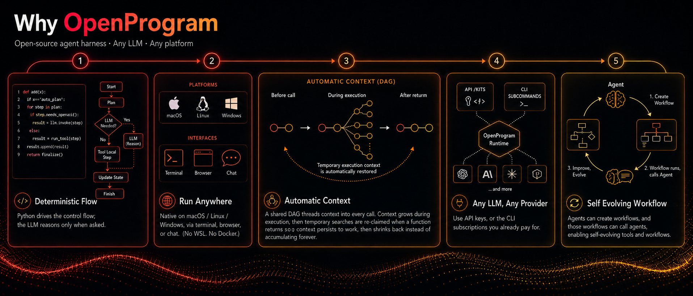
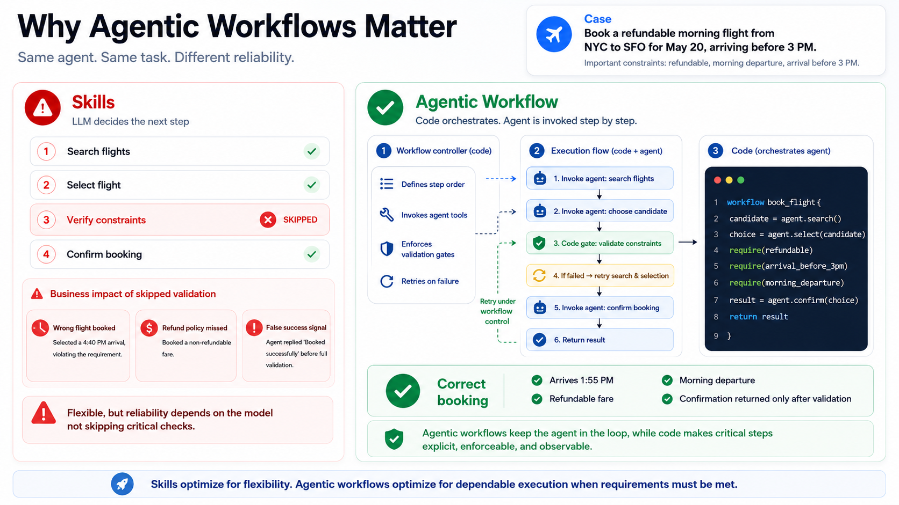

<p align="center">
  
</p>

<p align="center">
  <b>Open-Source, General-Purpose Agent Harness — Build Your Workflows in Python.</b><br/>
  Any LLM · Any Platform
</p>

<p align="center">
  <a href="https://github.com/Fzkuji/OpenProgram/releases/tag/v0.4.0"></a>
  <a href="https://github.com/Fzkuji/OpenProgram/blob/main/LICENSE"></a>
  <a href="https://www.python.org/"></a>
  
  <a href="https://github.com/Fzkuji/OpenProgram/actions/workflows/ci.yml"></a>
  <a href="https://github.com/Fzkuji/GUI-Agent-Harness"></a>
  <a href="https://github.com/Fzkuji/OpenProgram/stargazers"></a>
</p>

<p align="center">
  <a href="docs/GETTING_STARTED.md">Getting Started</a> &middot;
  <a href="docs/README.md">Docs</a> &middot;
  <a href="docs/API.md">API Reference</a> &middot;
  <a href="docs/philosophy/agentic-programming.md">Philosophy</a> &middot;
  <a href="docs/README_CN.md">中文</a>
</p>

---

> *"The more constraints one imposes, the more one frees oneself."*
> — **Igor Stravinsky**, *Poetics of Music*

**We propose _Agentic Programming_.** An LLM is flexible; code is deterministic. Let the model run everything and you get chaos — unpredictable execution, context explosion, no output guarantees; hard-code everything and you lose the intelligence. A **harness** balances the two, interleaved moment to moment — **Python for the flow you want fixed, the LLM for the judgement you can't script.** ([the full rationale →](docs/philosophy/agentic-programming.md))

<p align="center">
  
</p>

- **Deterministic flow, flexible reasoning** — Python drives the control flow; the LLM reasons only when asked.
- **Run it anywhere** — native on macOS / Linux / Windows, via terminal, browser, or chat (no WSL, no Docker).
- **Automatic context** — a shared DAG threads context into every call; multi-agent ready.
- **Any LLM, any provider** — API key, or the CLI subscription you already pay for.
- **Self-evolving workflows** — the agent builds, runs, and improves its own workflows and tools.



## Quick Start

### 1. Install

Clone the repo wherever you want OpenProgram to live, then run the one-command installer. It sets up **everything** — the Python package, the web UI, the terminal UI, and the GUI agent (with its model weight + OCR).

**macOS / Linux**
```bash
git clone https://github.com/Fzkuji/OpenProgram && cd OpenProgram
./scripts/install.sh
```

**Windows (PowerShell)**
```powershell
git clone https://github.com/Fzkuji/OpenProgram; cd OpenProgram
.\scripts\install.ps1
```

That's it. NVIDIA GPU? add `--cuda cu124` (use your own CUDA tag). Don't want the GUI agent? add `--no-gui`.

Then just start it — **the first run walks you through provider setup**, then opens the chat (web UI on `:18100`, API on `:18109`):

```bash
openprogram
```

Full dependency matrix, flags, and per-OS notes: **[docs/install.md](docs/install.md)**.

<details>
<summary><b>Prefer to skip the wizard?</b></summary>

Set a key instead — or log into a CLI provider (`claude` / `codex` / `gemini`) and `openprogram setup` adopts it:

```bash
export ANTHROPIC_API_KEY=sk-ant-...    # Claude
export OPENAI_API_KEY=sk-...           # GPT
export GOOGLE_API_KEY=...              # Gemini
```

Check with `openprogram providers`. Priority: **Claude Code → Codex → Gemini CLI → Anthropic → OpenAI → Gemini**.

**Multiple accounts per provider** are first-class: add several (each is a named profile), pick which one a provider runs on with `openprogram providers use <provider> [profile]`, and manage them from the same panel in the CLI, web (Settings → Providers), or TUI (`/login <provider>`). Add **multiple API keys** to one account and OpenProgram rotates across them — a rate-limited key cools down and the next takes over automatically. See [docs/features.md](docs/features.md#multi-account--key-rotation).

</details>

### 2. Chat — pick a surface

```bash
openprogram                                         # terminal UI (default)
openprogram web                                     # browser UI
openprogram --print "summarise this file"           # one-shot, no UI
```

One backend (`~/.openprogram/`) behind both — a terminal session shows up in the browser and vice versa. The web UI adds the mini-DAG, branch / merge, multi-agent, and attachments; the terminal UI auto-picks Ink (macOS/Linux) or Rich (Windows).

### 3. Write your own functions

Just ask the agent in chat — *"create an @agentic_function that summarises a PDF"* — and the bundled [`agentic-programming` skill](skills/agentic-programming/SKILL.md) handles location, decorator, smoke test, and validation.

### 4. Add the harness suite (optional)

Three sibling harnesses run as **OpenProgram programs** — they install *into* your OpenProgram checkout and are auto-discovered. (The installer in step 1 already set up the **GUI agent** by default — this section is for adding `research` / `wiki`, or for a host where you skipped it with `--no-gui`.)

```bash
openprogram programs install research    # or: gui / wiki
```

Each harness clones into **`openprogram/functions/agentics/<Harness-Name>/`** (inside your OpenProgram install), pip-installs its own deps, and **auto-registers** on the next worker restart (or hit **Refresh** on the Functions page) — so it appears in the web UI with no extra wiring. Identical on every OS. Details: [docs/installing-harnesses.md](docs/installing-harnesses.md).

> The **GUI** agent additionally needs a YOLO detector weight + OCR models that `pip` can't fetch. The step-1 installer sets them up by default; on a `programs install`-ed host, finish them by running the harness's own installer — see **[the GUI install guide](openprogram/functions/agentics/GUI-Agent-Harness/docs/install.md)**.

| Harness | What it does | Track record |
|---|---|---|
| [GUI&nbsp;Agent&nbsp;Harness](https://github.com/Fzkuji/GUI-Agent-Harness) | Observe → plan → click → verify by vision; drives desktop apps & OSWorld VMs. Runs on macOS / Windows / Linux (perception macOS-tuned). | **OSWorld Multi-Apps 79.8%** (72.6 / 91) |
| [Research&nbsp;Agent&nbsp;Harness](https://github.com/Fzkuji/Research-Agent-Harness) | Literature survey → idea → experiments → paper draft → cross-model review. | Topic → submission-ready draft |
| [Wiki&nbsp;Agent&nbsp;Harness](https://github.com/Fzkuji/Wiki-Agent-Harness) | Ingests notes / docs / chats into an Obsidian-compatible vault with `[[wikilinks]]`. | Obsidian vault output |

## Optional extras

The provider SDKs (`anthropic`, `openai`, `google-genai`) are installed
by default — no extra needed. The extras below are opt-in tools.

| Extra | Adds |
|---|---|
| `[browser]` | Playwright (~150 MB) |
| `[browser-stealth]` | Cloudflare-bypassing browsers |
| `[channels]` | Discord / Slack / WeChat bots |
| `[all]` | Everything except `[browser-stealth]` |

Post-install steps and per-extra notes: [docs/install.md](docs/install.md). The harness suite (GUI / Research / Wiki) is **not** an extra — install those via `openprogram programs install <name>` (step 4).

## Troubleshooting

Two diagnostic commands cover most "it broke and I don't know why" situations:

```bash
openprogram rescue          # 11 platform-agnostic probes, each with a fix command
openprogram doctor          # quick "is the install healthy?" check
openprogram logs tail       # follow the worker log live
openprogram providers doctor # OAuth tokens — expiring? refresh wired?
```

`rescue` is the one to reach for first when something doesn't work — it doesn't depend on an LLM being reachable, walks through provider config, ports, dependencies, build artefacts, and prints the exact command to fix each finding. Case-by-case docs live in [docs/troubleshooting.md](docs/troubleshooting.md).

For platform-builder topics (`Runtime` retry semantics, the full `@agentic_function` decorator API, the flat-DAG context model) see [docs/API.md](docs/API.md) and the per-topic notes under [docs/api/](docs/api/).

### Power-user commands

```bash
openprogram logs list                # all log files with size + age
openprogram logs tail worker -f      # follow worker.log
openprogram completion bash          # autocomplete: bash | zsh | powershell
openprogram secrets list             # same as `providers list` (openclaw-style alias)
openprogram providers use <prov> [profile]  # pick which account a provider runs on
openprogram providers login <prov> --profile work  # add a second account
openprogram worker status            # is the backend up? on what port?
openprogram --resume <session-id>    # pick up a previous chat
```

---

## How to use

Two ways to interact day-to-day — same backend, same sessions, switch freely.

### Web UI — `openprogram web`

Opens at `http://localhost:18100`. The full surface: a live **mini-DAG** of the session on the right rail, **branch / merge / attach** on any node, **multi-agent** rows tagged by producer, and drag-and-drop **file attachments**. Best when you want to *see and steer* the execution tree, or for longer, branching work.

<p align="center">
  
</p>

### Terminal UI — `openprogram`

The same backend without the browser — same commands, same chat history. Picks the native renderer per OS: **Ink** on macOS / Linux, **Rich** on Windows. Best for staying in the terminal or over SSH. One-shot, no UI: `openprogram --print "…"`.

<p align="center">
  
</p>

> Sessions live in `~/.openprogram/` and are shared by both — start in the terminal, pick it up in the browser tab, and vice versa.

---

## CLI use

Beyond the chat UIs, the `openprogram` command runs headless — script it, pipe it, automate it.

```bash
# One-shot: send a prompt, print the answer, exit (redirect or pipe it)
openprogram --print "summarise CHANGELOG.md" > summary.md

# Run a specific agentic function with key=value args
openprogram programs run research --arg topic="state-space models"

# Resume an earlier session by id
openprogram --resume local_d9a16a6b06
```

Same backend and sessions as the UIs (`~/.openprogram/`) — a `--print` run or a resumed session shows up in the web / terminal UI too.

## Detailed features

| Feature | One-line summary |
|---|---|
| **Automatic context** | Every `@agentic_function` call is a tree node; the runtime threads it through nested LLM calls — no manual prompt assembly. |
| **Deep work** | `deep_work(task, level)` runs an autonomous plan → execute → evaluate → revise loop until the output meets the chosen quality bar. State persists to disk. |
| **Functions that author functions** | New / fixed `@agentic_function`s are written by the agent itself via ordinary file-editing tools, guided by the `agentic-programming` skill. No dedicated `create()` / `fix()` calls. |
| **Conversation as a git DAG** | Sessions are commits + branches + merges + cherry-picks, with the right sidebar exposing the operations. File-touching branches run in isolated git worktrees. |
| **Layered memory** | Six stores under `~/.openprogram/memory/` (journal / wiki / sleep / scheduler / recall_counts / store), each for a different timescale. The agent picks the layer. |
| **Mini-DAG execution view** | The right rail draws every node + edge of the active session, scrolls with the chat, and offers a d3-hierarchy layout for fan-out-heavy traces. |
| **Multi-agent + multi-channel** | Every row tagged with its producer agent; channel layer wires external transports (Discord today, more coming). |

The detailed tour of each one — code samples, design rationale, where to look in the codebase — lives in [**docs/features.md**](docs/features.md).

## Integration

| Guide | Description |
|-------|-------------|
| [Getting Started](docs/GETTING_STARTED.md) | 3-minute setup and runnable examples |
| [Claude Code](docs/INTEGRATION_CLAUDE_CODE.md) | Use without API key via Claude Code CLI |
| [OpenClaw](docs/INTEGRATION_OPENCLAW.md) | Use as OpenClaw skill |
| [API Reference](docs/API.md) | Full API documentation |

<details>
<summary><strong>Project Structure</strong></summary>

```
openprogram/
├── __init__.py                      # agentic_function re-export
├── cli.py                           # `openprogram` command entry point
├── agentic_programming/             # engine — paradigm-essential primitives
│   ├── function.py                  #   @agentic_function decorator
│   ├── runtime.py                   #   Runtime (exec + retry + DAG context)
│   ├── session.py                   #   session lifecycle
│   └── skills.py                    #   SKILL.md discovery
├── context/                         # flat-DAG context model — nodes, storage, render, compute_reads
├── providers/                       # Anthropic, OpenAI, Gemini, Claude Code, Codex, Gemini CLI
├── functions/
│   ├── _registry.py                 #   unified registry for tools + agentic functions
│   ├── tools/                       #   @function leaves — bash, read, edit, grep, semble_search, web_search, …
│   └── agentics/                    #   @agentic_function modules (each its own dir, code in __init__.py)
│       ├── ask_user/                #     ask the user a clarifying question
│       ├── deep_work/               #     autonomous plan-execute-evaluate loop
│       ├── extract_pdf_figures/     #     PDF figure extraction
│       ├── …                        #     other agentics …
│       ├── GUI-Agent-Harness/       #     GUI agent (separate repo, cloned in)
│       ├── Research-Agent-Harness/  #     Research agent (separate repo, cloned in)
│       └── Wiki-Agent-Harness/      #     Wiki agent (separate repo, cloned in)
└── webui/                           # `openprogram web` — browser UI
skills/                              # SKILL.md files for agent integration
examples/                            # runnable demos
tests/                               # pytest suite
```

</details>

## Contributing

This is a **paradigm proposal** with a reference implementation. We welcome discussions, alternative implementations in other languages, use cases that validate or challenge the approach, and bug reports.

See [CONTRIBUTING.md](CONTRIBUTING.md) for details.

## Acknowledgements

OpenProgram stands on shoulders. The tool framework, provider abstraction, and
several tool implementations were ported or adapted from the projects below —
each under its own license. Enormous thanks to their authors.

- [**OpenClaw**](https://github.com/openclaw/openclaw) (MIT) — layout of the
  tool registry (`name / description / parameters / execute`), provider
  abstraction with `check_fn` + `requires_env` gating, `TOOLSETS` presets,
  skill loading via SKILL.md frontmatter + late-bound `read`. Our full clone
  lives under `references/openclaw/` (gitignored) for browsing.
- [**hermes-agent**](https://github.com/himanshuishere/hermes-agent)
  (MIT) — starting point for `execute_code` (we trimmed the
  Docker / Modal layers), `mixture_of_agents`, and the general shape of the
  multi-provider `web_search` / `image_generate` / `image_analyze` tools.
- [**pi-coding-agent**](https://github.com/mariozechner/pi-coding-agent)
  (MIT) — via OpenClaw's import, the canonical AgentSkill shape
  (`<available_skills>` XML formatter, name / description / location).
- [**Claude Code**](https://www.anthropic.com/claude-code) — overall ergonomics
  of the `DEFAULT_TOOLS` set (bash + read / write / edit + glob / grep / list
  + apply_patch + todo_read / todo_write) and the `todo` tool's JSON schema.
- **Anthropic / OpenAI / Google SDKs** — provider HTTP contracts; our
  providers call the raw HTTP APIs to keep SDK dependencies optional.

Individual tool files call out their direct inspirations in file-level
docstrings where the lineage is more specific. These MIT-licensed components
keep their original MIT terms; the combined work is distributed under
AGPL-3.0.

## Citation

Using OpenProgram in your work, or building on the code? Please cite it — and under the AGPL, any derivative you **distribute or run as a network service** must itself be open-sourced under the AGPL, with attribution preserved (see [License](#license)).

```bibtex
@software{openprogram2026,
  title  = {OpenProgram: An Open-Source Agentic Workflow Harness},
  author = {Fzkuji},
  year   = {2026},
  url    = {https://github.com/Fzkuji/OpenProgram},
}
```

## License

[AGPL-3.0](LICENSE) © 2026 Fzkuji. Free to use, study, modify, and share — but any derivative you distribute **or run as a network service** must also be released under the AGPL, with attribution preserved.
