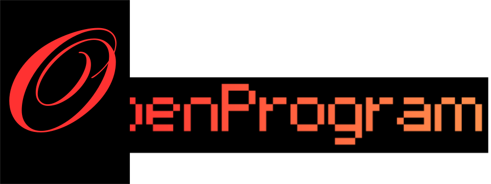
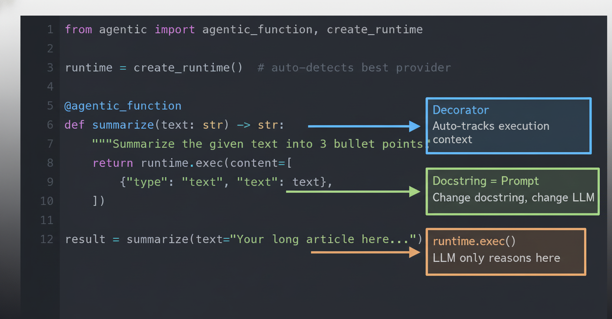

<p align="center">
  
</p>

<p align="center">
  <strong>Python schedules. The LLM only reasons when asked.</strong>
</p>

<p align="center">
  <a href="https://github.com/Fzkuji/OpenProgram/blob/main/LICENSE"></a>
  <a href="https://www.python.org/"></a>
  <a href="https://github.com/Fzkuji/OpenProgram/stargazers"></a>
</p>

<p align="center">
  <a href="docs/GETTING_STARTED.md">Getting Started</a> ·
  <a href="docs/API.md">API</a> ·
  <a href="docs/philosophy/agentic-programming.md">Philosophy</a> ·
  <a href="docs/README_CN.md">中文</a>
</p>

<p align="center">
  
</p>

---

## Quick install

```bash
pip install "openprogram[all]"
openprogram setup
```

---

## A 30-second example

```python
from openprogram import agentic_function, create_runtime

runtime = create_runtime()              # auto-detects provider

@agentic_function
def summarize(text):
    """Summarize this text into 3 bullet points."""
    return runtime.exec(content=[{"type": "text", "text": text}])

print(summarize("Agentic Programming is a paradigm where ..."))
```

The docstring is the prompt. `runtime.exec()` is the LLM call. Wrap it in `if`, `for`, or another `@agentic_function` — Python decides flow, the LLM only generates the bullets.

---

## What's in the box

<table>
<tr><td><b>Python in charge</b></td><td>Real <code>if</code>/<code>for</code>/<code>while</code> control flow. The LLM is a function you call when reasoning beats logic.</td></tr>
<tr><td><b>Self-evolving</b></td><td><code>create()</code> writes new functions; <code>fix()</code> repairs them from failure history.</td></tr>
<tr><td><b>Six providers</b></td><td>Anthropic / OpenAI / Gemini APIs + Claude Code / Codex / Gemini CLIs. Use a subscription, not a per-token bill.</td></tr>
<tr><td><b>Five front-ends</b></td><td>Python lib · TUI · Web UI · Skills (for Claude Code / Gemini CLI) · Worker as a system service.</td></tr>
<tr><td><b>Memory across sessions</b></td><td>Three-layer markdown + SQLite FTS5 store under <code>~/.agentic/memory/</code>. No embeddings, fully grep-able.</td></tr>
</table>

---

## Why Agentic Programming?

<p align="center">
  
</p>

|  | Tool-calling / MCP | Agentic Programming |
|---|---|---|
| Who schedules? | LLM decides | Python decides |
| Functions contain | Code only | Code + LLM reasoning |
| Context | Flat conversation | Structured tree |
| Prompt | Hidden in agent config | Docstring is the prompt |

[Full rationale →](docs/philosophy/agentic-programming.md)

---

## Built-in apps

| App | What it does |
|---|---|
| [GUI-Agent-Harness](https://github.com/Fzkuji/GUI-Agent-Harness) | Operates desktop apps via vision. Python runs observe → plan → act → verify. |
| [Research-Agent-Harness](https://github.com/Fzkuji/Research-Agent-Harness) | Literature → idea → experiments → paper. Topic to submission-ready PDF. |

---

## Acknowledgements

Ports / adaptations from: **[OpenClaw](https://github.com/openclaw/openclaw)** (tool registry, provider abstraction), **[hermes-agent](https://github.com/NousResearch/hermes-agent)** (`execute_code`, `mixture_of_agents`, memory lifecycle hooks), **[pi-coding-agent](https://github.com/mariozechner/pi-coding-agent)** (AgentSkill shape), **[Claude Code](https://www.anthropic.com/claude-code)** (default tool set ergonomics).

---

## License

MIT — see [LICENSE](LICENSE).
