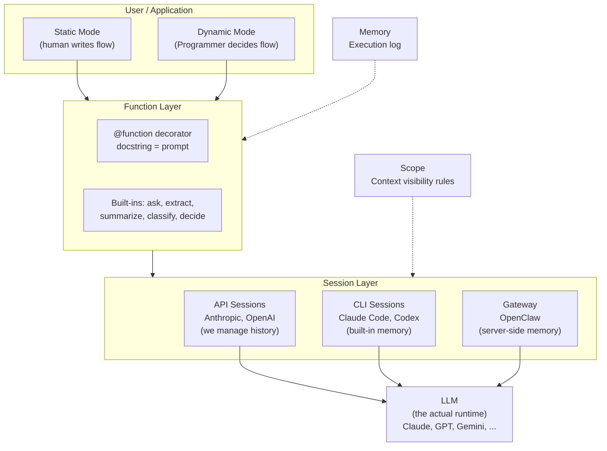
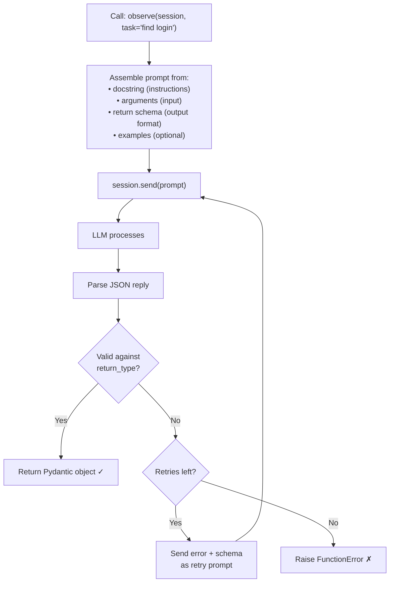
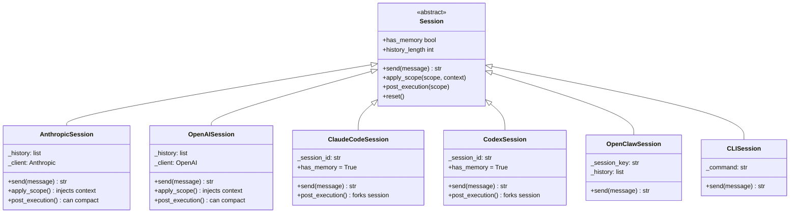
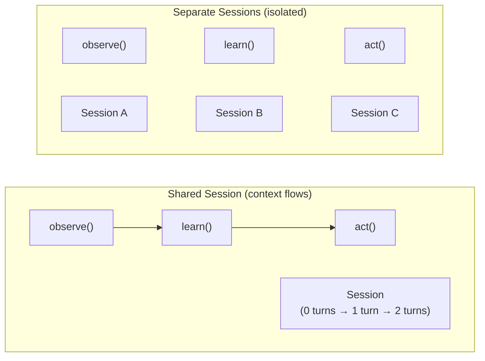
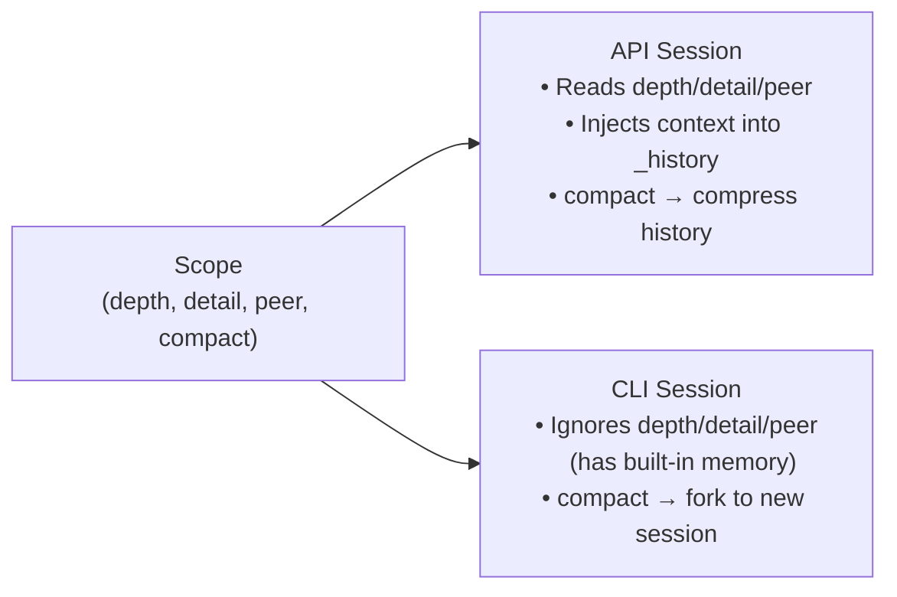
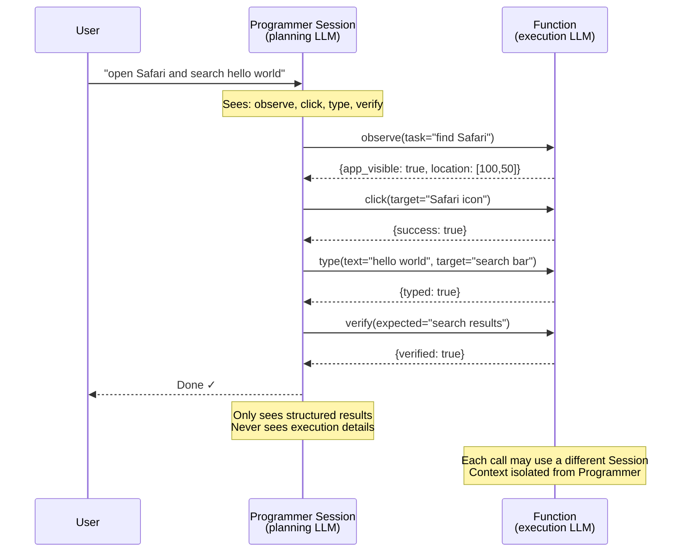
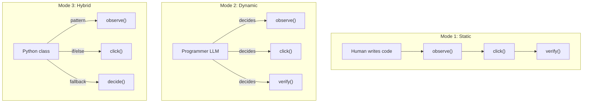
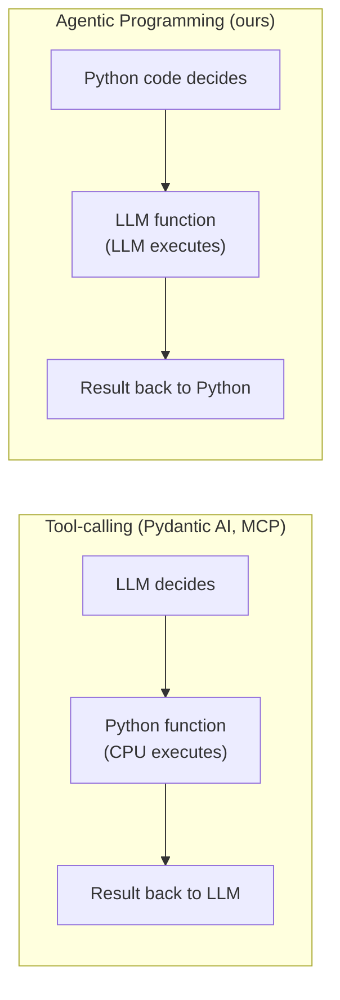

# Agentic Programming — Design Specification

> A programming paradigm where LLM sessions are the compute units.

---

## 1. Architecture Overview



---

## 2. Core Analogy

| Traditional Programming | Agentic Programming |
|-------------------------|---------------------|
| CPU executes code | LLM executes instructions |
| Function body = code | Function body = docstring |
| Type signature | return_type (Pydantic) |
| `result = fn(args)` | `result = fn(session, args)` |
| Standard library | Built-in functions |
| Class with methods | Python class with LLM methods |
| `if / for / while` | Same — Python is control flow |
| Runtime / interpreter | Session (LLM interface) |
| Debug log | Memory |

**There is no Runtime class.** The LLM *is* the runtime, accessed through Session.

---

## 3. Function

### What is a Function?

A Python function whose logic is described in natural language (the docstring) and executed by an LLM (via a Session).

**The docstring IS the prompt.** Change the docstring → change the behavior.

### How it works



### Two ways to define

**With decorator** (recommended):

```python
@function(return_type=ObserveResult)
def observe(session: Session, task: str) -> ObserveResult:
    """Look at the screen and find all visible UI elements.
    Check if the target described in 'task' is visible.
    List every element you can see."""

result = observe(session, task="find the login button")
```

**Manual** (full control):

```python
def observe(session: Session, task: str) -> ObserveResult:
    reply = session.send(f"Observe the screen. Task: {task}")
    return ObserveResult.model_validate_json(reply)
```

### Built-in functions

| Function | Input | Output | Description |
|----------|-------|--------|-------------|
| `ask` | question | str | Plain text Q&A |
| `extract` | text, schema | Pydantic model | Structured data extraction |
| `summarize` | text | str | Text summarization |
| `classify` | text, categories | str | Classification |
| `decide` | question, options | str | Decision making |

---

## 4. Session

### What is a Session?

The interface to the LLM. You send a message, get a reply. Sessions also manage conversation history for context reuse.



### Session types

| Session | Backend | Images | History managed by | Auth |
|---------|---------|--------|--------------------|------|
| AnthropicSession | Anthropic API | ✅ base64 | Us (`_history`) | API key |
| OpenAISession | OpenAI API | ✅ base64 | Us (`_history`) | API key |
| ClaudeCodeSession | Claude Code CLI | ✅ stream-json | CLI (`--session-id`) | Subscription |
| CodexSession | Codex CLI | ✅ `--image` | CLI (`--session-id`) | Subscription |
| OpenClawSession | OpenClaw gateway | ✅ OpenAI format | Server-side | Gateway token |
| CLISession | Any CLI command | ❌ | None (stateless) | Depends |

### Context sharing



- **Shared Session**: each function sees all prior conversation. KV cache prefix preserved.
- **Separate Sessions**: each function starts fresh. No shared context.

---

## 5. Scope

### What is Scope?

An intent declaration for context visibility. Attached to a function, read by the Session. Each Session type handles only the parameters it understands.

### Parameters

| Parameter | Type | Read by | Description |
|-----------|------|---------|-------------|
| `depth` | Optional[int] | API Sessions | Call stack layers visible (0=none, -1=all) |
| `detail` | Optional[str] | API Sessions | "io" (summary) or "full" (reasoning) |
| `peer` | Optional[str] | API Sessions | Sibling visibility: "none", "io", "full" |
| `compact` | Optional[bool] | CLI Sessions | Compress after execution |

All parameters are **Optional**. `None` = "no opinion, use default."

### How Sessions handle Scope



### Presets

| Preset | depth | detail | peer | Use case |
|--------|-------|--------|------|----------|
| `Scope.isolated()` | 0 | "io" | "none" | Pure function, no context |
| `Scope.chained()` | 0 | "io" | "io" | Sees sibling I/O summaries |
| `Scope.aware()` | 1 | "io" | "io" | Sees caller + siblings |
| `Scope.full()` | -1 | "full" | "full" | Sees everything |

---

## 6. Memory

### What is Memory?

A persistent execution log. Records every function call, result, decision, and media file during a run.

```mermaid
flowchart TD
    subgraph Run["Run: click login button"]
        RS["run_start"] --> FC1["function_call: observe"]
        FC1 --> MS1["message_sent"]
        MS1 --> MR1["message_received"]
        MR1 --> MD1["media: screenshot.png"]
        MD1 --> FR1["function_return ✓ 150ms"]
        FR1 --> D1["decision: call click"]
        D1 --> FC2["function_call: click"]
        FC2 --> FR2["function_return ✓ 200ms"]
        FR2 --> FC3["function_call: verify"]
        FC3 --> ERR["error: element not found"]
        ERR --> FR3["function_return ✗ 50ms"]
        FR3 --> RE["run_end: partial"]
    end
```



### Output format

```
logs/run_20260401_130000_abc123/
├── run.jsonl      ← Machine-readable (one JSON event per line)
├── run.md         ← Human-readable (Markdown with ✓/✗, timing, media links)
└── media/
    └── 001_screenshot.png
```

---

## 7. Programmer

### What is the Programmer?

An LLM that decides what functions to call and in what order. It sees function signatures (docstrings = capabilities), calls them, sees results, and decides the next step.



**Key design:**
- Programmer Session accumulates **decisions + result summaries** (grows slowly)
- Function Sessions accumulate **execution details** (isolated, then destroyed)
- Programmer never sees function execution details → context stays small

**Programmer vs MCP / tool-calling:**
Both let an LLM decide what to call. The difference: MCP tools contain Python code executed by a CPU. Our functions contain natural language executed by an LLM.

**Status:** Design finalized. Implementation deferred — Function layer first.

---

## 8. Execution Modes



| Mode | Who controls flow | Good for |
|------|-------------------|----------|
| **Static** | Human (Python code) | Known workflows, scripts |
| **Dynamic** | Programmer (LLM) | Open-ended tasks, exploration |
| **Hybrid** | Human structure + LLM decisions | Robust automation with fallbacks |

---

## 9. Design Principles

| Principle | Description |
|-----------|-------------|
| **Functions are functions** | Call them, get results. No Runtime class needed. |
| **Docstring = prompt** | Change the docstring, change the behavior. |
| **LLM is the runtime** | Session.send() is the "CPU instruction". |
| **Python is the control flow** | if/for/while/async — not a custom DSL. |
| **Scope is intent** | Declare what you want, Session handles how. |
| **Sessions are pluggable** | Same function works with any LLM backend. |
| **Memory is optional** | Log everything or nothing — your choice. |
| **Programmer is deferred** | Function layer first, planning layer later. |

---

## 10. Comparison



| | Tool-calling | Agentic Programming |
|---|---|---|
| Direction | LLM → Python → LLM | Python → LLM → Python |
| Who decides | LLM decides what tools to use | Program decides what to execute |
| Functions contain | Python code | Natural language instructions |
| Good for | Data retrieval, APIs, calculations | Reasoning, perception, analysis |

---

## 11. Project Structure

```
harness/
├── __init__.py      Exports: function, ask, extract, classify, ...
├── function/        @function decorator + built-in functions
├── session/         Session interface + 6 implementations
├── scope/           Scope: context visibility rules
└── memory/          Memory: persistent execution log

tests/               53 tests covering all components
docs/
└── DESIGN.md        This file
```
