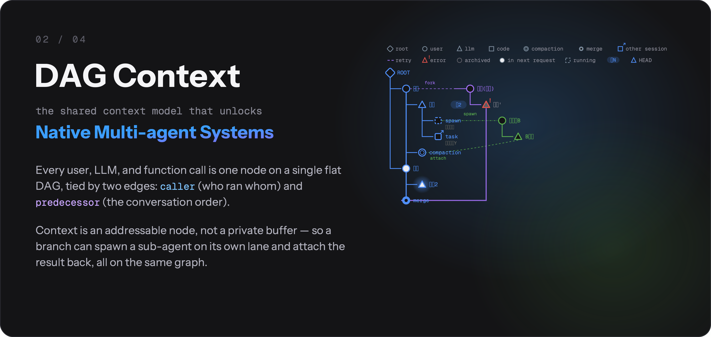
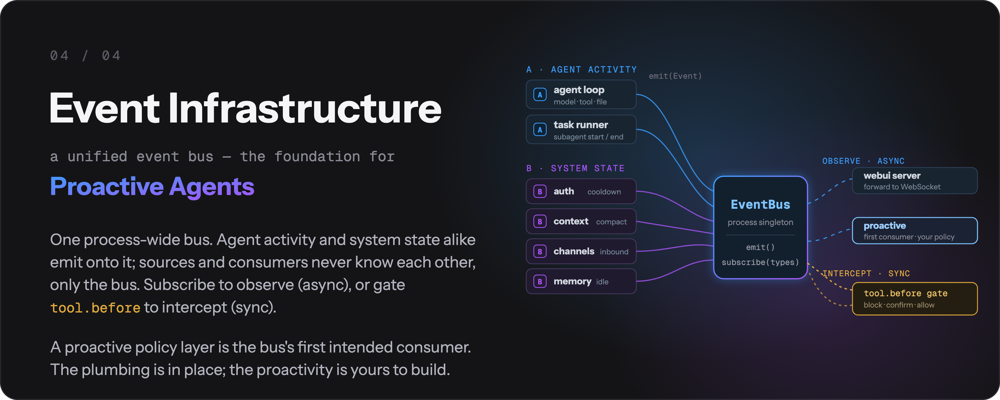
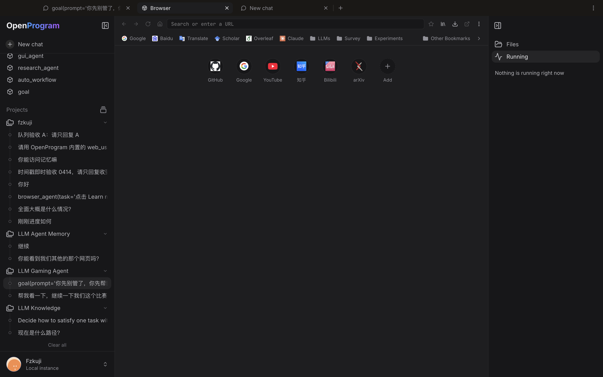

<p align="center">
  <picture>
    <source media="(prefers-color-scheme: dark)" srcset="images/logo-lockup.gif">
    <source media="(prefers-color-scheme: light)" srcset="images/logo-lockup-light.gif">
    
  </picture>
</p>

<p align="center">
  <b>OpenProgram: Self-Programming AI Agent Framework</b><br/>
  Agents create and refine their own workflows · Any LLM · macOS and Linux releases
</p>

<p align="center">
  <a href="https://arxiv.org/abs/2606.15874"></a>
  <a href="https://github.com/Fzkuji/OpenProgram/releases/latest"></a>
  <a href="https://github.com/Fzkuji/OpenProgram/blob/main/LICENSE"></a>
  <a href="https://www.python.org/"></a>
  
  <a href="https://github.com/Fzkuji/OpenProgram/actions/workflows/ci.yml"></a>
  <a href="https://github.com/Fzkuji/GUI-Agent-Harness"></a>
  <a href="https://github.com/Fzkuji/OpenProgram/stargazers"></a>
</p>

<p align="center">
  <a href="start/GETTING_STARTED.md">Getting Started</a> &middot;
  <a href="capabilities/agentic-programming/self-programming-ai-agents.md">Self-Programming Agents</a> &middot;
  <a href="comparisons/ai-agent-frameworks.md">Framework Comparison</a> &middot;
  <a href="reference/API.md">API Reference</a> &middot;
  <a href="capabilities/agentic-programming/philosophy.md">Philosophy</a> &middot;
  <a href="README.zh.md">中文</a>
</p>

---

> *"The more constraints one imposes, the more one frees oneself."*
> — **Igor Stravinsky**, *Poetics of Music*

**We propose _Agentic Programming_.** An LLM is flexible; code is deterministic. Let the model run everything and you get chaos — unpredictable execution, context explosion, no output guarantees; hard-code everything and you lose the intelligence. A **harness** balances the two, interleaved moment to moment — **Python for the flow you want fixed, the LLM for the judgement you can't script.** ([the full rationale →](capabilities/agentic-programming/philosophy.md))

> 🎉 **Paper:** [_LLM-as-Code: Agentic Programming for Agent Harness_](https://arxiv.org/abs/2606.15874) — accepted at the **KDD 2026 Workshop on Agentic Software Engineering (AgenticSE)**.

**Contents**

- [News](#news)
- [Why OpenProgram?](#why-openprogram)
- [Quick Start](#quick-start)
- [Troubleshooting](#troubleshooting)
- [How to use](#how-to-use)
- [CLI use](#cli-use)
- [Detailed features](#detailed-features)
- [Integration](#integration)
- [Contributing](#contributing)
- [Acknowledgements](#acknowledgements)
- [Citation](#citation)
- [License](#license)

## News

- **2026-08-24** — **v0.8.1** — smaller installers: the product no longer bundles PyTorch.
- **2026-08-24** — **v0.8.0** — context compaction you can follow (automatic compact, summary cards, folded originals, message navigation in sync) and a Chrome-style bookmarks bar on the built-in Browser.
- **2026-08-17** — **v0.7.0** — complete built-in browser release: multi-pane Browser, bookmarks and compact History, Chrome/Brave/Edge/Chromium profile import, and DOM-first Agent control of visible internal webpages.
- **2026-07-21** — **v0.6.0** — multi-agent collaboration: `spawn` N sub-agents, message them across sessions, run file-touching branches in isolated git worktrees.
- **2026-06-22** — **Paper accepted** at the KDD 2026 Workshop on Agentic Software Engineering ([arXiv:2606.15874](https://arxiv.org/abs/2606.15874)).
- **2026-06-07** — **v0.5.0** — installable harnesses (`openprogram programs install <owner>/<repo>`), one-command install on every platform, multi-account providers with automatic key rotation, and the `rescue` / `doctor` diagnostics.
- **2026-05-28** — **v0.4.0** — the design-system foundation behind the web UI and TUI.
- **2026-04-04** — **v0.3.0** — built-in Anthropic / OpenAI / Gemini providers.
- **2026-04-03** — **v0.1.0** — first release: the `@agentic_function` decorator and the execution DAG.

## Why OpenProgram?

The current OpenProgram release supports macOS and Linux installations, multiple providers, and terminal, browser, and chat interfaces. Windows native packaging is deferred for a later release decision; Windows and mobile devices can currently use the browser client against a supported remote host. The harness itself provides **three mechanisms for building agent programs.**

### ① DAG Context — for native multi-agent systems

<p align="center">
  
</p>

Every user turn, LLM call, and function call is **one node on a single flat DAG**. Two edges give it meaning: `caller` (who invoked whom) and `reads` (whose output fed this prompt) — so context is assembled from the graph, not hand-stitched. Each `@agentic_function` is **programmable context in one line**: `expose` controls what a call reveals to its parent, and `render_range` controls how much history a call pulls in (`{"callers": 0}` gives a throwaway, self-isolated scratch context that's reclaimed when it returns — no unbounded prompt growth).

Because context is an **addressable node rather than a per-agent buffer**, multi-agent stops being a bolt-on: fork a branch, `spawn` a clean sub-agent, `send_message` across sessions, or run a file-touching branch in an isolated `git worktree` — each is just "select a different node set as context" on the same DAG.

### ② Agentic Workflow — for trustworthy & self-evolving agents

<p align="center">
  
</p>

**Python drives the flow; the LLM reasons only when asked.** Critical steps become **code gates** — the model's choice is parsed and validated by code, and a failed check makes it *re-decide* instead of quietly moving on, so validation can't be skipped. Every call is a retryable, observable DAG node. That's what makes execution *trustworthy*: the guarantees live in code, not in the model's goodwill.

*Self-evolving* is a mechanism, not a black box: the agent writes and fixes its own `@agentic_function`s with **ordinary file-edit tools**, a file watcher hot-loads them, and the new tool is live on the next turn — no dedicated `create()` / `fix()` machinery.

### ③ Event Infrastructure — for proactive agents

<p align="center">
  
</p>

One **process-wide event bus** is the substrate under everything: the agent loop, auth, context, channels, and memory all emit onto it, and any component can subscribe by event type (every event is a uniform `Event(type, payload, ts)` envelope with `id` / `origin` / `metadata`). This is deliberately a **foundation** — a proactive policy layer that watches the stream and acts is the bus's first intended consumer. The plumbing is in place; the proactivity is yours to build on it.

## Quick Start

### 1. Install

**macOS / Linux CLI or server release:**
```bash
curl -fsSL https://openprogram.io/install | sh
```

macOS desktop users download the unsigned DMG from [GitHub Releases](https://github.com/Fzkuji/OpenProgram/releases). Linux users install the complete CLI/server runtime and use its Web UI or TUI; no Linux desktop package is published until a complete package passes the public-entry gate. All supported release installations contain the same complete product capabilities. See **[install.md](install/install.md)** for verification, platform scope, and source-development installation.

### 2. Run

```bash
openprogram
```

First run sets up your provider, then asks which surface to open. Skip the prompt with `openprogram tui` (terminal) or `openprogram web` (browser → http://localhost:18100).

### 3. Included Programs and additional harnesses

Every supported release installation already includes the three first-party Programs and their default runtime assets:

| Program | Release status | What it does |
|---|---|---|
| [GUI Agent](https://github.com/Fzkuji/GUI-Agent-Harness) | Included; the product runtime does not ship PyTorch or EasyOCR | Drives desktop apps & OSWorld VMs by vision. |
| [Research Agent](https://github.com/Fzkuji/Research-Agent-Harness) | Included | Literature survey → experiments → paper draft. |
| [Wiki Agent](https://github.com/Fzkuji/Wiki-Agent-Harness) | Included | Turns notes / docs / chats into an Obsidian vault with `[[wikilinks]]`. |
| [Scriptorium](https://github.com/Fzkuji/Scriptorium) | Related | Agent memory you can read; Markdown notes; facts cited to source messages; MCP for Claude Code. |

Third-party harnesses are additional functionality. Mutable extension environments use `openprogram programs install <owner>/<repo>` (or a full git URL); source editing and replacement OCR/browser backends are developer features.

Writing your own installable harness is one layout contract away — the
full guide (install, manage, author, test, publish) is
**[installing-harnesses.md](capabilities/installing-harnesses.md)**.

> Need a workflow of your own? Ask the agent in chat to create or update a Program.

## Troubleshooting

Two diagnostic commands cover most "it broke and I don't know why" situations:

```bash
openprogram rescue          # 12 platform-agnostic probes, each with a fix command
openprogram doctor          # quick "is the install healthy?" check
openprogram logs tail       # follow the worker log live
openprogram providers doctor # OAuth tokens — expiring? refresh wired?
```

`rescue` is the one to reach for first when something doesn't work — it doesn't depend on an LLM being reachable, walks through provider config, ports, dependencies, build artefacts, and prints the exact command to fix each finding. Case-by-case docs live in [troubleshooting.md](server/troubleshooting.md).

For platform-builder topics (`Runtime` retry semantics, the full `@agentic_function` decorator API, the flat-DAG context model) see [API.md](reference/API.md) and the per-topic notes under [reference/api/](reference/README.md).

### Power-user commands

```bash
openprogram logs list                # all log files with size + age
openprogram logs tail worker -f      # follow worker.log
openprogram completion bash          # autocomplete: bash | zsh | powershell
openprogram secrets list             # same as `providers list` (openclaw-style alias)
openprogram providers use <prov> [profile]  # pick which account a provider runs on
openprogram providers login <prov> --account work  # add a second account
openprogram worker status            # is the backend up? on what port?
openprogram --print --resume <id>    # continue a previous chat headlessly
```

**Providers & models** live in **Settings → Providers** (web UI). Each provider takes multiple accounts and multiple API keys under one credential pool — keys auto-rotate, cooling off a rate-limited one. Need a provider that isn't in the built-in list? **Add custom provider** takes just a **Name** and **Base URL** (id auto-generated) for any OpenAI-compatible endpoint; browse its models from the provider's `/models` endpoint or add a model by id, same multi-key management as the rest.

---

## How to use

Two ways to interact day-to-day — same backend, same sessions, switch freely.

### Web UI — `openprogram web`

Opens at `http://localhost:18100`. The full surface: a live **mini-DAG** of the session on the right rail, **branch / merge / attach** on any node, **multi-agent** rows tagged by producer, and drag-and-drop **file attachments**. Best when you want to *see and steer* the execution tree, or for longer, branching work.

<p align="center">
  
</p>

### Terminal UI — `openprogram`

The same backend without the browser — same commands, same chat history. Release installs include the Python terminal interface; source-development installs can also build Ink on macOS/Linux. One-shot, no UI: `openprogram --print "…"`.

<p align="center">
  
</p>

> Sessions live in `~/.openprogram/` and are shared by both — start in the terminal, pick it up in the browser tab, and vice versa.

---

## CLI use

Beyond the chat UIs, the `openprogram` command runs headless — script it, pipe it, automate it.

```bash
# One-shot: send a prompt, print the answer, exit (redirect or pipe it)
openprogram --print "summarise .github/CHANGELOG.md" > summary.md

# Run a specific agentic function with key=value args
openprogram programs run research --arg topic="state-space models"

# Continue an earlier session by id (headless; combine with --print)
openprogram --print --resume local_d9a16a6b06 "and now?"
```

Same backend and sessions as the UIs (`~/.openprogram/`) — a `--print` run or a resumed session shows up in the web / terminal UI too.

## Detailed features

| Feature | One-line summary |
|---|---|
| **Automatic context** | Every `@agentic_function` call is a tree node; the runtime threads it through nested LLM calls — no manual prompt assembly. |
| **Functions that author functions** | New / fixed `@agentic_function`s are written by the agent itself via ordinary file-editing tools and the documented API. No dedicated `create()` / `fix()` calls. |
| **Conversation as a git DAG** | Sessions are commits + branches + merges, with the right sidebar exposing the operations. File-touching branches run in isolated git worktrees. |
| **Memory that writes itself** | Markdown under `~/.openprogram/memory/`: `core.md` (always loaded), `topics/` (one file per subject, every paragraph citing its source), `sources/` (the conversations those citations point at). Conversations are folded into topics in the background, and every write lands whole or not at all. |
| **Mini-DAG execution view** | The right rail draws every node + edge of the active session and scrolls with the chat. |
| **Multi-agent + multi-channel** | Every row tagged with its producer agent; channel layer wires external transports (Telegram, Discord, Slack, WeChat). |

The detailed tour of each one — code samples, design rationale, where to look in the codebase — lives in [**features.md**](start/features.md).

## Integration

| Guide | Description |
|-------|-------------|
| [Getting Started](start/GETTING_STARTED.md) | 3-minute setup and runnable examples |
| [Claude Code](integrations/claude-code.md) | Use without API key via Claude Code CLI |
| [OpenClaw](integrations/openclaw.md) | Use as OpenClaw skill |
| [API Reference](reference/API.md) | Full API documentation |

<details>
<summary><strong>Project Structure</strong></summary>

```
openprogram/                         # Python product package
├── agent/                           # model loop, compaction, session runtime
├── agentic_programming/             # llm() / agent() primitives and @agentic_function
├── programs/
│   ├── _registry.py                 # Workflow registry and discovery
│   ├── tools/                       # deterministic @function tools
│   ├── workflow/                    # llm()/agent() Workflows, including goal/
│   └── applications/                # owner-recorded external Program checkouts
├── channels/                        # external chat transports
├── scheduler/                       # durable schedules and execution
└── webui/                           # worker API and WebSocket layer
apps/
└── cli/                            # TypeScript Ink terminal client
web/                                 # Next.js interface
desktop/                             # Electron desktop host
tests/                               # pytest: <layer>/<product-domain>
scripts/                             # executable and importable repository maintenance tools
```

See the workspace READMEs for
[`openprogram/`](https://github.com/Fzkuji/OpenProgram/blob/main/openprogram/README.md),
[`web/`](https://github.com/Fzkuji/OpenProgram/blob/main/apps/web/README.md), and
[`apps/cli/`](https://github.com/Fzkuji/OpenProgram/blob/main/apps/cli/README.md). Complete
ownership rules are in
[Repository Structure](reference/design/repository-structure.html).

</details>

## Contributing

This is a **paradigm proposal** with a reference implementation. We welcome discussions, alternative implementations in other languages, use cases that validate or challenge the approach, and bug reports.

See [CONTRIBUTING.md](https://github.com/Fzkuji/OpenProgram/blob/main/.github/CONTRIBUTING.md) for details.

## Acknowledgements

OpenProgram stands on shoulders. The tool framework, provider abstraction, and
several tool implementations were ported or adapted from the projects below —
each under its own license. Enormous thanks to their authors.

- [**OpenClaw**](https://github.com/openclaw/openclaw) (MIT) — layout of the
  tool registry (`name / description / parameters / execute`), provider
  abstraction with `check_fn` + `requires_env` gating, `TOOLSETS` presets,
  skill loading via SKILL.md frontmatter + late-bound `read`. Our full clone
  lives under `references/openclaw/` (gitignored) for browsing.
- [**hermes-agent**](https://github.com/himanshuishere/hermes-agent)
  (MIT) — starting point for `execute_code` (we trimmed the
  Docker / Modal layers), `mixture_of_agents`, and the general shape of the
  multi-provider `web_search` / `image_generate` / `image_analyze` tools.
- [**pi-coding-agent**](https://github.com/mariozechner/pi-coding-agent)
  (MIT) — via OpenClaw's import, the canonical AgentSkill shape
  (`<available_skills>` XML formatter, name / description / location).
- [**Claude Code**](https://www.anthropic.com/claude-code) — overall ergonomics
  of the `DEFAULT_TOOLS` set (bash + read / write / edit + glob / grep / list
  + apply_patch + the todo planning board) and the todo tools' JSON schema.
- **Anthropic / OpenAI / Google SDKs** — provider HTTP contracts; our
  providers call the raw HTTP APIs to keep SDK dependencies optional.

Individual tool files call out their direct inspirations in file-level
docstrings where the lineage is more specific. These MIT-licensed components
keep their original MIT terms; the combined work is distributed under
AGPL-3.0.

## Citation

Using OpenProgram in your work, or building on the code? Please cite our paper — and under the AGPL, any derivative you **distribute or run as a network service** must itself be open-sourced under the AGPL, with attribution preserved (see [License](#license)).

> _LLM-as-Code: Agentic Programming for Agent Harness_ — accepted at the **KDD 2026 Workshop on Agentic Software Engineering (AgenticSE)**. [arXiv:2606.15874](https://arxiv.org/abs/2606.15874)

```bibtex
@inproceedings{qi2026llmascode,
  title     = {LLM-as-Code: Agentic Programming for Agent Harness},
  author    = {Qi, Junjia and Fu, Zichuan and Gao, Jingtong and Zhang, Wenlin and Yan, Hanyu and Wu, Xian and Zhao, Xiangyu},
  booktitle = {KDD 2026 Workshop on Agentic Software Engineering (AgenticSE)},
  year      = {2026},
  eprint    = {2606.15874},
  archivePrefix = {arXiv},
  url       = {https://arxiv.org/abs/2606.15874},
}
```

## License

[AGPL-3.0](https://github.com/Fzkuji/OpenProgram/blob/main/LICENSE) © 2026 Fzkuji. Free to use, study, modify, and share — but any derivative you distribute **or run as a network service** must also be released under the AGPL, with attribution preserved.
