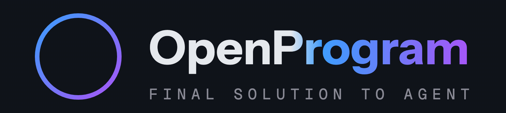
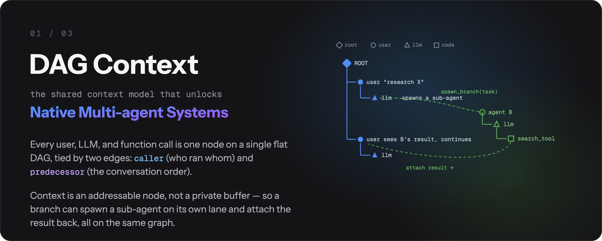
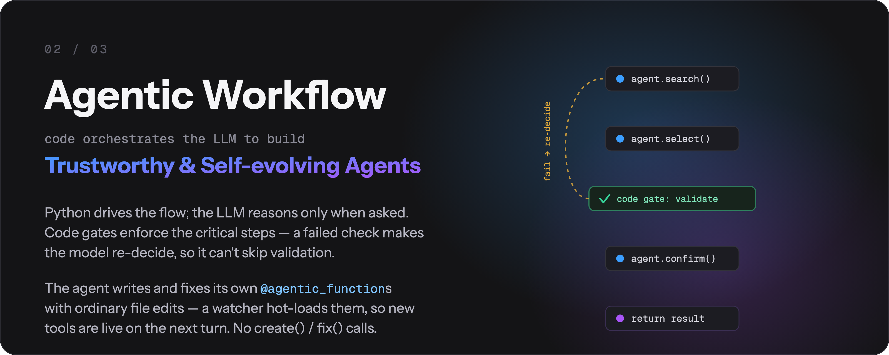
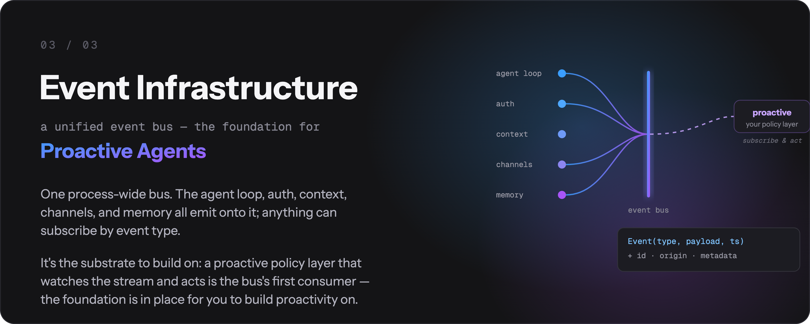
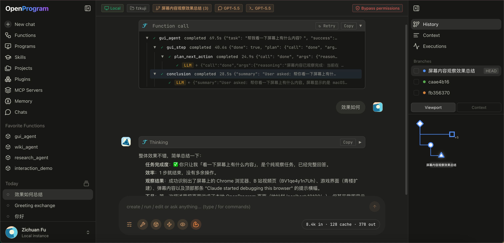
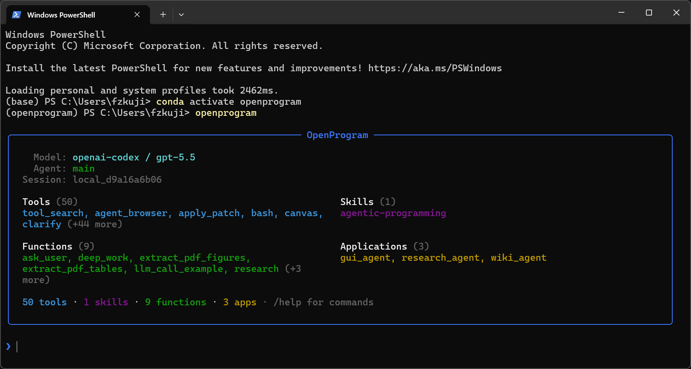

<p align="center">
  <picture>
    <source media="(prefers-color-scheme: dark)" srcset="images/logo-lockup.gif">
    <source media="(prefers-color-scheme: light)" srcset="images/logo-lockup-light.gif">
    
  </picture>
</p>

<p align="center">
  <b>开源通用 Agent Harness —— 用 Python 搭建你的工作流。</b><br/>
  任意 LLM · 任意平台
</p>

<p align="center">
  <a href="https://arxiv.org/abs/2606.15874"></a>
  <a href="https://github.com/Fzkuji/OpenProgram/releases/tag/v0.5.0"></a>
  <a href="https://github.com/Fzkuji/OpenProgram/blob/main/LICENSE"></a>
  <a href="https://www.python.org/"></a>
  
  <a href="https://github.com/Fzkuji/OpenProgram/actions/workflows/ci.yml"></a>
  <a href="https://github.com/Fzkuji/GUI-Agent-Harness"></a>
  <a href="https://github.com/Fzkuji/OpenProgram/stargazers"></a>
</p>

<p align="center">
  <a href="start/GETTING_STARTED.md">快速上手</a> &middot;
  <a href="reference/API.md">API 参考</a> &middot;
  <a href="capabilities/agentic-programming/philosophy.md">设计哲学</a> &middot;
  <a href="README.md">English</a>
</p>

---

> *"The more constraints one imposes, the more one frees oneself."*
> —— **Igor Stravinsky**，《Poetics of Music》

**我们提出 _Agentic Programming_。** LLM 灵活,代码确定。让模型掌控一切,得到的是混乱——不可预测的执行、上下文爆炸、没有输出保证;把一切硬编码,又丢掉了智能。**Harness** 在两者之间取得平衡,逐时逐刻地交织——**想固定的流程交给 Python,写不进脚本的判断交给 LLM。**([完整论证 →](capabilities/agentic-programming/philosophy.md))

> 🎉 **论文:** [_LLM-as-Code: Agentic Programming for Agent Harness_](https://arxiv.org/abs/2606.15874) —— 已被 **KDD 2026 Workshop on Agentic Software Engineering (AgenticSE)** 接收。

## 它有什么不同

多平台、多 provider、多渠道——这些是标配,OpenProgram 都有(macOS / Linux / Windows,任意 LLM,终端 / 浏览器 / 聊天渠道)。真正让它不同的,是 **harness 本体里的三个机制——每一个都是一类 agent 的地基,你可以在上面继续搭。**

### ① DAG 上下文 —— 原生多 agent 系统的地基

<p align="center">
  
</p>

每个用户轮次、LLM 调用、函数调用都是**同一张扁平 DAG 上的一个节点**。两种边赋予它含义:`caller`(谁调了谁)和 `reads`(谁的输出喂进了这次 prompt)——上下文由图组装出来,不靠手工缝合。每个 `@agentic_function` 都是**一行声明的可编程上下文**:`expose` 控制一次调用向父级展示什么,`render_range` 控制一次调用拉进多少历史(`{"callers": 0}` 给出一次性的自隔离草稿上下文,函数返回即回收——prompt 不会无界增长)。

因为上下文是**可寻址的节点而不是每个 agent 一份的缓冲区**,多 agent 不再是外挂:fork 一个分支、`spawn` 一个干净的子 agent、跨会话 `message_branch`、把动文件的分支放进隔离的 `git worktree` 里跑——在同一张 DAG 上,每一样都只是"选一组不同的节点当上下文"。

### ② Agentic 工作流 —— 可信且自我演化的 agent 的地基

<p align="center">
  
</p>

**Python 驱动流程;LLM 只在被要求时推理。** 关键步骤变成**代码关卡**——模型的选择由代码解析和校验,校验不过就让它*重新决策*,而不是悄悄跳过,所以校验不可能被绕开。每次调用都是可重试、可观测的 DAG 节点。这就是执行*可信*的来源:保证写在代码里,不写在模型的善意里。

*自我演化*是一套机制,不是黑箱:agent 用**普通文件编辑工具**编写和修复自己的 `@agentic_function`,文件监听器热加载,新工具下一轮就上线——没有专门的 `create()` / `fix()` 机构。

### ③ 事件基础设施 —— 主动 agent 的地基

<p align="center">
  
</p>

一条**进程级事件总线**是一切之下的基底:agent 循环、auth、上下文、渠道、记忆都往上面发事件,任何组件都能按事件类型订阅(每个事件都是统一的 `Event(type, payload, ts)` 信封,带 `id` / `origin` / `metadata`)。这里刻意只做**地基**——监视事件流并主动行动的策略层,是这条总线的第一个预期消费者。管线已经就位;主动性留给你在上面搭。

## 快速开始

### 1. 安装

**macOS / Linux:**
```bash
curl -fsSL https://raw.githubusercontent.com/Fzkuji/OpenProgram/main/scripts/install.sh | bash
```

**Windows(PowerShell):**
```powershell
iwr -useb https://raw.githubusercontent.com/Fzkuji/OpenProgram/main/scripts/install.ps1 | iex
```

更多选项——参数、无人值守 / AI agent 安装、从 checkout 安装:**[install.md](install/install.md)**。

### 2. 运行

```bash
openprogram
```

首次运行会先配置 provider,然后问你打开哪个界面。跳过询问可以直接 `openprogram tui`(终端)或 `openprogram web`(浏览器 → http://localhost:18100)。

### 3. 添加 harness

Harness 是 `openprogram/functions/agentics/` 下的程序。任何克隆进那个目录的东西在下次 worker 重启时自动注册——这是任何程序(包括你自己写的)接入 OpenProgram 的通用方式。纯 Python 的 harness 还有一行快捷命令 `openprogram programs install <name>`,替你克隆进去。

| Harness | 安装 | 功能 |
|---|---|---|
| [GUI Agent](https://github.com/Fzkuji/GUI-Agent-Harness) | `openprogram programs install gui`(会拉 PyTorch),再跑它的安装器装检测器/OCR 资产——**[指南](https://github.com/Fzkuji/GUI-Agent-Harness#1-install)** | 通过视觉操控桌面应用和 OSWorld 虚拟机。 |
| [Research Agent](https://github.com/Fzkuji/Research-Agent-Harness) | `openprogram programs install research` | 文献调研 → 实验 → 论文初稿。 |
| [Wiki Agent](https://github.com/Fzkuji/Wiki-Agent-Harness) | `openprogram programs install wiki` | 把笔记 / 文档 / 聊天整理成带 `[[wikilinks]]` 的 Obsidian 知识库。 |
| **任意第三方 harness** | `openprogram programs install <owner>/<repo>`(或完整 git URL) | 同一套流程——克隆、依赖、契约检查;无需在任何地方登记。 |

写一个自己的可安装 harness 只差一份布局契约——完整指南(安装、管理、编写、测试、发布)见
**[installing-harnesses.md](capabilities/installing-harnesses.md)**。

> 需要一条自己的工作流?直接在聊天里让 agent 做——内置的 [`agentic-programming` skill](https://github.com/Fzkuji/OpenProgram/blob/main/skills/agentic-programming/SKILL.md) 会处理其余一切。

## 排障

两条诊断命令覆盖大多数"坏了但不知道为什么"的情况:

```bash
openprogram rescue          # 11 项跨平台探测,每项附修复命令
openprogram doctor          # 快速检查安装是否健康
openprogram logs tail       # 实时跟踪 worker 日志
openprogram providers doctor # OAuth token——要过期了?刷新接好了吗?
```

出问题先找 `rescue`——它不依赖 LLM 可达,逐项检查 provider 配置、端口、依赖、构建产物,并打印修复每一项的确切命令。逐案文档见 [troubleshooting.md](server/troubleshooting.md)。

平台构建者话题(`Runtime` 重试语义、完整的 `@agentic_function` 装饰器 API、扁平 DAG 上下文模型)见 [API.md](reference/API.md) 和 [reference/api/](reference/README.md) 下的分主题页面。

### 高级命令

```bash
openprogram logs list                # 全部日志文件,带大小和时间
openprogram logs tail worker -f      # 跟踪 worker.log
openprogram completion bash          # 自动补全:bash | zsh | powershell
openprogram secrets list             # 等价 `providers list`(openclaw 风格别名)
openprogram providers use <prov> [profile]  # 选择 provider 当前跑哪个账号
openprogram providers login <prov> --profile work  # 添加第二个账号
openprogram worker status            # 后端起了吗?在哪个端口?
openprogram --print --resume <id>    # headless 接着之前的聊天继续
```

**Provider 与模型**在 **Settings → Providers**(Web UI)里管理。每个 provider 支持多账号,一个凭据池里可放多个 API key——key 自动轮询,被限流的自动冷却。内置列表里没有的 provider?**添加自定义 Provider** 只需要**名称**和 **Base URL**(id 自动生成),适用于任何 OpenAI 兼容端点;模型可从该 provider 的 `/models` 端点浏览,也可按 id 手动添加,多 key 管理与内置 provider 相同。

---

## 怎么用

日常两种交互方式——同一个后端、同一批会话,随时切换。

### Web UI —— `openprogram web`

打开 `http://localhost:18100`。全量界面:右栏是会话的实时 **mini-DAG**,任意节点上可 **branch / merge / attach**,**多 agent** 行按生产者打标,支持拖拽**附件**。适合想*看着并引导*执行树,或较长的、多分支的工作。

<p align="center">
  
</p>

### 终端 UI —— `openprogram`

同一个后端,不开浏览器——同样的命令、同样的聊天历史。按操作系统选原生渲染器:macOS / Linux 用 **Ink**,Windows 用 **Rich**。适合留在终端或走 SSH。一次性、无 UI:`openprogram --print "…"`。

<p align="center">
  
</p>

> 会话存在 `~/.openprogram/`,两边共享——终端里开始,浏览器标签页里接着,反之亦然。

---

## CLI 用法

聊天 UI 之外,`openprogram` 命令可以 headless 跑——写脚本、接管道、做自动化。

```bash
# 一次性:发 prompt、打印答案、退出(可重定向或接管道)
openprogram --print "summarise CHANGELOG.md" > summary.md

# 用 key=value 参数运行指定 agentic function
openprogram programs run research --arg topic="state-space models"

# 按 id 继续早前的会话(headless,配合 --print 使用)
openprogram --print --resume local_d9a16a6b06 "and now?"
```

与 UI 同一套后端和会话(`~/.openprogram/`)——`--print` 的一次运行或恢复的会话同样出现在 web / 终端 UI 里。

## 功能详情

| 功能 | 一句话总结 |
|---|---|
| **自动上下文** | 每次 `@agentic_function` 调用是一个树节点;runtime 把它穿进嵌套的 LLM 调用——不用手工拼 prompt。 |
| **Deep work** | `deep_work(task, level)` 跑自主的计划 → 执行 → 评估 → 修订循环,直到输出达到选定的质量档。状态持久化到磁盘。 |
| **函数编写函数** | 新建 / 修复 `@agentic_function` 由 agent 自己用普通文件编辑工具完成,遵循 `agentic-programming` skill。没有专门的 `create()` / `fix()` 调用。 |
| **对话即 git DAG** | 会话是 commit + 分支 + 合并,右侧栏暴露这些操作。动文件的分支在隔离的 git worktree 里跑。 |
| **分层记忆** | `~/.openprogram/memory/` 下的分层存储——`journal/`(每日笔记)、`wiki/`(长期页面)、`core.md`(常驻画像)、`index.sqlite`(召回索引)。agent 自己选层。 |
| **Mini-DAG 执行视图** | 右栏画出活动会话的每个节点和边,随聊天滚动。 |
| **多 agent + 多渠道** | 每一行都标注生产它的 agent;渠道层接入外部通道(Telegram、Discord、Slack、微信)。 |

每一项的详细导览——代码示例、设计理由、去代码库哪里看——在 [**features.md**](start/features.md)。

## 集成

| 指南 | 描述 |
|-------|-------------|
| [Getting Started](start/GETTING_STARTED.md) | 3 分钟上手及可运行示例 |
| [Claude Code](integrations/claude-code.md) | 通过 Claude Code CLI 使用,无需 API key |
| [OpenClaw](integrations/openclaw.md) | 作为 OpenClaw skill 使用 |
| [API Reference](reference/API.md) | 完整 API 文档 |

<details>
<summary><strong>项目结构</strong></summary>

```
openprogram/
├── __init__.py                      # agentic_function 再导出
├── cli.py                           # `openprogram` 命令入口
├── agentic_programming/             # 引擎 — 范式必需的原语
│   ├── function.py                  #   @agentic_function 装饰器
│   ├── runtime.py                   #   Runtime（exec + retry + DAG 上下文）
│   ├── session.py                   #   会话生命周期
│   └── skills.py                    #   SKILL.md 发现
├── context/                         # 扁平 DAG 上下文模型 — nodes, storage, render, compute_reads
├── providers/                       # Anthropic、OpenAI、Gemini、Claude Code、Codex、Gemini CLI
├── functions/
│   ├── _registry.py                 #   tools + agentic functions 的统一注册表
│   ├── tools/                       #   @function 叶子工具 — bash、read、edit、grep、semble_search、web_search 等
│   └── agentics/                    #   @agentic_function 模块（每个一个目录，代码写在 __init__.py）
│       ├── ask_user/                #     向用户提澄清问题
│       ├── deep_work/               #     自主计划-执行-评估循环
│       ├── extract_pdf_figures/     #     PDF 图表抽取
│       ├── …                        #     其它 agentics …
│       ├── GUI-Agent-Harness/       #     GUI agent（独立仓库，克隆进来）
│       ├── Research-Agent-Harness/  #     研究 agent（独立仓库，克隆进来）
│       └── Wiki-Agent-Harness/      #     Wiki agent（独立仓库，克隆进来）
└── webui/                           # `openprogram web` — 浏览器 UI
skills/                              # 用于 agent 集成的 SKILL.md 文件
examples/                            # 可运行的示例
tests/                               # pytest 测试套件
```

</details>

## 贡献

这是一个**范式提案**,附带参考实现。欢迎讨论、其他语言的替代实现、验证或挑战此方法的用例,以及 bug 报告。

详见 [CONTRIBUTING.md](https://github.com/Fzkuji/OpenProgram/blob/main/CONTRIBUTING.md)。

## 致谢

OpenProgram 站在前人的肩膀上。工具框架、provider 抽象和若干工具实现移植或改编自下列项目——各自遵循其原许可证。非常感谢这些作者。

- [**OpenClaw**](https://github.com/openclaw/openclaw)(MIT)—— 工具注册表的布局
  (`name / description / parameters / execute`)、带 `check_fn` + `requires_env`
  门禁的 provider 抽象、`TOOLSETS` 预设、经 SKILL.md frontmatter + 延迟绑定 `read`
  的 skill 加载。完整克隆放在 `references/openclaw/`(已 gitignore)供浏览。
- [**hermes-agent**](https://github.com/himanshuishere/hermes-agent)
  (MIT)—— `execute_code` 的起点(我们裁掉了 Docker / Modal 层)、
  `mixture_of_agents`,以及多 provider 的 `web_search` / `image_generate` /
  `image_analyze` 工具的整体形态。
- [**pi-coding-agent**](https://github.com/mariozechner/pi-coding-agent)
  (MIT)—— 经 OpenClaw 引入的规范 AgentSkill 形态
  (`<available_skills>` XML 格式器,name / description / location)。
- [**Claude Code**](https://www.anthropic.com/claude-code) —— `DEFAULT_TOOLS`
  集合的整体人机工学(bash + read / write / edit + glob / grep / list
  + apply_patch + todo_read / todo_write)以及 `todo` 工具的 JSON schema。
- **Anthropic / OpenAI / Google SDK** —— provider 的 HTTP 契约;我们的
  provider 直接调原生 HTTP API,让 SDK 依赖保持可选。

血缘更具体的工具文件在文件级 docstring 里各自注明了直接灵感来源。这些 MIT
许可的组件保留其原 MIT 条款;组合作品整体以 AGPL-3.0 分发。

## 引用

在你的工作中使用了 OpenProgram,或基于这份代码构建?请引用我们的论文——并注意在 AGPL 下,任何你**分发或作为联网服务运行**的衍生作品必须同样以 AGPL 开源,并保留署名(见[许可证](#许可证))。

> _LLM-as-Code: Agentic Programming for Agent Harness_ —— 已被 **KDD 2026 Workshop on Agentic Software Engineering (AgenticSE)** 接收。[arXiv:2606.15874](https://arxiv.org/abs/2606.15874)

```bibtex
@inproceedings{qi2026llmascode,
  title     = {LLM-as-Code: Agentic Programming for Agent Harness},
  author    = {Qi, Junjia and Fu, Zichuan and Gao, Jingtong and Zhang, Wenlin and Yan, Hanyu and Wu, Xian and Zhao, Xiangyu},
  booktitle = {KDD 2026 Workshop on Agentic Software Engineering (AgenticSE)},
  year      = {2026},
  eprint    = {2606.15874},
  archivePrefix = {arXiv},
  url       = {https://arxiv.org/abs/2606.15874},
}
```

## 许可证

[AGPL-3.0](https://github.com/Fzkuji/OpenProgram/blob/main/LICENSE) © 2026 Fzkuji。可自由使用、研究、修改、分享——但任何你分发**或作为联网服务运行**的衍生作品也必须以 AGPL 发布,并保留署名。
