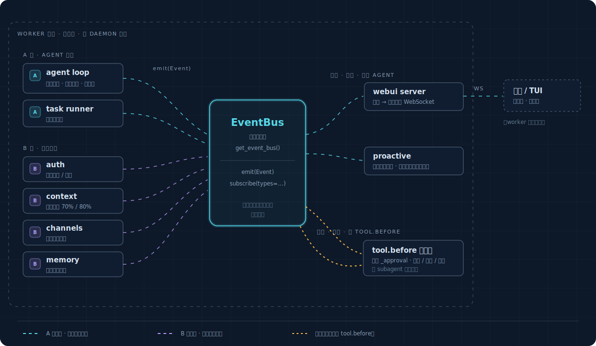

# 事件层

一条统一的事件流，给整个框架用。proactive 只是它第一个消费者。

> **实现状态（2026-06-13）**：本篇 §1–§5 已落地——`Event`/`make_event`/`emit_safe`/
> `subscribe(types=)`/`get_event_bus()` 在 `openprogram/agent/event_bus.py`，同步问询点在
> `openprogram/agent/tool_gate.py`（`register_tool_gate`/`decide_tool_gate`）。A 类事件全部
> 在发（含 `file.changed`），B 类桥接未做。观察方式：`OPENPROGRAM_EVENT_LOG=1` 重启 worker
> 后读 `/tmp/openprogram-events.jsonl`。

**为什么要**：框架里"某件事发生了"的信号现在散在六套互不相通的机制里（agent loop 的
AgentEvent 流、auth 的 `_emit`、context 的 on_event、channels 的 WS 广播、memory 的定时 poll、
store 的纯日志）。想"在某时机做某事"，得先搞清那个时机归哪套、怎么接。这层把它们统一成
**一条总线：源往里 emit，消费者从里 subscribe**。（`auth/store.py:204` 的 `subscribe/_emit`
已经把事件做对了，这层是把它推广到全框架。）

## 1. Event 模型

核心三样（是什么事 + 内容 + 时间）固定；关联信息放进一个开放的 metadata 口袋，不写死字段。

```python
@dataclass(frozen=True)
class Event:
    id: str          # 唯一编号
    ts: float        # 发生时间
    type: str        # 是什么事，见 §3
    origin: str      # 谁引起的：user / agent / tool / system / proactive
    payload: dict    # 这件事的内容（命令、文件路径、哪个账号被限流……）
    metadata: dict   # 开放口袋：{"session":..., "turn":..., "lane":...}，需要才塞
```

为什么 session/turn/lane 进口袋而不做固定字段：它们不是事件的内在属性，是外加的关联，且对
一半事件（auth、channel）根本没意义——做成固定字段就得靠"可空"打补丁。开放 dict 还让以后加
新关联维度不用改模型。（成熟事件系统都这形状：核心固定，关联进 labels / headers。）

> turn 不是这层要建模的东西——框架里没有 Turn 对象，它就是 assistant 消息的 id，靠一个
> ContextVar（`_current_turn_id`）传着。agent 事件 emit 时这个 var 有值就塞进 metadata；
> auth/channel 事件 emit 时它是空的，口袋里自然没 turn。

## 2. 两类事件源

| | A 类：agent 活动 | B 类：系统状态 |
|---|---|---|
| 何时 | agent 干活过程中 | 全局状态变化，可能没 agent 在跑 |
| 例子 | 用户消息、模型回复、工具前后、文件改、一轮结束 | 凭据限流、上下文要溢出、外部消息进、技能变 |
| 对 proactive | 基础 | 往往更有价值（"凭据限流了""上下文要溢出"是明确的可响应时机） |

容易只盯 A 类，但 B 类（agent loop 之外的 auth/context/channels）对主动性常常更重要。两类都
进同一条总线，metadata 口袋天然装得下——A 类带 turn，B 类不带，不为谁开特例。

## 3. 事件类型（第一版）

| 类 | type | 何时 | 来源（实际接线） | 状态 |
|---|---|---|---|---|
| A | `user.prompt_submitted` | 用户发消息 | dispatcher（持久化分支外，webui/channel 两路都发） | ✅ 在发 |
| A | `model.response_started`/`.completed` | 模型开始/说完回复 | agent_loop 流式 start/done | ✅ 在发 |
| A | `tool.before` | 工具即将执行 | agent_loop `_execute_tool_calls`（可拦截，见 §5） | ✅ 在发+可拦 |
| A | `tool.after` | 工具执行完 | agent_loop | ✅ 在发 |
| A | `file.changed` | 文件被改（payload 带 path/op） | write/edit/apply_patch 写成功后 | ✅ 在发 |
| A | `turn.ended` | 一轮结束 | agent_loop（正常 + error/abort 两处） | ✅ 在发 |
| A | `subagent.started`/`.ended` | 子任务起止 | TaskRunner 状态漏斗 | ✅ 在发 |
| B | `credential.cooldown`/`.exhausted`/`.rotated` | 凭据限流/池耗尽/轮换 | `AuthStore._emit` 桥接 | ⏳ 步 3 |
| B | `context.compaction_recommended`/`.compacted` | 上下文到阈值/已压缩 | `context/engine.py` 桥接 | ⏳ 步 3 |
| B | `channel.message_inbound` | 外部消息进来 | `channels/_broadcast.py` 桥接 | ⏳ 步 3 |
| B | `skills.changed`/`plugins.update_available` | 技能改/插件有新版 | webui watcher 桥接 | ⏳ 步 3 |

## 4. 定位：一个进程级单例总线

所有相关组件（webui、agent loop、channels、memory、auth、task runner）都跑在**同一个 worker
进程**里（各是 daemon 线程）。所以总线就是个**进程级单例**——复用闲置的 `agent/event_bus.py`，
照框架已有的 `get_store()`/`get_runner()` 双检锁先例加个 `get_event_bus()`。同进程所有线程拿到
同一实例，直接 emit/subscribe，不需要跨进程桥接。

```python
class EventBus:
    def emit(self, event: Event) -> None: ...
        # 广播给订阅者，fire-and-forget，不阻塞调用方

    def subscribe(self, handler, *, types=None) -> unsubscribe_fn: ...
        # 按事件类型订阅，只收关心的那几类
```

（现有 EventBus 是按 channel 订阅、传任意 data；改成按事件类型订阅、传统一 Event。）

## 5. 两种交互：观察 vs 拦截

**观察型（默认，异步）**：emit 出去，订阅者异步收到，事件源不等。绝大多数事件走这条，订阅者
再慢也不拖慢框架。

**拦截型（仅 `tool.before`，同步）**：工具执行前这个点要能让下游说"别执行"。在工具的单一入口
`_execute_tool_calls` 的 `tool.execute()` 之前加一个同步问询点。要点：必须快（不许调 LLM）；
多方表态取最严；对 subagent 也生效（位于 approval 包装之外，`permission_mode=bypass` 关不掉它）。

已落地的 API（`openprogram/agent/tool_gate.py`）：

```python
from openprogram.agent.tool_gate import register_tool_gate

# gate 函数：拿到 tool.before 事件，返回 None（放行）或 deny 理由字符串
unregister = register_tool_gate(
    lambda ev: "危险删除" if "rm -rf" in str(ev.payload.get("args")) else None
)
```

deny 理由经现有错误路径作为 error tool result 回给模型；多 gate 的 deny 理由合并；gate 自身
抛异常按放行处理（fail-open）。"ask（弹确认）"档复用 `_approval.py` 的泛化留到后续步。

## 6. 框架图



> 交互版（带事件流动画的完整可视化页面）：[`event-layer.html`](event-layer.html)

- 总线是唯一枢纽：源和消费者互不认识，只认总线——这就是"统一"。
- webui 和 proactive 都只是**消费者**，平级。proactive 不在事件层里面，是它之上的应用——
  事件层和 proactive 彻底解耦，可以只做事件层。
- 拦截是右侧单独一条同步线，只为 `tool.before`；其余全是异步观察。

## 7. 两条要记住的原则

**不是所有调用都是事件，只有"有消费者想响应"的时机才是。** §3 那张表是精挑的，不是把框架
所有动作列进来。agent 内部一次列表拼接没人想响应，就不发事件。事件流变成什么都往里倒的垃圾场，
是这类系统最常见的腐烂方式。

**以后想加监测很便宜，因为源和消费者互不认识——加事件只动 emit 那一处，别处不用改。**
框架自己的函数加一行 `emit` 即可；一整类动作（如所有工具）在公共入口加一次就覆盖一批；只有
第三方碰不到的代码才要包一层。**演进只加不改**：加事件类型、给 payload 加字段都零风险（老订阅者
只读自己关心的），改老结构才会影响老订阅者——这也是 payload/metadata 用开放 dict 的理由。

## 8. 落地

接线点（file:line）、把六套源桥进总线的做法、分步与验证，见
[实施规划](../../plans/proactive-implementation.md)。顺序：先把 A 类收口成总线并验证能打出完整
事件序列，再补文件改动事件和工具前可截，再桥进 B 类系统事件，最后补并发的 lane 区分。
