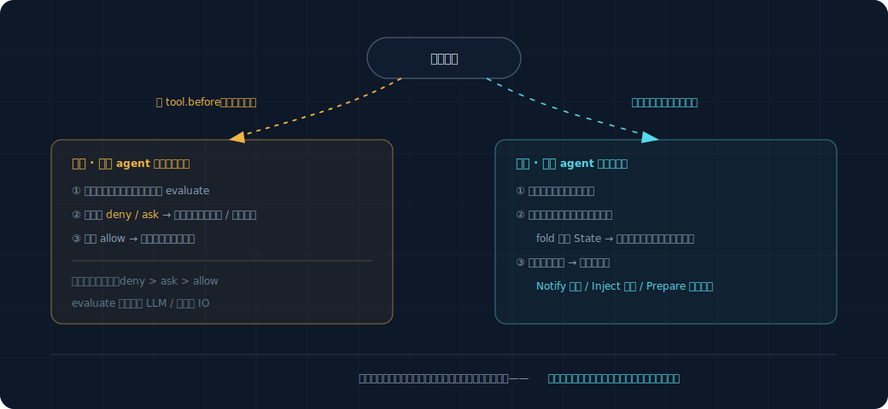

# How Rules Are Written and How They Run

The overview explained what a rule (Policy) is and that there are two kinds. This doc covers the details: what a complete rule looks like, what's distinctive about each of the two kinds (the blocking ones / the watching ones), and how the framework invokes them. Read `overview.md` and `events-and-state.md` before this one.

## 1. What a Complete Rule Looks Like

A rule is just a Python class, and the framework recognizes these few things:

```python
class Policy:
    on: set[str]          # which kinds of events I watch
    lane: str             # am I a "blocker" (gate) or a "watcher" (observer)
    cooldown_s: float     # after I act, how long before I'm allowed to act again (anti-spam)

    def evaluate(self, event, state) -> Action | None:
        # an event arrives; take a look at the current event + current state, decide whether to act or stay out of it
        # to act, return an Action; to stay out, return None
        ...
```

That's the four things. `on` and `lane` are declarations (what I care about, which kind I am), `evaluate` is the logic (what to do when something arrives), and `cooldown_s` is a simple anti-spam knob.

At startup the framework **registers** all rules, building an index keyed by `on`: "when a `tool.before` event arrives, which rules should be woken up." When an event arrives, the framework looks it up in the index, wakes only the rules that care about it, and calls `evaluate` on each one.

## 2. The Blocking Ones (gate)

**Stop something before it happens.** They watch only one kind of event: `tool.before` (a tool is about to execute). Because "blocking" only makes sense before the thing has happened — blocking after the tool has already run is pointless.

```python
class DangerousCommandGuard:
    on = {"tool.before"}
    lane = "gate"
    cooldown_s = 0

    def evaluate(self, event, state):
        if event.payload["tool"] != "bash":
            return None
        command = event.payload["command"]
        if "rm -rf" in command or "git push --force" in command:
            return Gate.ask(f"This command is risky: {command}, confirm execution?")
        return None
```

A blocking rule can only return three actions: `Gate.allow()` (let it through), `Gate.deny(reason)` (block it outright), and `Gate.ask(question)` (ask the user, only let it through if the user says OK).

### Two Things to Keep in Mind for Blocking Rules

**One, it must be fast.** It sits in the middle of the path of tool execution, and the agent is waiting on its verdict before it can continue. If it's slow, the agent stalls. So a blocking rule's `evaluate` **must not do slow work**: no calling the LLM, no network reads, no reading the kind of complex state that requires on-the-spot inference. Just look at the event in front of you + simple ready-at-hand state, and give an answer immediately. `DangerousCommandGuard` only glances at the command string — very fast.

**Two, it applies to subtasks as well.** OpenProgram currently sets "no approval" for subagents (`permission_mode=bypass`), meaning tools inside subtasks don't go through the approval flow. But **blocking rules must bypass this setting and block anyway** — otherwise a dangerous command could slip through simply by being stuffed into a subtask. This is an existing hole that needs to be plugged.

## 3. The Watching Ones (observer)

**Watch after something happens, think it over slowly, don't hold up the agent.** They watch all kinds of events — a tool finished, the model finished replying, a file changed.

```python
class StuckToolWatcher:
    on = {"tool.after"}
    lane = "observer"
    cooldown_s = 300                 # already reminded once, don't bring up the same thing again within 5 minutes

    def evaluate(self, event, state):
        tool = event.payload["tool"]
        if state.tool_failure_count[tool] >= 3:
            return Notify(f"{tool} has failed repeatedly, might be stuck", severity="info")
        return None
```

A watching rule can return these actions:

| Action | What it does |
|---|---|
| `Notify(message)` | Give the user a non-intrusive reminder (doesn't interrupt the agent's work) |
| `Inject(text)` | Quietly slip a hint to the model before its next round of thinking (doesn't disturb the user) |
| `Prepare(task)` | Spin up a read-only background task to do some homework first, and once it has a conclusion, decide whether to Notify |

### What to Keep in Mind for Watching Rules: It Can Be Slow, but It Mustn't Slow the Agent Down

A watching rule can do slow work (even call the LLM to judge), because it isn't blocking the path. But there's a reverse requirement: **no matter how slow it is, it must not slow the agent down.** The way this works is — the agent does its thing and doesn't wait on it; the watching rule processes events on a separate, independent lane alongside. The event stream is recorded first, the watching lane consumes it slowly, and the agent side is entirely unaware.

`Prepare` is the most interesting move among the watching ones: "do your homework before you speak up." Take "tests weren't added," for example: rather than reminding the moment you see it (easy to get false positives), it's better to spin up a read-only background task, let it actually go look at whether this change really lacks tests, and whether the gap is worth raising, and only Notify once it has a reliable conclusion. This background task is read-only (not allowed to modify files) and runs on the existing background-task mechanism.

## 4. How the Framework Strings This All Together



## 5. A Few Simple Fallbacks (Good Enough for This Version)

- **Anti-spam**: each rule has a `cooldown_s`; after acting, it won't act on the same situation again within that window. The simplest dedup is enough.
- **Multiple rules hitting the same tool**: when blocking, if multiple rules act on the same `tool.before`, take the strictest — `deny` > `ask` > `allow`.
- **A rule erroring out**: if a rule's `evaluate` throws an exception, the framework catches it, logs it, and treats it as returning None (don't let one rule's bug crash the whole agent).

More complex interruption budgets, automatic circuit-breaking, and fine-grained fallback strategies on error — this version **doesn't do** them; they're archived in `_research_archive/`. For now we lean on `cooldown_s` as the single knob, which is enough to get the framework running and to add rules.

## 6. What It Takes to Add a New Rule

This is what you'll be doing most often going forward, so just remember it:

1. Write a new class, defining `on` (which kind of event to watch), `lane` (blocking or watching), and `cooldown_s`.
2. Write `evaluate`: look at the event + state, return an action or None.
3. Register it with the framework.

No need to touch the framework core, no need to touch the event stream, fold, or persistence logic. The framework core stays stable, and capabilities grow by adding rules — this is exactly the point of "building a framework" rather than "hanging a few hooks."
