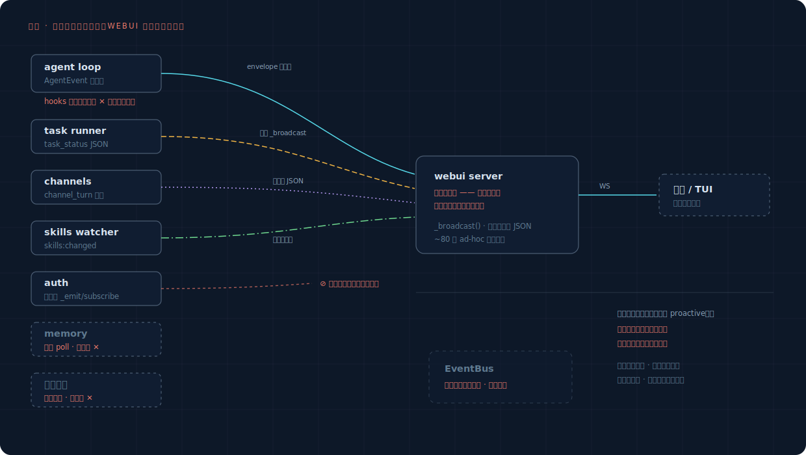
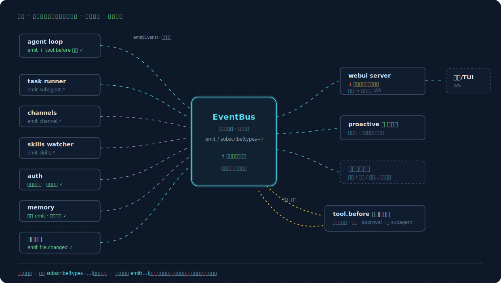

# Framework Evolution: Current State → Target

With the event layer in place (`event-layer.md`), how does the whole framework change? Three things: what it looks like today, what it should look like, and how to get there.

## 1. Current State: webui Forced to Act as the Signal Hub

The root cause in one sentence: **almost every signal exists for the sole purpose of "letting the frontend see it," so they're all hardwired into the webui server's `_broadcast`**—task_status, channel_turn, and skills:changed each connect to it directly with their own JSON; agent events reach it through the dispatcher callback chain. webui is a UI component, yet it has become the de facto hub. The rest is worse: auth's events are done right but almost nobody subscribes to them, memory and file changes emit no signal at all, hooks' return values are discarded (you can observe but can't intercept), and the EventBus sits idle.

The result: to add a new consumer (proactive is the first), you have to integrate with five or six separate mechanisms, and for some moments there's simply no signal to hook into.

## 2. Target: the Bus as the Hub, Three Roles Change

| Role change | Who | How it changes |
|---|---|---|
| **↑ Promoted** | EventBus | From idle dead code to the sole hub (process-level singleton, unified Event format, subscribe by type) |
| **↓ Demoted** | webui server | From the forced hub down to an ordinary subscriber: subscribe to the bus → forward to the frontend WS |
| **＋ Entering** | proactive and any future feature | Just another subscriber, plugging in with one line of `subscribe(types=…)` |

Plus one new capability: the `tool.before` synchronous interrogation point—the only interception site in the whole framework (reuses `_approval`, takes effect for subagents). Every other interaction is asynchronous observation.

## 3. How Each Subsystem Changes

| Subsystem | Now | Future | Change size |
|---|---|---|---|
| agent loop | AgentEvent internal stream; hooks' return values discarded | Also emit to the bus at key points; tool.before adds synchronous interrogation | Small |
| dispatcher | on_event callback chain reaching webui directly | Kept (transition period), and additionally emits `user.prompt_submitted` etc. | Small |
| task runner | Connects directly to `_broadcast` task_status | Emits `subagent.*`; frontend broadcast handled by webui subscribing and forwarding | Small |
| auth | Its own `_emit/subscribe` (the standard) | **Itself unchanged**, with a bridge that translates AuthEvent into Event and emits it onto the bus | Minimal |
| context | on_event callback | Emits `context.*` alongside in the callback | Minimal |
| channels | broadcast_channel_turn direct connection | Emits `channel.*`; direct connection kept during transition | Small |
| memory | Periodic poll, no signal | Emits at processing start/end, wrapping the "periodic" into events | Minimal |
| file changes | Silently backs up, no signal | Emits `file.changed` at `backup_for_current_turn` | Minimal |
| plugin hooks | observe-only, 6 fire points | Internally unified onto the bus; hooks kept as a plugin API (wrapped in a subscription layer) or gradually retired | Decision point |
| webui server | Hub | Subscriber; old direct connections retired source by source | Medium |
| EventBus | Idle | Upgraded (type subscription + singleton) and enabled | Core |

## 4. How to Migrate: Old and New in Parallel, Switch Source by Source

No big-bang rewrite. The bus first runs **in parallel** with the existing paths, with each step independently verifiable and reversible:

1. ✅ **Bus enabled + Class A sources connected** (landed, 2026-06-13)—purely additive, zero behavior change, old paths run as-is. Verified: a real turn produces the full sequence `user.prompt_submitted → model.response_started → tool.before → tool.after → turn.ended`, with metadata automatically carrying session/turn.
2. ✅ **Fill two holes** (landed, 2026-06-13)—`file.changed` (after write/edit/apply_patch succeeds, live-verified) and the `tool.before` synchronous interrogation point (`tool_gate.py`, end-to-end tests prove the tool truly doesn't execute, the reason is returned to the model, and bypass can't turn it off).
3. ✅ **Class B source bridging** (landed, 2026-06-13)—auth goes through a real bridge (`event_bridges.py`, installed at worker startup), while context / channels / memory / webui watcher tap directly at the source. `skills.changed` is live-verified.
4. ✅ **webui switchover** (landed, 2026-06-13)—5 external sources (task runner / sub_agent / worktree / functions watcher / channels) no longer import webui; they instead emit `ws.frame` events, and webui subscribes and broadcasts them as-is. Frame type/fields are byte-for-byte unchanged, frontend untouched. With this, webui is demoted from signal hub to bus subscriber. Live-verified: spawn_task's task_status all four states reach the frontend over the new path.
5. ⏳ **New consumers entering**—proactive and others, which from now on face only the bus.

Steps 1–3 are all additive; step 4 touches the old paths, using a pass-through envelope (frames byte-for-byte unchanged) instead of shadow comparison, so the frontend switches over seamlessly.

## 5. What Is Deliberately Left Untouched

What changes and what doesn't are equally important. These are **not** in scope for this evolution:

- The dispatcher's seven-stage turn orchestration and the external signature of `process_user_turn`
- session git DAG storage and contextgit
- TaskRunner's thread-pool model
- The `ApprovalRegistry` approval mechanism (reused, not rewritten)
- AuthStore itself (bridged, not touched)
- The frontend WS protocol (transparent to the frontend once webui becomes a subscriber)

> For specific wiring points (file:line) and step-by-step verification, see the [implementation plan](../../plans/proactive-implementation.md).
> Visual version: [`framework-evolution.html`](framework-evolution.html).
