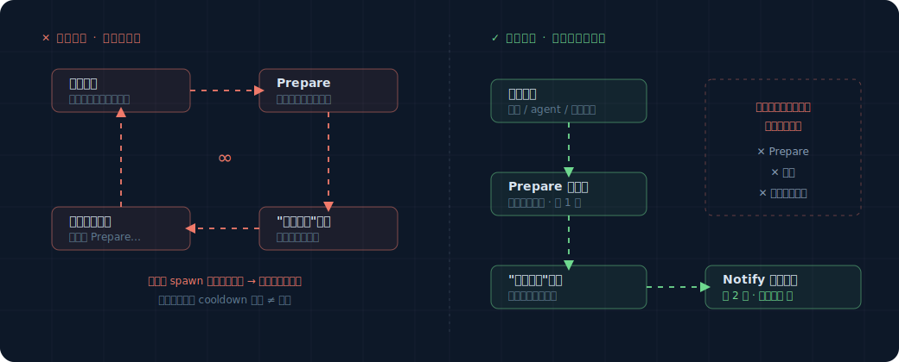

# 框架自己要守的底线

规则是你写的、会变；但有几条底线是**框架内核必须永远守住**的，不管谁写什么规则都不能破。
这版只有两条，都很直观。读这篇前先读完 `overview.md`。

（注：研究/生产级还有几条关于对抗安全、防篡改的底线，这版砍掉了，归档在
`_research_archive/threat-model.md`，以后做安全加固再取回。）

## 底线一：框架不能自己触发自己，绕成死循环

这是最重要的一条，不守住会出大事。

### 问题长什么样

回忆一下：框架自己出手时，也会产生事件（overview 概念 1 提过，`origin=proactive`）。
比如一条旁观规则起了个 `Prepare` 后台任务，这个任务做完会产生一条"准备好了"的事件。

如果不管这条事件的来历，它又被某条规则看到、又触发一个 `Prepare`、又产生一条"准备好了"……



每个 `Prepare` 都是真金白银的后台任务（可能调 LLM）。绕成死循环 = 无限烧钱、刷屏。

### 怎么守住

**框架自己产生的事件（`origin=proactive`），不能再触发"会产生新事件"或"会打扰用户"的动作。**

具体说，规定一个很短的链条，只允许走一次：

```
正常事件（用户/agent/工具引起）
   → 旁观规则可以起一个 Prepare（做功课）
   → Prepare 完成产生"准备好了"事件
   → 这条事件只允许干一件事：决定要不要 Notify（提醒用户）
   → 到此为止，不许再起 Prepare、不许再注入
```

实现上很简单：每条事件带个标记，记着"我这条因果链是不是框架自己起的头"。框架在让规则出手前
先看这个标记——是框架自己起的头，就只允许它走到"提醒一次"为止，不许再往下繁殖。

```python
def 允许出手(event, 动作):
    if event.是框架自己引起的:
        # 框架自己的链条上，只允许提醒用户一次，不许再起后台任务/再注入
        return 动作 是 Notify 且 链条没超过一跳
    return True   # 正常事件，随便出手
```

这条底线是**框架级的**，规则关不掉、绕不过。它是地基的一部分。

## 底线二：挡路规则不会被"用烦了"而自动关掉

这条是为以后留的余地，现在先讲清楚原则。

将来你可能会加"用户老是忽略某个提醒，就自动少提醒"这类逻辑（自动消音）。如果加了，**必须把
挡路规则排除在外**——安全护栏（比如拦危险命令）不能因为"被拒绝多了"就自动关掉。

想象一下反例：有人（或被注入的恶意内容）诱导 agent 连续触发危险命令确认、连续点拒绝，如果
这能让护栏"以为自己没用"而自动消音，那下一条真正危险的命令就没人拦了。

所以原则是：**自动消音只对"旁观的提醒"生效，永远不碰"挡路的护栏"。** 这版还没做自动消音
（只有简单的 `cooldown_s`），但先把这条原则写下来，将来加消音时照着办。

## 小结

| 底线 | 一句话 | 为什么 |
|---|---|---|
| 不自我触发死循环 | 框架自己产生的事件，最多走到"提醒一次"，不许再繁殖 | 否则无限烧钱、刷屏 |
| 护栏不被自动关掉 | 将来的自动消音只对提醒生效，不碰挡路护栏 | 否则安全护栏会被刷拒绝刷到失效 |

这两条由框架内核保证，写规则的人不用操心、也改不动它们。
