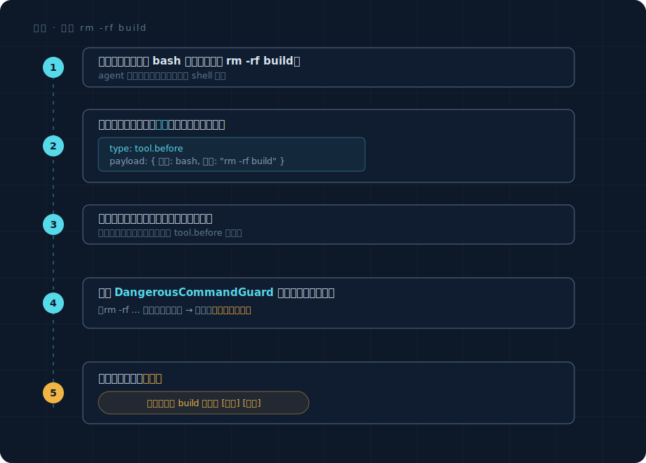
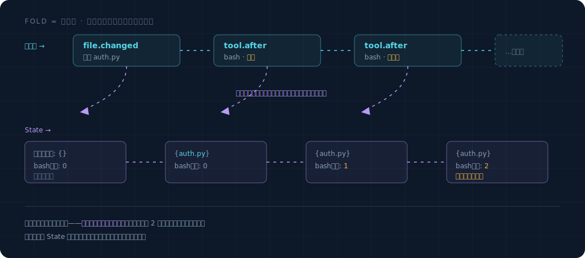
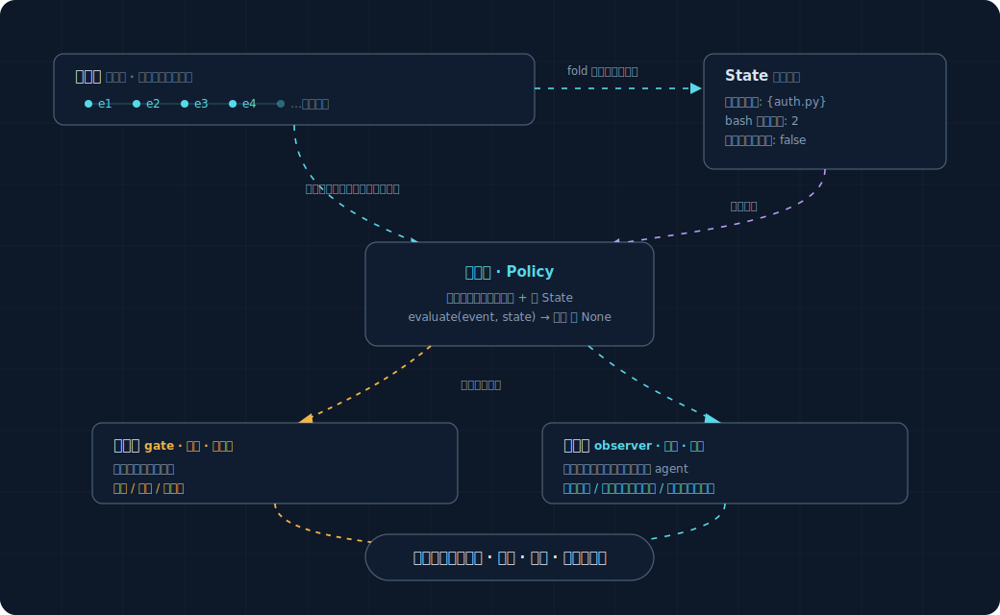

# Overview: Walk Through One Scenario End to End

No jargon piled up — let's first see how one thing happens from start to finish. Once you've read this page, you'll understand what the whole layer is for.

## Scenario: the model wants to run `rm -rf build`, and the framework stops it

The agent is helping the user clean up a project. At some point, the model decides to run the shell command `rm -rf build`.
We want the framework to take a look **before** this command actually runs, notice that it's dangerous, stop it, and ask the user.

Here's how the whole process goes:



That's all there is to it. Now let's go through the few concepts that showed up in these five steps, one by one.

## Concept 1: Event

**An event = a record that "something just happened."** That thing with curly braces in step ② above is an event.

While the agent works, events are produced everywhere:

| What happened | Event |
|---|---|
| The user sent a message | `user.prompt_submitted` |
| The model started / finished its reply | `model.response_started` / `model.response_completed` |
| A tool is about to run | `tool.before` ← step ② is this one |
| A tool finished running | `tool.after` |
| A file was changed | `file.changed` |

Each event is a small data packet that records "what type, when, who did it, and what the relevant content is."
What an event looks like and what fields it has is covered in detail in the next page, `events-and-state.md`.

**Key mental model**: think of events as an ever-growing ledger — append-only, never altered. Everything that happens in the system leaves an entry on this ledger. Your proactive rules don't watch the agent's internals directly; they watch this ledger.

## Concept 2: Policy

**A policy = a piece of logic that "watches a certain kind of event, and when one arrives, decides whether to step in."** That `DangerousCommandGuard` in step ④ is a policy.

A policy is an ordinary Python class that states three things:

```python
class DangerousCommandGuard:
    # 1. Which kind of event am I watching?
    on = {"tool.before"}

    # 2. When an event arrives, how do I decide?
    def evaluate(self, event):
        command = event.payload["command"]
        if "rm -rf" in command:
            return block("This command will delete files; confirm first")  # step in
        return None                                                        # don't step in, let it through
```

`on` says "I only care about events where a tool is about to run," so the framework only wakes it up when that kind of event occurs.
`evaluate` receives the event, takes a look, and either returns an "action" (steps in) or returns `None` (does nothing).

The whole framework is just a pile of rules like this. **Adding a new proactive capability = writing a new Policy class.** Later, if you want the framework to "remind when no tests were written" or "intervene when the model gets stuck," each is just another class like this — no need to touch the framework's core.

## Concept 3: Two kinds of policies — "blockers" and "observers"

Not all stepping-in is the same. There are two fundamentally different moments to step in, and the framework splits policies into two kinds:

| | Blocker (gate) | Observer |
|---|---|---|
| Where it steps in | **Before** something happens, to block it | **After** something happens, watching |
| Example | "This command is dangerous, don't run it yet" | "You changed core code but didn't add tests — a reminder" |
| Must it be fast? | **Yes.** It stands in the middle of the path; the agent is waiting for it to give the green light, and every millisecond it's slow, the agent stalls a millisecond | No. It thinks slowly on the side and speaks up once it's done, without holding up the agent |
| How it steps in | Block / allow / ask the user to confirm | Give a reminder / quietly do some prep in the background |

Why must there be two kinds — why not merge them into one? Because **their timing requirements are opposite**: blockers must be fast (they can't make the agent wait), while observers can be slow (slowness is fine, but they must not slow the agent down in return). Mash the two together and either the observer slows the agent down, or the blocker sacrifices capability for speed. Keep them separate, each minding its own business, neither dragging on the other.

`DangerousCommandGuard` is a blocker. "Remind when no tests were added" is an observer. How rules are written and what each kind cares about is covered in detail in `execution-model.md`.

## Concept 4: How to step in (Action)

When a policy's `evaluate` decides to step in, it doesn't return just anything — it returns one of a few fixed "actions":

| Action | What it does | Who uses it |
|---|---|---|
| **Block / allow / ask the user** | Stop a tool that's about to run | Blocker policies |
| **Remind the user** | Pop up a non-intrusive hint | Observer policies |
| **Inject a line into the model** | Quietly slip a hint in before the model's next round of thinking (without disturbing the user) | Observer policies |
| **Quietly prep in the background** | Spin up a read-only background task that does the homework first, and only decides whether to remind once it has a conclusion | Observer policies |

A policy is only responsible for "deciding to step in + choosing which action," while **how it actually lands (how to pop up, how to block, how to inject) is the framework's job.** Policies don't touch this grunt work, so they can be written short and focused.

## Concept 5: State — why this layer is worth building

By now you might be thinking: isn't this just "inserting a check before a tool runs"? Can't I just hang a hook and be done with it — why a whole framework?

Right — **if every rule only looks at the one thing in front of it, a hook really is enough, and you don't need this framework.** Where this framework truly earns its keep only shows up when you want to write a rule like this:

> "The model has called the same tool and failed **three times in a row** — remind the user it might be stuck."

Notice "three times in a row" — to judge this, the rule has to **remember what happened before**; it's not about glancing at one moment.

A hook makes this awkward: you'd have to store a counter somewhere yourself, manually increment it on each failure, manually reset it on success, and also manage multiple sessions so they don't cross-talk. Every time you add a rule that "needs memory," you hand-roll another container like this, and after three or five of them it's a mess.

Event-driven design solves this naturally: **since every thing is recorded as an event (that ledger), the "current situation" is just the result of accumulating the ledger from the beginning.** Want to know "how many times this tool failed recently"? Just count the failure events for this tool on the ledger — you don't maintain a counter by hand; it's a natural byproduct of the events.

This act of "accumulating a long string of events into the current situation" has a name: **fold** (also called reduce). Don't be scared by the word — it's just rolling a snowball: start from blank, roll each event past it, and the snowball (state) grows bigger and bigger; when you're done rolling, that's "the current situation."



This accumulated "current situation" is called **State**. Besides looking at the current event, a policy's `evaluate` can also read this State:

```python
def evaluate(self, event, state):
    if state.consecutive_failures_of_a_tool >= 3:
        return remind("This tool has failed repeatedly; it might be stuck")
```

How State is accumulated from events, and why it's designed this way, is covered in detail in `events-and-state.md` — that's the foundation of the whole layer.

## Tying the five concepts together



That's all of it. The rest of the docs each go into detail on one block of this diagram:
- `events-and-state.md`: what an event looks like, how State is folded out
- `execution-model.md`: how rules are written, the considerations for the two kinds of rules
- `policies-mvp.md`: three real rules as templates
- `invariants.md`: the bottom lines the framework itself must hold (don't loop into a deadlock)

## What this version deliberately leaves out

To keep the foundation clean, the following have been **cut** (archived in `_research_archive/`; if you want them later, they can be added without rework):

- Persisting events to disk with crash-recovery and tamper resistance — research/production-grade reliability fit-out.
- Offline replay (using historical sessions to validate a new rule's false-positive rate) — only needed for writing papers.
- Adversarial security (preventing malicious injection, redacting secrets) — not needed under the simplification of treating the adversary as a well-meaning user.
- Complex interruption budgets and automatic circuit breaking — for now, get by with the simplest cooldown (the same reminder only comes back after a while).

This version has just one goal: **an event-driven foundation that runs, that you can keep adding rules to, and whose rules can remember past events.**
