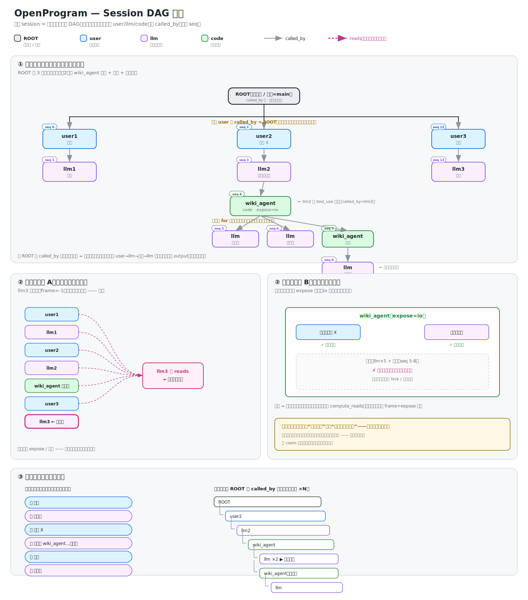

# Session DAG Model — Data Structure + Context Retrieval + The Two Merges (Final)

Status: **decided (final model, implementation begins)** · Created: 2026-06-19 · Finalized: 2026-06-20

> This document is the **authoritative design** for the agent execution record: (1) data structure (what the single graph stores), (2) how context is retrieved from the graph, (3) how to draw it, (4) how the two existing call paths (chat / function) merge into one.
> For the rationale behind the model choice, see `docs/research/execution-trace-model-selection.md` (the span concept + what's novel).
> For the call flow diagram, see `agent-call-flow.svg` (the full unified runtime flow, including retry/approval/nesting).
>
> **Visualization**: `session-dag.svg` ((1) a real session as a single graph, (2) context retrieval: chat accumulation vs function pop, (3) the two views).



## 1. Final Conclusion (a Single Graph)

The entire session = **one single DAG with a unique root** (not split into multiple independent traces, and no dangling turns).

- **Root node (session root)**: one root per session, representing "this session / this user" (it is main). **The `caller` of every top-level user node points to it** — this is the aggregation point that connects multiple turns into a single graph. Without it, the turns would be isolated and split into separate graphs.
- **Node (span)**: one of three roles — user / llm / code. A single data structure; an LLM call is always the same kind of llm node, never split by whether it was "triggered by the user" or "triggered by a function". (The root node itself can be seen as a special session node, with no input/output.)
- **Two edges** (see §2 · Edges):
  - `caller` (who invoked me) — the sub-call edge. An LLM calling a tool, a function calling a sub-function; the caller of a top-level node is ROOT.
  - `predecessor` (who came before me in the chat) — the conversation-chain edge. Forks/branches are distinguished by it.
  - Both are directed and acyclic. **The previous design conflated these two into a single `called_by`, which was wrong** (see §2).
- **Shared seq**: one monotonically increasing seq across the whole graph (global temporal order).
- **Multiple top-level turns**: the `caller` of each turn's user is the **root** (hung under ROOT, siblings); its `predecessor` points to the **previous turn's reply** (conversation order). Branches are distinguished by predecessor, time is ordered by seq.
- **Nesting within a turn**: a function call is a `caller` subtree.
- **Context**: on this **single graph**, retrieved by `seq + frame + expose` (`render_context`).

### Why It Must Be a Single Graph With a Root (Not Independent Trace + Session)

The industry (LangSmith/Datadog) splits each request into an independent trace and groups them with a session tag — because they do **post-hoc observation** and never read context back. We can't do that: **our `render_context` retrieves history relying on "the same graph, the same seq".** Once split into independent graphs, the llm in turn N can no longer see the earlier turns (cross-graph retrieval fails), and top-level conversational continuity breaks.

To make the turns truly form "a single graph" without dangling, we need a **root** to hang each turn onto (each turn's user has `caller=root`). Otherwise each top-level user has an empty `caller` = multiple isolated roots = multiple graphs, broken again. **A root + shared seq is the hard constraint that makes "a single graph".**

### Key Distinction: Hanging Under the Same Root ≠ Stringing Into a Chain

These two things were previously conflated; they are in fact orthogonal:

Distinguish the two concepts (each edge handles one):

| | Meaning | Which edge |
|---|---|---|
| **Hung under the same root** | Each turn's user has `caller=ROOT`; turns are siblings under the root (no dangling) | `caller` |
| **Conversation order** | Turn 2's user `predecessor` points to turn 1's reply (chat ordering) | `predecessor` |

`caller` makes all top-level nodes converge onto ROOT (a single graph); `predecessor` expresses chat ordering and
distinguishes branches. The two are orthogonal, each uses its own edge, and they don't interfere.

```
One graph (shared seq, unique root). Each node has two edges: caller(C) / predecessor(P)
ROOT          session root
├ user1  seq0  C=ROOT  P=empty    ┐ the caller of top-level users is always ROOT (hung on root)
│  └ llm1 seq1 C=user1 P=user1    │ conversation order is chained by predecessor:
├ user2  seq2  C=ROOT  P=llm1     │   user2.P=llm1 (follows turn 1's reply)
│  └ llm2 seq3 C=user2 P=user2    │   user3.P=llm2
├ user3  seq4  C=ROOT  P=llm2     ┘
│  └ llm3 seq5 C=user3 P=user3
   render_context(frame=-1) → take all nodes with seq<5 → both prior turns visible ✓
```

> Note: following `caller` from ROOT you can reach any node (a single connected graph); following `predecessor` you can
> reconstruct the chat order and distinguish branches. A fork = the same predecessor having multiple children.

## 2. Node Structure

```
Node(span):
  id           unique identifier
  seq          monotonically increasing integer, global temporal order (the sole sort key)
  created_at   wall-clock (for humans, not for sorting)

  role         "user" | "llm" | "code"   ← only determines rendering, doesn't split the essence
  name         model id / function name / user name

  input        prompt / function args / None
  output       reply / return value / user text
  status       running | success | error | cancelled

  caller       who invoked me (sub-call parent id). Top-level node = ROOT.
  predecessor  who came before me in the chat (conversation-chain parent id). First user is empty.
  attributes   metadata (token/model/source/expose…); LLM leaf fields align with gen_ai.*
  reads        which nodes this LLM call read (references, used to render context; not a structural edge)
```

### Edges: Two of Them, Don't Conflate Into One Again

A node has **two kinds of parent relationship**, both previously named `called_by` (one at the node's top level, one stuffed into metadata). The name clash → the code repeatedly couldn't tell which one it was reading → the root cause of a string of branching/rendering bugs. **They are now split into two explicit fields**:

| Edge | Field | Meaning | Who has it |
|---|---|---|---|
| **Sub-call edge** | `caller` | who invoked me to execute | all nodes (top-level = ROOT) |
| **Conversation-chain edge** | `predecessor` | who I follow in chat order | user / llm (first user is empty) |

Why both are needed: **forks (branches) must be distinguished by `predecessor`**. When the user retries a message, two children sprout at the same position; seq (time) alone can't tell "which child follows which branch line", so there must be an explicit "who I follow" edge. A single-edge model (only caller + seq) cannot get around branching.

> For the naming rationale / refactor landing, see `docs/design/runtime/edge-field-rename.md`.

### The Two Edges for the Three Roles

| role | caller (sub-call parent) | predecessor (conversation-chain parent) | input | output |
|---|---|---|---|---|
| (root) | empty (the only true root) | empty | None | None (session container) |
| user | **ROOT** | the previous turn's llm reply (first one is empty) | None | user text |
| llm | the node that triggered it (top-level = this turn's user; inside a function = that code node) | this turn's user | system (optional) | model reply |
| code | the node that called it (model tool_use → that llm; manual call = ROOT) | current branch head (for manual calls) | function args | return value |

## 3. Loops Are Not Nodes

for/while loops **occupy no node** (the execution trace doesn't record code structure). A loop running N times = N siblings under the same parent (ordered by seq). When visualizing, many repeats are folded into ×N (purely display; the data is still N nodes).

- Top-level multiple turns (the chat while) = N peer-level user/llm at the top level
- A for inside a function = N children under that code node

## 4. Context Retrieval (Implemented, Reused)

`render_context(graph, head_seq, frame_entry_seq, render_range)` — selects reads on the **single graph**:

- **Top-level chat** (frame=-1): all nodes are in-frame, **fully visible** (accumulation) → all prior turns of the conversation are fed in.
- **Function within a turn** (frame = that code node's seq): pre-frame (history up to the root) + in-frame (the function's own internal progress) are visible; the internals of other functions are popped per `expose` (io by default exposes only input/output).

**Top-level = add everything (no hierarchical selection, it should be flat); within a turn = frame+expose hierarchical selection.** The same render_context, each layer takes what it needs. This mechanism is **already supported in the current state**; no change needed.

## 5. The Complete Node System

### Node Types

| Scenario | Node | role | caller | DAG shape |
|---|---|---|---|---|
| Session root | ROOT | user | empty | diamond |
| User sends a message | user | user | ROOT | circle |
| LLM reply | llm | llm | user | triangle |
| LLM calls a tool | code | code | llm | square |
| User manually calls a function | code | code | ROOT | square |
| Function internally calls an LLM | llm | llm | code | triangle |
| Function internally calls a sub-function | code | code | code | square |

All nodes have only three roles: user, llm, code. Two edges: `caller` (sub-call) + `predecessor` (conversation chain). ROOT is the unique root.

**Function-call node principle**: whatever function was called, that function is the one and only node in the DAG. Absolutely no anchor, placeholder, or any auxiliary node (the three data flows — persistence/real-time/refresh — are in §6).

### Branches (fork)

A branch = an alternative possibility at the same position (a parallel world). **A branch node's `predecessor` is exactly the same as the node it replaces** — the same predecessor now having multiple children is a fork.

| Scenario | Replaced node | Branch node | Shared predecessor |
|---|---|---|---|
| User resends a message | user2 (predecessor=llm1) | user2' (predecessor=llm1) | llm1 |
| LLM retry | llm1 (predecessor=user1) | llm1' (predecessor=user1) | user1 |
| Tool retry | code search (caller=llm1) | code search' (caller=llm1) | llm1 (caller) |

No special handling needed — a branch node is just an ordinary node sharing the same `predecessor` as the replaced node (tool retry shares `caller`). Which one is currently active is tracked by the HEAD pointer. In the DAG graph, branches are connected to their peer siblings with dashed lines, offset to the right into a separate column.

### Viewport Layout Rules

The DAG viewport (the minimap in the right-hand panel) renders nodes in a tree-indent fashion. Core rules:

1. **tier (horizontal column position) is fixed by role**, not derived by recursively walking the caller chain:
   - ROOT: tier=0
   - user: tier=1
   - llm/assistant: tier=2
   - tool/code (direct sub-call): tier=3
   - deeper sub-calls: tier=caller's tier + 1

2. **depth (vertical row position) is ordered by seq DFS**, with fork siblings aligned to the same row.

3. **lane (branch column)**: the trunk is lane=0, fork siblings each occupy their own lane.

4. **Edges**:
   - trunk user nodes draw their edge from the ROOT column (the tier=0 vertical trunk + the tier=1 horizontal branch)
   - llm draws its edge from user (tier=1 vertical + tier=2 horizontal)
   - tool draws its edge from llm (tier=2 vertical + tier=3 horizontal)
   - fork siblings are connected to each other with an animated dashed line
   - within a fork branch, edges are drawn normally parent→child

5. **Collapsing** only collects sub-calls (the caller relationship), not the subsequent turns on the conversation chain.

```
Normal two-turn conversation:
◇ ROOT (tier=0)
├─ ○ user1 (tier=1)
│  └─ △ llm1 (tier=2)
├─ ○ user2 (tier=1)    ← back to the same column
│  └─ △ llm2 (tier=2)

With fork/retry:
◇ ROOT
├─ ○ user1          ┈┈┈  ○ user1' (animated dashed connection)
│  └─ △ llm1              └─ △ llm1'
├─ ○ user2
│  └─ △ llm2

With a tool call:
◇ ROOT
├─ ○ user1
│  └─ △ llm1
│     └─ ■ code(web_search) (tier=3)

With a manual function call:
◇ ROOT
├─ ○ user1
│  └─ △ llm1
├─ ■ gui_agent (tier=1, hung on ROOT)
│  ├─ ■ gui_step (tier=2)
│  │  └─ △ llm(internal) (tier=3)
│  └─ ■ conclusion (tier=2)
│     └─ △ llm(internal) (tier=3)
├─ ○ user2
│  └─ △ llm2
```

### Two Views (Same Data)

| View | How it traverses |
|---|---|
| Chat stream | top-level user + its llm, ordered by seq, with function nesting folded |
| Call tree | fully expanded along caller; loop siblings folded ×N |

## 6. Function-Call Persistence (Three Data Flows)

> This section is merged from the deleted `fn-call-persist-redesign.md` (its content is folded in here). It grounds §5's "Function-call node principle" into implementation: how a single function call travels along the three data flows ("persistence / real-time WS / refresh load", respectively) and who is the single source of truth.

### The Single Source of Truth: the code-node subtree in SessionStore

In storage, a single function call has **only** the code node (and its internal llm/code child nodes) — no anchor, no placeholder, no `display=runtime` auxiliary rows. All three data flows are projections of this code subtree:

- **Persistence state (authoritative)**: the `@agentic_function` decorator, on execution return, writes this call as a code node (`openprogram/agentic_programming/function.py`), whose `caller` points to the real caller. Child nodes (LLMs / sub-functions called inside the function) have their `caller` point to it. This subtree is the single source of truth.
- **Real-time state (projection)**: during function execution, `live_progress` (`openprogram/webui/_exec_dag.py`) rebuilds the subtree from SessionStore every ~1.2s using `build_exec_dag`, and broadcasts a `tree_update` frame to drive the front-end card filling. **The real-time state also reads SessionStore, not a separate in-memory dataset.** When the function finishes it flushes the final state once (`status=completed` + final output), and the same front-end card flips to complete.
- **Refresh state (projection)**: on page refresh, `handle_load_session` (`openprogram/webui/ws_actions/session.py`) + `conv-mapper` (front-end) rebuild the same card from SessionStore's code node. **The refresh state must produce the same card as the real-time state** (same id, same shape, same output), only missing the intermediate animation.

Ruling: **SessionStore's code subtree is the single source of truth; both the real-time WS frame and the refresh load are its projections.** All three must produce a consistent view of the same call (one card, one square node, consistent caller).

### caller Is Decided by the Caller (Two Kinds of code Node)

| Trigger | code node caller | How it's decided |
|---|---|---|
| User manually calls a function (fn-form / Functions panel) | `ROOT` | no LLM reply as parent; hung directly on ROOT |
| LLM calls a function (tool_use) | the id of that LLM reply node | the model reply triggered it |
| Function internally calls a sub-function / calls an LLM | the outer code node id | `_call_id` ContextVar propagates the current frame |

In implementation, the decorator reads the `_call_id` ContextVar to decide `caller`; the call entry point (the wrapper in `runtime_attach.py`) sets this ContextVar to the real caller before execution (user manual call = `"ROOT"`, LLM call = LLM reply id), and resets it after execution.

### head_id Never Dangles

After a function call completes, the session `head_id` advances to **the real code node id**, never pointing to some placeholder/anchor id that no longer exists. Both the user-manual-call path (`dispatch_forced_tool_call`) and the LLM-call path (`process_user_turn` finalize) must advance head to the code node. Otherwise HEAD dangles → `linear_history` can't reach it → refresh renders an empty Welcome.

### Subprocess Execution (spawn, not fork)

The `@agentic_function` tool body runs in a separate subprocess (`openprogram/agent/process_runner.py`), so the stop button can SIGKILL the entire process group for millisecond-level abort. **The subprocess is `spawn` (a fresh interpreter), not `fork`** — because the parent worker has already loaded PyTorch/libomp, and forking would SIGSEGV on the child's first BLAS call. What spawn means:

- The subprocess **re-imports the on-disk code** (it doesn't inherit the parent's in-memory module objects), so after a code change the subprocess always uses the new code.
- But the parent worker is a **long-lived process**: it first runs the outer wrapper + starts the `live_progress` poller, which use the old module objects in the parent worker's memory. **You must run `openprogram worker restart` so the parent worker also re-imports the new code**, otherwise the change "doesn't take effect".
- The subprocess writes the code subtree using its own SessionStore; the parent worker's cache can't see it, so after execution you must `invalidate_cache` to make the parent worker read the on-disk truth.
- The `.pyc` cache invalidates by source mtime, and normally is not the cause of "the change didn't take effect"; the real culprit is not restarting the long-lived parent worker.

**Definite conclusion: after changing function-call-related code, `openprogram worker restart` is both sufficient and necessary; `PYTHONDONTWRITEBYTECODE` is not needed.**

## 7. What's Novel (the Moat — Don't Claim the Parts)

**What's claimable is the fusion**: the recorded call tree **is itself the runtime context**; each call queries it by "frame scope + per-function expose", and all nodes are retained (for fork/replay). No framework does the whole thing (LangGraph has graph retention + fork but no read-back as context / no pop; StackMemory has stack scoping but relies on search + drops summaries). **Don't separately claim "ContextVar call-stack tracking" or "graph fork" — those are common.** See the research document for details.

## 8. Implementation: The Two Merges (Stepwise, With Decision Conclusions)

Two paths currently coexist:
- **Chat**: `process_user_turn` → `engine.prepare` (`_assemble_messages`, real ToolCall/ToolResult chain + aging + attachments + compaction) → `agent_loop`; records via `insert_placeholder` / `persist_assistant_message` (writes the token columns + blocks + parent_id).
- **exec**: `_open_model_call_node` → `render_context` + `render_dag_messages` → `_close_model_call_node`.

Goal: unify into one — both go through "one graph + render_context + unified recording primitives".

### Key Decisions (must be settled before starting, verified against the code)

**Decision 0: the parent_id chain is not removed — storage has the chain, retrieval doesn't look at the chain.**
The earlier idea of "make the top level peer-level, remove the parent_id chain" would break: `get_branch` (session_store.py:742) takes a branch along parent_id, and **fork/rewind/trunk traversal (session_store.py:800) / compaction (engine.py:314) / branch deletion (branch.py:443) all depend on it**; branch.py has no forked_from, a fork is just a new node whose parent_id points to the divergence point.
**Conclusion**: the storage layer **keeps the parent_id chain** (the branch skeleton, untouched); "top-level peer-level visibility" is implemented in the **retrieval layer** — `render_context` already doesn't look at parent_id, it only goes by seq (nodes.py:586). The single graph + seq retrieval (peer-level) coexists with the parent_id branch skeleton, orthogonally. **This is exactly "the same graph ≠ stringing into a chain": storage can have a chain (for branches), retrieval doesn't look at the chain (peer-level by seq).**

**Decision 1: the two kinds of code node must be rendered differently (the first pitfall of merging).**
- The code node for a model tool_use: has a tool_call_id (currently hidden inside the synthetic id `{assistant_msg_id}_t_{tid}`, dispatcher:462) → **must** be ToolCall/ToolResult (otherwise the provider rejects an orphan tool_use).
- The code node for code directly calling an @agentic_function (function.py:132): **has no** tool_call_id → a user/assistant text pair (which is what render.py:100 currently does).
**Conclusion**: give the node an explicit `metadata.tool_call_id` (only present for model tool_use); `render_dag_messages` splits into two paths by it. ToolCall must be **placed inside the AssistantMessage.content of its owning llm node** (currently render emits each node independently, which is wrong for ToolCall — the tool node must be grouped into its llm node by called_by). Backward compat for old sessions: `{id}_t_{tid}` can still be parsed out for tid.

**Decision 2: unify the status vocabulary.** Chat uses completed/cancelled/error, exec uses success/error. Unify into one set (completed/error/cancelled), otherwise `_node_to_msg` (_msg_adapter.py:117) defaults + the streaming recovery UI will misjudge exec nodes.

**Decision 3: unified recording primitives — every llm node fills all fields, no chat/function distinction.**
`open_call_node(role, name, system, content, called_by, reads, parent_id=None, tool_call_id=None, source=None, status="running") -> id`
`close_call_node(id, output, status, usage=None, blocks=None)`

**Key: fields are treated identically for all llm nodes; there is no such thing as "chat fields" and "function fields".** Currently the two paths each fill their own and each lack the other's (chat has token/blocks/parent_id/source, lacks called_by/reads; function has called_by/reads, lacks token/blocks) — this is **implementation debt, not design**. After unification, **both sides fill everything**:

| Field | What it does | Current gap → after unification |
|---|---|---|
| token columns (usage) | metering/cost | function node lacks it (`_close_model_call_node` doesn't write it) → **fill in**: a model call inside a function costs money too, must be recorded |
| blocks + tool_calls | front-end bubble thinking/text/tool order + replay | function node lacks it → **fill in**: replies inside functions also have structure |
| called_by | the caller (who invoked this llm) | chat node lacks it (improvised with parent_id) → **fill in**: chat's llm also has a caller (this turn's user/ROOT) |
| reads | which history nodes this read | chat node lacks it → **fill in**: chat model calls also read history |
| parent_id | branch/fork skeleton | both need it |
| source / status | source / final state | both need it (for status see the unified vocabulary in Decision 2) |

It's not "fill on demand" (that amounts to tacitly endorsing them being different); it's **fill everything + close each side's current gap**. `_close_model_call_node` currently drops usage/blocks; fill them in when unifying.

**Decision 4: the render gaps before switching chat to render_context (verified — only 1 item is a real blocker).**
Originally thought to be 5 items; after checking the code:
- (a) ToolCall/ToolResult chain + (b) ToolResultMessage type → **done** (step 1).
- (c) images/attachments → **not a gap**: `_assemble_messages` itself also only sends TextContent, doesn't render history images (the two sides match). The current turn's images are injected in the dispatcher's outer layer (`__init__.py:892`), neither renderer touches them. History image rendering needs Decision 7's node image references, **deferred** (documented).
- (d) tool-result aging → **a real blocker, done** (step 3): the render outer layer's `_aged_code_ids` preprocessing — keep the last TAIL_TURNS=3 llm nodes intact, fold earlier code nodes into `[aged]` stubs (reusing tool_aging.summarize), no storage change.
- (e) compaction/summary nodes → **not a blocker, deferred**: render_context doesn't produce a summary id, and the LLM summary is currently `None` (engine.py:623 "added in phase 5"). When re-enabling compaction, prepend the active summary in the render outer layer (`AssistantMessage("[Summary]…")`), without adding a 4th role to the DAG.

**Decision 5: factor automatic retry into a policy function that wraps `run_once`.** `_run_with_retry` (session.py:178) depends on the Agent object; what the dispatcher calls is a bare agent_loop (dispatcher:917) + asyncio.Event cancellation. Factor out a "retry policy (retriable check + backoff + rerun + drop last assistant)" wrapping a single `run_once()→final AssistantMessage`, with the dispatcher's `_drain` (dispatcher:870) as run_once. Pitfall: rerun re-sends the prompt → the second time must continue-from-context (mimic session.py:230); placeholder/persist must run once **after** the retry loop, not each time.

**Decision 6: the system prompt is project-wide unified, part of the trunk, not chat-exclusive.**
Currently the two sides' system differs: chat uses the dispatcher-assembled one (identity + project memory + tool catalog + plan mode), exec uses `self.system` (runtime.py:1451, often empty) + skills. **This causes: (1) inconsistent prefix → KV cache misses → cost explosion; (2) the model inside a function lacks project memory/instructions → loses background.**
**Conclusion: one unified system prompt for the whole project (identity + project memory + unified tool list + skills), shared by all model calls (chat / inside function bodies), unchanged from start to finish by default.** A constant prefix → maximal cache hits; the model inside a function also has full background.
- **Not separated** (not one for chat and one for functions).
- **No splitting off a "mutable tail segment"** (the tool list is unified too, not varying by call site — once it varies the prefix varies, and with long context everything misses).
- **Exceptions via customization**: an individual agent call that only does a minimal job and doesn't need the full context can explicitly declare a slim system at that call site. This is a deliberate user choice accepting the "cache miss" cost; it belongs to the **usage layer**, and this data model / call-flow layer doesn't elaborate on it.
- **"Don't call the wrong tool inside a function" (e.g. wiki_agent self-recursion) is decoupled from this decision** — solve it with **situational guidance + a recursion-depth cap as a backstop** (the model autonomously declines to call based on the situation + same-name beyond 5 levels throws `RecursionError`), **not by changing system's tool list** (that would break the unified prefix). Key consistency point: the situational hint goes at the **start of the user turn** (content that varies per function), the system prefix stays constant, which fits this decision exactly. See `runtime/agentic-self-recursion.md` for details. (The old version blocked tools via deny, now abandoned.)
- Meaning correction: previously drawing the system prompt as a "chat-exclusive hook" was **wrong**; it belongs to the trunk. Compaction (budget gatekeeping) is likewise a **shared** outer step, not chat-exclusive.

**Decision 7: node content is multimodal (text / image / file collectively called "content"); images are not special and not a hook.**
Previously drawing "image injection" as a hook was **wrong** — an image is just user input, no different from text, all of it is content of a user node. There is no split of "text goes into the node, images go through a hook". render_context fetching a node = fetching all of its content (including images).
- The current code, to save the FTS5 search index, doesn't store the image base64 into the node and only keeps a "[N images]" manifest (dispatcher:241) → causing **history-turn images to not be fetched back by render_context** (the image body isn't in the node). This is a storage compromise, **not how the model should be**.
- **The correct approach**: store images in node content as a **reference/path** (the image body goes in the attachments directory, the node stores the path). This way the node content is complete (text + image reference) without bloating the index (the index holds the path, not base64); render_context fetches the node → render loads the image by reference.
- **Model layer: image = node content, no special handling, no hook.** "Where the image body lives" is a storage optimization, decoupled from the model. (This item can be done separately later; it doesn't block unifying the text context.)

### Full List of Differences Between the Two Paths (verified against code · implementation checklist)

Each item must be handled before merging. ⚠ = a landmine (not handling it blows up at runtime: cancellation fails / retries double / side effects lost). **Unifying principle: nearly all asymmetry is implementation debt, default to leveling everything to "both sides consistent", unless there's a genuine reason for exclusivity.**

| # | Difference | Chat (dispatcher) | Function (runtime.exec) | Unification direction | Risk |
|---|---|---|---|---|---|
| 1 | Reading context | get_branch flat list | render_context + render_dag_messages | both go through render_context (chat = frame=-1) | |
| 2 | Tool node rendering | real ToolCall/ToolResult (has tool_call_id) | text pair (no id) | render splits into two paths by tool_call_id (Decision 1) | ⚠ |
| 3 | system prompt | profile.system_prompt + tool block + deferred + plan (memory is injected by agent_loop each time) | self.system (often empty) + skills | one project-wide unified, shared (Decision 6) | ⚠ |
| 4 | Recording fields | token columns/blocks/parent_id/source | called_by/reads | unified primitives fill everything, close each side's gap (Decision 3) | ⚠ |
| 5 | status vocabulary | completed/cancelled/error/**failed** | success/error | unify into one set (Decision 2) | |
| 6 | Engine entry | direct agent_loop | AgentSession (retry/replace_messages wrapper) → agent_loop | both go through agent_loop; factor the wrapper into common | |
| 7 | Automatic retry | none (turn level only) | AgentSession loop level | factor out to wrap a unified loop (Decision 5) | ⚠ |
| 8 | Compaction/budget | yes (engine.prepare + inline before call) | none | lift to a shared outer layer | ⚠ |
| 9 | Attachments/images | ImageContent injection | usually none | image = node content stored as reference (Decision 7) | |
| 10 | Streaming channel | on_event→WebSocket envelope | on_stream callback | both have streaming, bridge the channels into one | |
| 11 | Auto title | finalize has it | none | see #H (finalize side effects) | |
| A | **Cancellation mechanism** | threading.Event→asyncio, cooperative abort without throwing | poll a global flag + **throw** ExecInterrupt | unify driving both kinds (and the chat path must arm exec cancellation) | ⚠ |
| B | **Retry layers** | 0 layers + no deadline | AgentSession + exec second layer + wall-clock timeout/Retry-After | unify into one layer with a deadline, don't stack | ⚠ |
| C | **Error handling** | swallowed into AssistantMessage then folded | **throws** a structured error upward | unify into one (close(status=error)) | ⚠ |
| D | **Who sets ContextVars** | sets _store/_turn_id/_runtime/plan/deferred | only sets tool/stream/policy, **inherits** the former | unify the entry to set everything, exec inherits unchanged | ⚠ |
| E | Metering scope | opens UsageContext(call_kind=chat) | inherits the caller, doesn't open | unify opening at the entry, exec inherits | |
| F | **Tool filtering** | channel+MCP+plan filtering + approval wrapper + agentic-block wrapper + deferred catalog | default all-on, only deny; no approval/plan/block wrapper | unify the filter chain; preventing the wrong tool inside a function (e.g. wiki_agent recursion) is solved by this, not by changing system | ⚠ |
| G | steering/mid-flight injection | agent_loop handles it | AgentSession doesn't, it's a no-op | unify the hookup if exec is to be interruptible | |
| H | **finalize side effects** | head advance + context-commit backfill + tool concatenation + usage feedback + git commit + project auto-commit + backup cleanup | only _close_model_call_node | split into shared trunk + entry hook, don't lose side effects | ⚠ |
| I | Auto-compaction location | inline before call (independent of #8 prepare) | none | merge into #8's shared outer layer | |
| J | Mid-flight tool-row persistence | writes a role=tool DB row (visible on refresh) | accumulates last_blocks in memory | unify mid-flight persisting | |
| K | session status | manages running→done + registers the active runtime | doesn't touch | keep as an entry hook | |

> Essence: **the lower layer (the agent_loop engine + storage + render_context) has long been shared; all the differences are in the periphery (reading/recording/cancellation/retry/error/finalize/tool filtering/cleanup).** These peripheral differences are more numerous and deeper than imagined — A/B/C/H/F are the most lethal, and a naive merge would blow up.

### Landing Order (dependency-sorted, each step independently verified)

| Step | What to do | Independence | Verification |
|---|---|---|---|
| 1 | Add `tool_call_id` discrimination to the node + render splits into two paths (ToolCall grouped into the llm node) | **independent** · additive | ✅ done |
| 2 | Unify status vocabulary + close_call_node fills usage/blocks fields (Decision 3 fill everything) | independent | ✅ done |
| 3 | render closes the 5 gaps (tool chain/ToolResult/images/aging/summary) | depends on 1+2 | ✅ done |
| 4 | Switch chat context to render_context (flag-gated, default OFF) | depends on 3 | ✅ done — enabled via `context.render=dag` |
| 5 | Unified recording: chat persist rewritten to Call objects (skip _msg_to_node) | depends on 2 | ✅ done — all 5 persist points changed, with except fallback |
| 6 | Unify error metadata + cancelled status | high risk | ✅ done — error carries type/trace; cancel writes cancelled not error |
| 7 | Split finalize into shared trunk + unify tool filtering | high risk | ✅ verified no change needed: finalize is chat-exclusive (title/git/status), exec is covered within the chat turn; metering is already unified at the stream.py chokepoint; the tool filtering policies are fundamentally different (user permission vs developer-defined) |
| 8 | Draw the visualization to the new model (ROOT + top-level peer + within-turn nesting + loop fold ×N) | independent · pure front-end | to do |

Steps 1/2/8 can ship independently; 3→4 and 2→5 are the coupled main line; 6/7 are the high-risk zone (cancellation/retry/error/finalize/tool filtering), touching dispatcher persistence and control flow — do them with dedicated focus and thorough regression.
Forks currently rely on parent_id (kept by Decision 0); **no fork change is needed for this merge**; forked_from is a more distant conceptual cleanup, not done this time.

## Related Files
- `openprogram/context/nodes.py` — Call + render_context (retrieval, already supports a single graph)
- `openprogram/context/render.py` — render_dag_messages (S1 changes here)
- `openprogram/agent/dispatcher/__init__.py` — get_branch / agent_loop entry (S2/S3)
- `openprogram/agent/dispatcher/persistence.py`, `agent/internals/_turn_lifecycle.py` — chat records (S4)
- `openprogram/agentic_programming/runtime.py` — exec / _open/_close_model_call_node (S1/S4)
- `openprogram/store/session/session_store.py` — get_branch / storage (S2)
