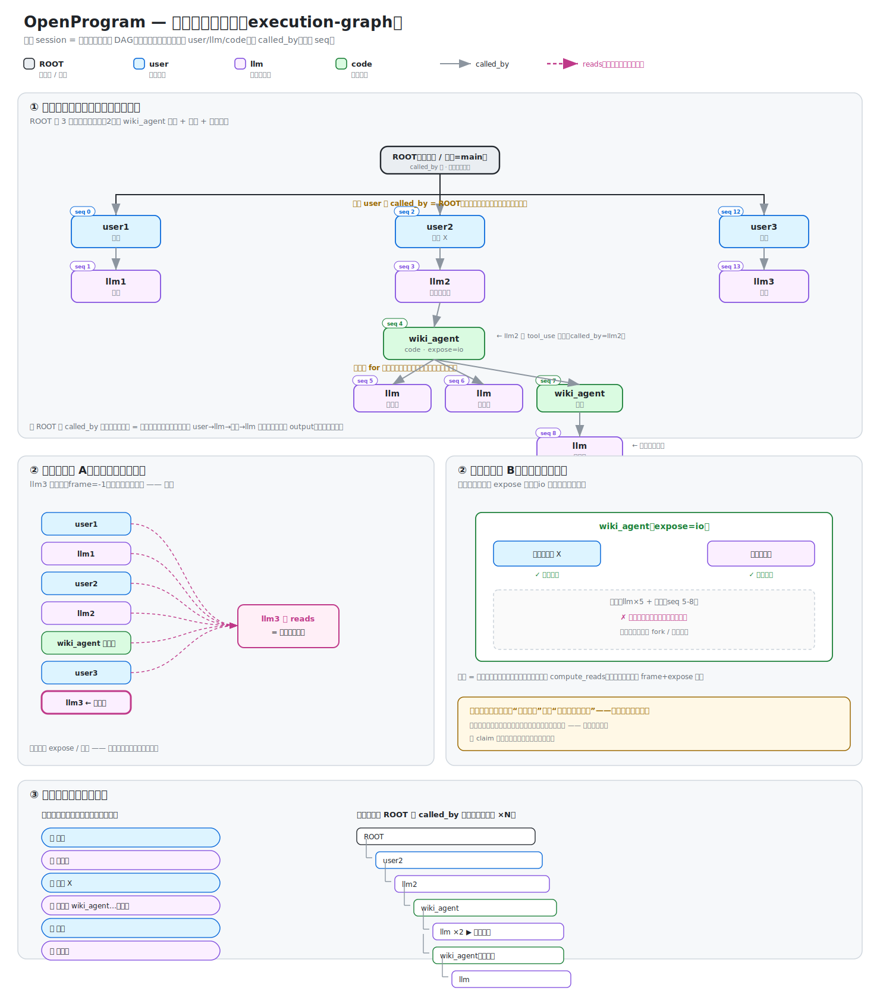

# 执行图模型(execution-graph)—— 数据结构 + 上下文检索 + 两套合并(最终定稿)

Status: **decided（最终模型，开始实现）** · Created: 2026-06-19 · Finalized: 2026-06-20

> 本文是 agent 执行记录的**权威设计**:① 数据结构(一整张图存什么)② 上下文怎么从图中检索 ③ 怎么画 ④ 现状两套调用路径(聊天 / 函数)怎么合并成一套。
> 模型选型理由见 `docs/research/execution-trace-model-selection.md`(span 概念 + 创新点)。
> 调用流程图见 `agent-call-flow.svg`(统一后的完整运行流程,含重试/审批/嵌套)。
>
> **可视化**:`execution-graph.svg`(① 一整张图真实会话 ② 上下文检索:聊天累加 vs 函数弹出 ③ 两种视图)。



## 一、最终结论(一整张图)

整个 session = **一整张 DAG,有唯一的根**(不切成多个独立 trace,也不让多轮悬空)。

- **根节点(session 根)**:每个会话一个根,代表"这个会话 / 这个用户"(它是 main)。**所有顶层 user 节点的 `called_by` 都指向它**——这就是把多轮连成一整张图的汇总点。没有它,多轮各自孤立、就断成多张图了。
- **节点(span)**:user / llm / code 三种 role。一种数据结构,大模型调用永远是同一种 llm 节点,不因"被用户触发"还是"被函数触发"分裂。(根节点本身可看作一个特殊的 session 节点,无 input/output。)
- **边**:`called_by`(谁调出谁),有向、无环。唯一的结构边。
- **共享 seq**:整张图一套单调递增 seq(全局时间序)。
- **顶层多轮**:每轮的 user 是**根的子**(`called_by=根`),多轮之间是**兄弟**(同一个根下,靠 seq 排)。**不互相串链**(第2轮不指向第1轮的回复)。
- **轮内嵌套**:函数调用是 called_by 子树。
- **上下文**:在这**一整张图**上,按 `seq + frame + expose` 检索(`compute_reads`)。

### 为什么必须是一整张图、且有根(不是独立 trace + session)

业界(LangSmith/Datadog)把每次请求切成独立 trace、用 session 标签归类——因为它们是**事后观测**,上下文不读回。我们不行:**我们的 `compute_reads` 靠"同一张图、同一套 seq"检索历史**。一旦切成独立图,第 N 轮的 llm 就看不到前面几轮(跨图检索不到),顶层对话连贯性断裂。

而要让多轮真正成为"一整张图"、不悬空,就需要一个**根**把每轮挂上去(每轮 user 的 `called_by=根`)。否则多轮 user 各自 `called_by` 为空 = 多个孤立的根 = 多张图,又断了。**根 + 共享 seq,是"一整张图"的硬约束。**

### 关键区分:挂在同一个根 ≠ 串成链

这两件事之前被混淆,其实正交:

| | 含义 | 要不要 |
|---|---|---|
| **挂在同一个根** | 每轮 user 的 `called_by=session 根`,多轮是根下兄弟 | **要**(否则多轮悬空 = 多张图) |
| **串成链** | 第2轮 `called_by` 指第1轮回复(首尾相接) | **不要**(逻辑反:像"大模型调用了下一个用户";脏) |

正确:顶层多轮是**同一个根下的兄弟**,靠 seq 排序 + compute_reads 全可见,**不需要串链**。

```
一张图(共享 seq,唯一根):
ROOT          session 根(用户 / main),called_by 空
├ user1  seq0  called_by=ROOT   ┐
│  └ llm1 seq1 called_by=user1   │ 每轮 user 挂在 ROOT 下(兄弟)
├ user2  seq2  called_by=ROOT   │ 多轮之间不互相指(不串链)
│  └ llm2 seq3 called_by=user2   │
├ user3  seq4  called_by=ROOT   ┘
│  └ llm3 seq5 called_by=user3
   compute_reads(frame=-1) → 取所有 seq<5 的节点 → 前两轮全可见 ✓
```

> 注:轮内 llm 的 `called_by` 指向本轮的 user(谁触发了它);user 的 `called_by` 指向 ROOT。
> 这样从 ROOT 出发沿 called_by 能走到任何节点——**真正一整张连通的树**。

## 二、节点结构

```
Node(span):
  id           唯一编号
  seq          单调递增整数,全局时间序(排序唯一依据)
  created_at   wall-clock(给人看,不排序)

  role         "user" | "llm" | "code"   ← 只决定渲染,不分裂本质
  name         模型 id / 函数名 / 用户名

  input        prompt / 函数参数 / None
  output       回复 / 返回值 / 用户文本
  status       running | success | error | cancelled

  called_by    谁调出我(父 id)。顶层 user 为空。
  attributes   元信息(token/model/source/expose…);LLM 叶子字段对齐 gen_ai.*
  reads        这次 LLM 调用读了哪些节点(引用,渲染上下文用;不是结构边)
```

### 三种 role

| role | called_by | input | output |
|---|---|---|---|
| (root) | 空(唯一真正的根) | None | None(session 容器,无内容) |
| user | **ROOT**(挂在 session 根下) | None | 用户文本 |
| llm | 触发它的节点(顶层=本轮 user;函数内=那个 code 节点) | system(可选) | 模型回复 |
| code | 调它的节点(模型 tool_use → 那个 llm 节点) | 函数参数 | 返回值(返回=填这字段,不画返回边) |

## 三、循环不是节点

for/while 循环**不占节点**(执行轨迹不记代码结构)。循环跑 N 次 = 同一个父下 N 个兄弟(按 seq 排)。可视化时重复多了折叠成 ×N(纯显示,数据仍是 N 个节点)。

- 顶层多轮(聊天 while)= 顶层 N 个平级 user/llm
- 函数内 for = 那个 code 节点下 N 个子

## 四、上下文检索(已实现,沿用)

`compute_reads(graph, head_seq, frame_entry_seq, render_range)` —— 在**一整张图**上选 reads:

- **顶层聊天**(frame=-1):所有节点 in-frame,**全可见**(累加)→ 前面所有轮的对话都喂进去。
- **轮内函数**(frame=该 code 节点的 seq):pre-frame(到根的历史)+ in-frame(自己内部进展)可见;别的函数内部按 `expose` 弹出(io 默认只露输入输出)。

**顶层 = 全加(无层级选择,本来就该平);轮内 = frame+expose 层级选择。** 同一个 compute_reads,两层各取所需。这套机制**现状已支持**,不用改。

## 五、两种视图(同一份数据)

| 视图 | 怎么走 |
|---|---|
| 聊天流 | 顶层 user + 其 llm,按 seq 排,函数嵌套折叠 |
| 调用树 | 沿 called_by 全展开;循环兄弟折叠 ×N |

## 六、fork / 分支

版本派生,跟 called_by 正交。用独立的 `attributes.forked_from`(指被派生节点)。active 分支 = 沿同一版本线 + seq 取,排除岔掉的。**不复用 called_by,也不靠对话链。**

## 七、创新点(护城河,别 claim 零件)

**可 claim 的是融合**:记录的调用树**本身就是运行时上下文**,每次调用按"帧作用域 + per-function expose"查询它,节点全部保留(供 fork/replay)。无框架做全(LangGraph 有保留图+fork 但无读回作上下文/无 pop;StackMemory 有栈作用域但靠搜索+丢摘要)。**别单独 claim "ContextVar 调用栈追踪""图 fork"——那是常见的。** 详见调研文档。

## 八、实现:两套合并(分步,带决策定论)

现状两套并存:
- **聊天**:`process_user_turn` → `engine.prepare`(`_assemble_messages`,真 ToolCall/ToolResult 链 + aging + 附件 + 压缩)→ `agent_loop`;记录 `insert_placeholder`/`persist_assistant_message`(写 token 列 + blocks + parent_id)。
- **exec**:`_open_model_call_node` → `compute_reads` + `render_dag_messages` → `_close_model_call_node`。

目标:统一成一套——都走"一张图 + compute_reads + 统一记录原语"。

### 关键决策(动手前必须定的,已查实)

**决策 0:parent_id 链不删 —— 存储有链,检索不看链。**
之前想"顶层改平级、删 parent_id 链"会崩:`get_branch`(session_store.py:742)沿 parent_id 取分支,**fork/rewind/主干遍历(session_store.py:800)/压缩(engine.py:314)/删分支(branch.py:443)全依赖它**;branch.py 没有 forked_from,fork 就是新节点 parent_id 指向岔点。
**定论**:存储层**保留 parent_id 链**(分支骨架,不动);"顶层平级可见"在**检索层**实现——`compute_reads` 本来就不看 parent_id、只按 seq(nodes.py:586)。同一张图 + seq 检索(平级)与 parent_id 分支骨架共存,正交。**这正是"同一张图 ≠ 串成链":存储可有链(给分支),检索不看链(按 seq 平级)。**

**决策 1:两种 code 节点必须区分渲染(合并第一坑)。**
- 模型 tool_use 的 code 节点:有 tool_call_id(现藏在合成 id `{assistant_msg_id}_t_{tid}` 里,dispatcher:462)→ **必须** ToolCall/ToolResult(否则 provider 拒孤儿 tool_use)。
- 代码直调 @agentic_function 的 code 节点(function.py:132):**无** tool_call_id → user/assistant 文本对(现状 render.py:100 对的)。
**定论**:给节点加显式 `metadata.tool_call_id`(模型 tool_use 才有);`render_dag_messages` 按它分两路。ToolCall 必须**挂在所属 llm 节点的 AssistantMessage.content 里**(现状 render 每节点独立 emit,对 ToolCall 是错的——要按 called_by 把 tool 节点归到其 llm 节点内)。旧 session 兼容:`{id}_t_{tid}` 仍可读出 tid。

**决策 2:统一 status 词汇。** 聊天用 completed/cancelled/error,exec 用 success/error。统一成一套(completed/error/cancelled),否则 `_node_to_msg`(_msg_adapter.py:117)默认 + 流式恢复 UI 会误判 exec 节点。

**决策 3:统一记录原语 —— 每个 llm 节点都填全部字段,不分聊天/函数。**
`open_call_node(role, name, system, content, called_by, reads, parent_id=None, tool_call_id=None, source=None, status="running") -> id`
`close_call_node(id, output, status, usage=None, blocks=None)`

**关键:字段对所有 llm 节点一视同仁,不存在"聊天字段"和"函数字段"之分。** 现状两套各填各的、互相缺对方的(聊天有 token/blocks/parent_id/source、缺 called_by/reads;函数有 called_by/reads、缺 token/blocks)——这是**实现欠债,不是设计**。统一后**两边都填全**:

| 字段 | 干什么 | 现状缺口 → 统一后 |
|---|---|---|
| token 列(usage) | 计量/成本 | 函数节点缺(`_close_model_call_node` 没写)→ **补**:函数内调模型一样花钱,必须记 |
| blocks + tool_calls | 前端气泡 thinking/text/tool 顺序 + 回看 | 函数节点缺 → **补**:函数内回复也有结构 |
| called_by | 调用者(谁调出这个 llm) | 聊天节点缺(用 parent_id 凑)→ **补**:聊天的 llm 也有调用者(本轮 user/ROOT) |
| reads | 这次读了哪些历史节点 | 聊天节点缺 → **补**:聊天调模型也读了历史 |
| parent_id | 分支/fork 骨架 | 都要 |
| source / status | 来源 / 终态 | 都要(status 见决策2 统一词汇) |

不是"按需填"(那等于默许它们就该不一样);是**填全 + 补上各自现状的缺口**。`_close_model_call_node` 现在丢了 usage/blocks,统一时补上。

**决策 4:聊天换 compute_reads 前,render 必须补 5 项**(vs `_assemble_messages`):
(a) ToolCall/ToolResult 链(决策1);(b) ToolResultMessage 类型(现只 User/Assistant);(c) 图片/附件注入(现只 TextContent from output);(d) 工具结果 aging(engine.py:241 的 [aged] stub);(e) 压缩/摘要节点(engine.py:600 的 sm_/summary)。每项都是硬前提。

**决策 5:自动重试抽成包住 `run_once` 的策略函数。** `_run_with_retry`(session.py:178)依赖 Agent 对象;dispatcher 调的是裸 agent_loop(dispatcher:917)+ asyncio.Event 取消。抽出"重试策略(可重试判定+退避+重跑+丢上次 assistant)"包住一个 `run_once()→final AssistantMessage`,dispatcher 的 `_drain`(dispatcher:870)当 run_once。坑:重跑会重发 prompt → 第二次须 continue-from-context(仿 session.py:230);placeholder/persist 须在重试循环**之后**跑一次,不是每次。

**决策 6:system prompt 全项目统一,是主干的一部分,不是聊天专属。**
现状两边 system 不一致:聊天用 dispatcher 组装的(身份 + 项目记忆 + 工具目录 + plan 模式),exec 用 `self.system`(runtime.py:1451,常为空)+ skills。**这会:① 前缀不一致 → KV 缓存命不中 → 成本爆;② 函数内的大模型缺项目记忆/指令 → 丢背景。**
**定论:整个项目一个统一的 system prompt(身份 + 项目记忆 + 统一工具列表 + skills),所有大模型调用(聊天 / 函数体内)共用,默认从头到尾不变。** 前缀恒定 → 缓存最大化命中;函数内大模型也有完整背景。
- **不分开**(不是聊天一个、函数一个)。
- **不拆"可变尾段"**(工具列表也统一,不按调用点变——一变前缀就变,长上下文后全不命中)。
- **例外靠自定义**:个别 agent 调用只做极简活、不需要完整上下文,可在该调用点显式声明用精简 system。这是用户主动选择并自担"不命中缓存"的代价,属**使用层**,本数据模型/调用流程层不展开。
- **"函数内别调错工具"(如 wiki_agent 递归)与本决策解耦**——用调用点的工具过滤 / 递归保护解,**不靠改 system 的工具列表**(那会破坏统一前缀)。
- 含义修正:此前把 system prompt 画成"聊天专属钩子"是**错的**;它属于主干。压缩(预算把关)同理是**共享**外层步骤,非聊天专属。

**决策 7:节点内容是多模态的(文本 / 图片 / 文件统称"内容"),图片不特殊、不是钩子。**
此前把"图片注入"画成一个钩子是**错的**——图片就是用户输入,跟文本没有区别,都是 user 节点的内容。不存在"文本进节点、图片走钩子"的分裂。compute_reads 取到一个节点 = 取到它的全部内容(含图)。
- 现状代码为省 FTS5 搜索索引,把图片 base64 不存进节点、只留"[N images]"清单(dispatcher:241)→ 导致**历史轮的图片 compute_reads 取不回**(节点里没有图本体)。这是存储妥协,**不是模型该有的样子**。
- **正确做法**:节点内容里图片存成**引用/路径**(图片本体放附件目录,节点存路径)。这样节点内容完整(文本 + 图片引用)、又不撑爆索引(索引里是路径不是 base64);compute_reads 取节点 → render 按引用加载图。
- **模型层:图片 = 节点内容,无任何特殊处理、无钩子。** "图片本体放哪"是存储优化,与模型解耦。(此项可后续单独做;它不阻塞文本上下文的统一。)

### 两套差异全清单(经代码核实 · 实现 checklist)

合并前必须逐项处理。⚠ = 会埋雷(不处理会在运行时炸:取消失灵 / 重试翻倍 / 副作用丢失)。**统一原则:不对称几乎都是实现欠债,默认全部补平到"两边一致",除非确有理由专属。**

| # | 差异项 | 聊天(dispatcher) | 函数(runtime.exec) | 统一方向 | 险 |
|---|---|---|---|---|---|
| 1 | 读上下文 | get_branch 扁平 list | compute_reads + render_dag_messages | 都走 compute_reads(聊天=frame=-1) | |
| 2 | 工具节点渲染 | 真 ToolCall/ToolResult(有 tool_call_id) | 文本对(无 id) | render 按 tool_call_id 分两路(决策1) | ⚠ |
| 3 | system prompt | profile.system_prompt + 工具块 + deferred + plan(记忆是 agent_loop 每次注入) | self.system(常空)+ skills | 全项目统一一个,共用(决策6) | ⚠ |
| 4 | 记录字段 | token列/blocks/parent_id/source | called_by/reads | 统一原语填全,补齐各自缺口(决策3) | ⚠ |
| 5 | status 词汇 | completed/cancelled/error/**failed** | success/error | 统一一套(决策2) | |
| 6 | 引擎入口 | 直接 agent_loop | AgentSession(retry/replace_messages 包装)→ agent_loop | 都走 agent_loop;包装抽公共 | |
| 7 | 自动重试 | 无(仅 turn 级) | AgentSession loop 级 | 抽出包住统一 loop(决策5) | ⚠ |
| 8 | 压缩/预算 | 有(engine.prepare + 调用前 inline) | 无 | 提到共享外层 | ⚠ |
| 9 | 附件/图片 | ImageContent 注入 | 通常无 | 图片=节点内容存引用(决策7) | |
| 10 | 流式通道 | on_event→WebSocket 信封 | on_stream 回调 | 都有流式,通道桥接统一 | |
| 11 | 自动标题 | finalize 有 | 无 | 见 #H(finalize 副作用) | |
| A | **取消机制** | threading.Event→asyncio,协作中止不抛 | 轮询全局 flag + **抛** ExecInterrupt | 统一驱动两种(且聊天路径要 arm exec 取消) | ⚠ |
| B | **重试层数** | 0 层 + 无 deadline | AgentSession + exec 第二层 + 墙钟 timeout/Retry-After | 统一成一层带 deadline,别叠加 | ⚠ |
| C | **错误处理** | 吞进 AssistantMessage 再 fold | **抛**结构化错误往上传 | 统一一种(close(status=error)) | ⚠ |
| D | **ContextVar 谁设** | 设 _store/_turn_id/_runtime/plan/deferred | 只设工具/stream/policy,**继承**前者 | 统一入口设全,exec 继承不变 | ⚠ |
| E | 计量 scope | 开 UsageContext(call_kind=chat) | 继承调用方,不开 | 统一在入口开,exec 继承 | |
| F | **工具过滤** | channel+MCP+plan 过滤 + 审批包装 + agentic-block 包装 + deferred 目录 | 默认全开,只 deny;无审批/plan/block 包装 | 统一过滤链;函数内防调错工具(如 wiki_agent 递归)用此解,不靠改 system | ⚠ |
| G | steering/中途注入 | agent_loop 接了 | AgentSession 没接,哑的 | 若要 exec 可干预则统一接 | |
| H | **finalize 副作用** | head 推进 + context-commit 回填+工具拼接 + usage 反馈 + git commit + 项目自动提交 + 备份清理 | 只 _close_model_call_node | 拆成共享主干 + 入口钩子,别丢副作用 | ⚠ |
| I | 自动压缩位置 | 调用前 inline(独立于 #8 prepare) | 无 | 并入 #8 共享外层 | |
| J | 中途工具行持久化 | 写 role=tool DB 行(刷新可见) | 内存攒 last_blocks | 统一中途落盘 | |
| K | session 状态 | 管 running→done + 注册 active runtime | 不碰 | 入口钩子保留 | |

> 本质:**底层(agent_loop 引擎 + 存储 + compute_reads)早已共享;全部差异在外围(读/记/取消/重试/错误/finalize/工具过滤/善后)。** 这些外围差异比想象的多且深——A/B/C/H/F 几项最要命,naive 合并会炸。

### 落地顺序(依赖排序,每步独立验证)

| 步 | 做什么 | 独立性 | 验证 |
|---|---|---|---|
| 1 | 节点加 `tool_call_id` 判别 + render 分两路(ToolCall 归到 llm 节点内) | **独立**·加性(无 id 则走文本对,不破现状) | test_render_dag_messages + 新增 ToolCall 归组用例 |
| 2 | 统一 status 词汇 + close_call_node 补 usage/blocks 字段(决策3 填全) | 独立 | _node_to_msg status 测试 + 函数节点带 token/blocks |
| 3 | render 补 5 缺口(工具链/ToolResult/图片/aging/摘要) | 依赖 1+2 | golden 对比 render vs _assemble(带工具+图片+摘要的 fixture) |
| 4 | 聊天上下文换 compute_reads(**保留 parent_id 骨架**) | 依赖 3 | test_dag_session_db_branches + rewind + 带工具 turn 往返一致 |
| 5 | 统一记录:聊天 persist 改调 open/close_call_node | 依赖 2 | test_dispatcher_integration + 计量列在 + 前端 blocks 在 |
| 6 | 统一取消(A)+ 重试(B,合成一层带 deadline)+ 错误(C,统一 close error) | 高风险·一起做 | 注入 errors-once + 中途取消 的 stream_fn 测试 |
| 7 | finalize(H)拆共享主干 + 入口钩子;工具过滤(F)统一链 | 高风险·单独做 | 端到端:标题/git commit/计量反馈/审批 全在 |
| 8 | 可视化按新模型画(ROOT + 顶层平级 + 轮内嵌套 + 循环折叠 ×N) | 独立·纯前端 | 浏览器自检 |

步 1/2/8 可独立发;3→4、2→5 是耦合主线;6/7 是高风险区(取消/重试/错误/finalize/工具过滤),动 dispatcher 持久化与控制流,单独专注做、充分回归。
fork 现状靠 parent_id(决策0 保留),**不需要为本次合并改 fork**;forked_from 是更远期的概念清理,本次不做。

## 相关文件
- `openprogram/context/nodes.py` — Call + compute_reads(检索,已支持一张图)
- `openprogram/context/render.py` — render_dag_messages(S1 改这里)
- `openprogram/agent/dispatcher/__init__.py` — get_branch / agent_loop 入口(S2/S3)
- `openprogram/agent/dispatcher/persistence.py`、`agent/internals/_turn_lifecycle.py` — 聊天记录(S4)
- `openprogram/agentic_programming/runtime.py` — exec / _open/_close_model_call_node(S1/S4)
- `openprogram/store/session/session_store.py` — get_branch / 存储(S2)
