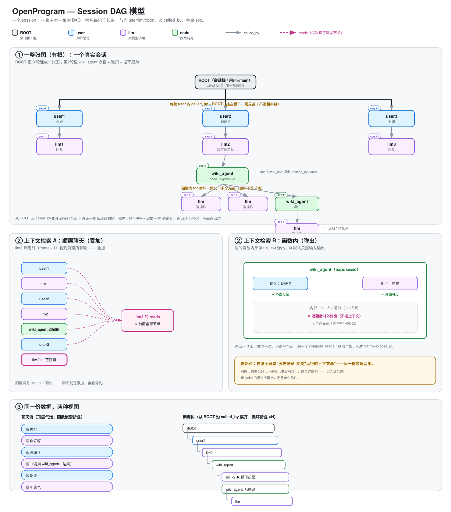

# Session DAG — 设计

> 本文是 agent 执行记录的权威设计：数据模型、边与不变量、分支与 spawn、上下文渲染、
> 上下文装配、压缩。模型选型的论证见
> [`../../research/execution-trace-model-selection.zh.md`](../../research/execution-trace-model-selection.zh.md)。
> 调用流程图见 [`../agent-call-flow.svg`](../agent-call-flow.svg)。
> 可视化渲染规范（布局、连线、图例、默认可见性）是
> [`dag-rendering.zh.md`](dag-rendering.zh.md)——绘制以它为准，本文只讲语义。



## 1. 概述与动机

整个会话是**一张有唯一根的 DAG**。每条用户消息、每次 LLM 调用、每次函数调用都是同一
张图里的节点，共享一个单调递增的 `seq`。这张图同时是：

- **持久化记录**——发生过什么的唯一存底；
- **运行时上下文**——每次 LLM 调用的上下文都是对图中一条路径的渲染；
- **展示来源**——聊天流、调用树、minimap 都是同一批节点的投影。

这种融合正是设计的核心。可观测性系统（LangSmith、Datadog）把每个请求拆成独立
trace、用 session 标签分组，因为它们只做事后观察、从不回读记录。本系统要回读：
`render_context` 沿同一张图、同一个 `seq` 取历史，所以各轮必须连成一张图。唯一根 +
共享 seq 是"一张图"的硬约束——没有根，每个顶层节点就是各自孤立的图。

可主张的创新在于融合本身：记录下的调用树**就是**运行时上下文，每次调用按 frame 作用
域 + 逐函数 expose 查询它，且所有节点保留（供 fork 与 replay）。单项要素（ContextVar
调用栈追踪、图 fork）都是常见的，整体不是。

## 2. 数据模型

### 节点（Call）

一个数据结构覆盖一切。LLM 调用永远是同一种 `llm` 节点，不因触发方是用户还是函数而
分裂。

```
Call:
  id           唯一标识
  seq          单调递增整数，全局时间序（唯一排序键）
  created_at   墙钟时间（给人看，不用于排序）

  role         "user" | "llm" | "code"   ← 只决定渲染，不分裂本质
  name         模型 id / 函数名 / 用户名

  input        prompt / 函数参数 / None
  output       回复 / 返回值 / 用户文本
  status       running | completed | error | cancelled

  caller       谁调用了我（子调用父 id）；非子调用节点为空
  predecessor  聊天里谁在我前面（对话链父 id）；
               顶层 schema 字段——这条边唯一的存储位置
  reads        本次 LLM 调用读了哪些节点（渲染用引用，不是结构边）
  metadata     token 用量 / 模型 / source / expose / tool_call_id …
               LLM 叶子字段对齐 gen_ai.*
```

定义在 `openprogram/context/nodes.py`。

### 三种 role 与 ROOT

| 场景 | role | caller | predecessor |
|---|---|---|---|
| 会话根（ROOT） | user（特殊，`display=root`） | 空 | 空 |
| 用户发消息 | user | ROOT | 上一轮 llm 回复；会话首节点用哨兵 `"ROOT"` |
| LLM 回复 | llm | 本轮 user（顶层）或所在 code 节点 | 本轮 user |
| LLM 调工具 | code | 该 llm 节点 | — |
| 用户手动调函数 | code | 空 | 当前分支 head（根层为 `"ROOT"`） |
| 函数内调 LLM / 子函数 | llm / code | 所在 code 节点 | — |

循环不占节点：跑 N 次的循环 = 同一父节点下的 N 个兄弟（按 `seq` 排序）；可视化可以折
叠成 ×N，但数据仍是 N 个节点。一次函数调用只有一个 code 节点——绝无 anchor、
placeholder 或任何辅助节点。

### status 词表

所有节点统一一套：`running | completed | error | cancelled`。聊天与函数路径共用；
error 节点带结构化 type/trace 元数据，用户取消写 `cancelled`，绝不写 `error`。

## 3. 边与不变量

### 两条边，绝不混为一条

| 边 | 字段 | 含义 | 谁有 |
|---|---|---|---|
| **子调用边** | `caller` | 谁调用我执行 | 只有真被子调用的节点；普通顶层回复留空 |
| **对话链边** | `predecessor` | 聊天顺序上我接在谁后面 | user / llm 节点 |

两条边都有向无环。`caller` 让所有顶层节点汇聚到 ROOT（一张连通图）；`predecessor`
表达聊天顺序并区分分支。二者正交：

```
一张图（共享 seq，唯一根）。每个节点：caller(C) / predecessor(P)
ROOT
├ user1  seq0  C=ROOT  P="ROOT"   ┐ 顶层 user 经 caller 挂在 ROOT 上；
│  └ llm1 seq1 C=user1 P=user1    │ 对话顺序经 predecessor 成链：
├ user2  seq2  C=ROOT  P=llm1     │   user2.P=llm1, user3.P=llm2
│  └ llm2 seq3 C=user2 P=user2    │ fork = 同一 predecessor 有多个对话子节点
├ user3  seq4  C=ROOT  P=llm2     ┘
```

为什么要两条边：分支必须靠 `predecessor` 区分。用户重发消息时同一位置长出两个子节
点，仅凭 `seq` 分不清哪个子节点属于哪条分支线。单边模型（caller + seq）表达不了分支。

### `predecessor` 是 schema 字段

`predecessor` 是 `Call` 的顶层字段——唯一存储位置。序列化只写顶层；没有 metadata 镜
像，没有旧格式读取路径。把这条边放进 schema 而不是事后校验 metadata，才让读方可以依
赖它：链接错的分支无法被 linter 修复，所以 append 路径必须拒绝制造它。

### 写入不变量

在 store 的 append 路径强制执行（`openprogram/store/session/session_store.py`）：
**每个 ROOT 级对话节点（role 为 user/llm、无真实 caller）必须带 `predecessor`。**
违规 append 抛 `PredecessorMissingError`，而不是悄悄在 ROOT 处 fork 会话。合法例外：

- **会话首节点**与**显式根 fork**——带哨兵 `predecessor="ROOT"`（不是空），所以重试
  首条消息会产生不变量允许的合法 ROOT 级兄弟；
- **spawn 分支根**——只能经 `spawn_branch()`（§4）创建，`predecessor=None`、
  `caller` 指向发起节点；
- **`ask_user` 应答节点**——带非 None `input` 的 user 节点是调用内的被调方回复，
  不是对话轮；
- **压缩 summary 节点**——按 §8 是合法链上成员。

### 读取不变量

`get_branch` 与 `list_branches` 纯沿边行走——没有 caller 回退，没有 seq 拼接，没有
猜测。无 `predecessor` 的节点必须是合法分支终点（spawn 根、ROOT 本身、会话首节
点）；否则就是坏数据，抛 `BrokenPredecessorChainError` 并带上出问题的节点 id。坏数
据浮出水面，绝不被绕过去。

## 4. 分支与 Spawn

### Fork

分支是同一位置上的另一种可能。**分支节点的 `predecessor` 与被替换节点完全相同**——
同一 predecessor 有多个对话子节点即为 fork。不存在特殊节点类型：

| 场景 | 被替换节点 | 分支节点 | 共享边 |
|---|---|---|---|
| 用户重发消息 | user2 (P=llm1) | user2' (P=llm1) | predecessor |
| LLM 重试 | llm1 (P=user1) | llm1' (P=user1) | predecessor |
| 工具重试 | code (C=llm1) | code' (C=llm1) | caller |

### Spawn

`SessionStore.spawn_branch(session_id, caller_node_id, *, source, name=…)` 是开
spawn 分支的**唯一**原语。它创建分支根 user 节点（`predecessor=None`、
`caller=caller_node_id`、`metadata.source`、`metadata.spawn_branch_root=True`），
注册为 head，返回节点 id。spawn 调用方（task runner、协作消息、后台 agent）一律调
用原语、绝不手工组装边，新调用点不可能把边写错。

spawn 分支根**不**挂在 ROOT 上：它的 `caller` 指向发起它的节点，经该节点维持单连通
图不变量。（例外：跨会话 spawn 的分支根指向另一会话的图；在本会话内挂在 ROOT 上，
渲染层打 ↗ 徽标——见 [`dag-rendering.zh.md`](dag-rendering.zh.md) 图例。）

spawn 分支的上下文是干净的：spawn 分支上的 `get_branch` 止步于 spawn 根，不会经
caller 边漏进父分支。spawn 分支的聊天视图只显示本分支自己的历史。

## 5. 头指针与分支管理

- **head**：会话维护一个 `head_id`——当前活跃分支的末端。每条写路径都把它推进到真
  实节点 id；函数调用完成后 head 移到实际 code 节点，绝不指向 placeholder。悬空的
  head 会让分支行走不可达、会话渲染为空。
- **get_branch(session_id, head_id)**：从 head 沿 predecessor 链走到终点，返回该分
  支的线性历史。
- **list_branches(session_id)**：枚举分支末端（无对话子节点的对话节点）。"main"末
  端由最早的对话根沿首子路径走到底得出——正好匹配用户视觉上认作主干的 lane-0 直
  线。spawn 根从不出现在 predecessor 子节点表里（其 predecessor 为 None），无需特
  判。分支名存在会话 meta 的 `branches: {head_id: name}`。

## 6. 上下文渲染

`render_context` 是唯一的取用原语。成员资格规则只说一遍：

> **一个节点进入渲染，当且仅当它最近的 ROOT 级祖先（沿 `caller`）位于 `head_id` 的
> predecessor 主链上，且 frame/expose 规则放行。**

原语从 `head_id` 沿 predecessor 链走到分支终点，再对主链上每个节点按 frame 与
expose 过滤其 caller 子树后收入。`seq` 仍是排序键，但不再是成员资格判定——成员资格
是路径原生的，分支隔离是行走本身的性质，不是引擎里事后的集合求交。引擎的职责收缩
为：解析 head → 调原语 → 把节点交给 `render_dag_messages`。

frame 语义：

- **顶层聊天**（frame = −1）：主链上每一轮全量可见——累加；该分支的所有历史轮平铺
  喂入。
- **函数内**（frame = 该 code 节点的 seq）：frame 前的历史 + 函数自身 frame 内的进
  展可见；其他函数的内部按各自 `expose` 弹出（默认 `io` 只暴露输入输出）。

原语是**纯函数**：读路径不写盘。必须落盘的事（大节点 spill）发生在写路径（§8）。

工具节点的渲染：带 `metadata.tool_call_id` 的 code 节点（模型 tool_use）渲染为真
ToolCall/ToolResult 对、归入所属 llm 节点的 assistant 消息；不带的（直接函数调用）
渲染为文本对。两个视图投影同一份数据：聊天流（顶层 user + llm 按 seq，嵌套折叠）与
调用树（沿 `caller` 全展开，循环兄弟折叠 ×N）。

## 7. 上下文装配

### 一个 system prompt，一个装配器

全项目只有一份 system prompt（身份 + 项目记忆 + 统一工具列表 + skills），由**唯一装
配器** `context.build_system_prompt(agent_profile, tools, mode)` 产出，所有模型调用
共享——顶层聊天与函数体内一视同仁。预算统计的就是实际发出的那个字符串；装配器输出等
于线上输出。

prompt 默认从会话开始到结束恒定。恒定前缀让 provider KV 缓存命中最大化，函数内的模
型也拿到与聊天模型相同的项目背景。推论：

- **不拆分**成聊天版和函数版。
- **没有"可变尾段"**：工具列表也统一，不随调用点变化——一变前缀就变，长上下文全部
  miss。
- **例外走定制层**：个别调用想要精简 system，在调用点显式声明，自愿承担 cache miss。
- 函数内防误调工具（如自递归）靠用户轮开头的情境提示 + 递归深度上限兜底——绝不靠改
  system 工具列表。详见
  [`../execution/agentic-self-recursion.zh.md`](../execution/agentic-self-recursion.zh.md)。

### prompt 被记录，而非隐含

装配出的 prompt 哈希一旦变化（会话开始、工具集变更、plan 模式切换），store 就在当
前分支追加一个 `role=code` 节点，`name="context/system_prompt"`、`caller=ROOT`、
output 为全文。渲染时取主链上最新的该类节点作为线上 system 消息。任何历史调用的
replay 都能复现当时实际发出的 prompt。不引入第四种 role；`context/*` 名字保留并在聊
天视图隐藏（与隐藏 summary 节点同一机制）。

### memory prefetch 位于用户轮内

预取的记忆渲染为**当次用户节点**线上消息内的前缀块，并存入该节点的 metadata
（`memory_prefetch`）。system prompt 与工具段跨轮字节级稳定（历史继续命中缓存），
replay 看到的就是模型当时看到的。该块不参与老化；与本轮其他用户内容一样随轮消亡。

### 多模态内容

图片与文件就是节点内容，与文本无异——没有注入 hook。节点存引用（正文放附件目录），
内容完整又不撑爆搜索索引。`render_context` 取节点即取其全部内容；渲染按引用加载图
片。

## 8. 压缩与老化

### summary 节点入链

压缩是 append-only 的图改写。summary 节点为 `role=llm`、`name="context/summary"`、
`predecessor` = 它覆盖的第一个节点的 predecessor、
`metadata.covers = [first_seq, last_seq]`。head 移到一个 predecessor 为该 summary
节点的新节点上。保留尾段**不**克隆：渲染沿主链穿过 summary 节点，跳过 seq 落在
`covers` 内的节点，其余照收。一次压缩只追加两个节点（summary + 新 head 链接），零克
隆、零孤儿，旧主链作为兄弟分支原样保留供回滚。`covers` 用零复制实现克隆语义——克隆
会造出第二套 id 空间，逼所有消费方做翻译。

### 老化是棘轮，渲染可 replay

尾轮老化边界只在轮提交时推进，绝不在轮中途（逐调用滚动的边界每次调用都打破缓存前
缀）。每个 llm 节点在调用发生的那一刻记录
`metadata.render_manifest = {policy_version, aged_before_seq, spilled: [...]}`。
replay 一次调用 = 用 manifest 记录的策略渲染，而不是今天的策略——同一张图任何一天渲
染出相同字节。

### 写时 spill，单一管线

超过阈值的节点在**记录时**落盘 spill（一次、确定性），绝不在碰巧被渲染时——读路径保
持无副作用，正是 §6 的要求。DAG 渲染是**唯一**的上下文管线：没有回退装配路径。渲染
抛错则本轮带错误可见地失败。静默回退会掩盖坏掉的管线；响亮失败才是特性。

## 9. 存储层

会话持久化在 git 后端的 store（`openprogram/store/session/`）：

- 每会话一个磁盘上的 `GitSession`，位于 `<state>/sessions/<id>/`；
- 每会话一个内存中的 `SessionMemoryIndex`，懒加载，持有行走所用的 node-by-id /
  children-by-predecessor 索引；
- `head_id` 与分支名存在会话的 `meta.json`；
- store 只持久化原始节点 + meta；context commit 属于 commit 子系统。

`@agentic_function` 的函数体在 **spawn** 的子进程里跑（全新解释器而非 fork——父进
程已加载 PyTorch/libomp，fork 后子进程首次 BLAS 调用会 SIGSEGV），stop 可对进程组
SIGKILL。子进程用自己的 SessionStore 写 code 子树；父进程执行结束后 invalidate 缓
存以读取磁盘真相。函数调用的单一事实来源是 SessionStore 的 code 子树；实时
WebSocket 帧与刷新加载都是它的投影，必须产出同一张卡片。

## 附录：实现状态

数据模型、边、不变量、spawn 原语、纯沿边分支行走（§2–§5）以及 frame/expose 渲染机制
已实现；细节以 `openprogram/context/nodes.py` 与
`openprogram/store/session/session_store.py` 的代码为准。以下设计小节尚未落地：

- §6 路径原生成员资格——`render_context` 目前仍按 seq 窗口选取；分支隔离现在发生在
  引擎侧的集合求交。
- §7 全部——唯一装配器、`context/system_prompt` 节点、memory prefetch 迁移。
- §8 全部——基于 `covers` 的 summary 节点、老化棘轮、render manifest、写路径
  spill、单管线强制。现有压缩机制早于写入不变量，在本节落地前被显式豁免。

## 相关文件

- `openprogram/context/nodes.py` — Call schema + render_context
- `openprogram/context/render.py` — render_dag_messages
- `openprogram/store/session/session_store.py` — append 不变量、get_branch、
  spawn_branch、list_branches
- `openprogram/agent/dispatcher/__init__.py` — 聊天入口、agent loop
- `openprogram/agentic_programming/runtime.py` — 函数体内模型调用
- [`dag-rendering.zh.md`](dag-rendering.zh.md) — 可视化渲染规范（绘制的权威）
