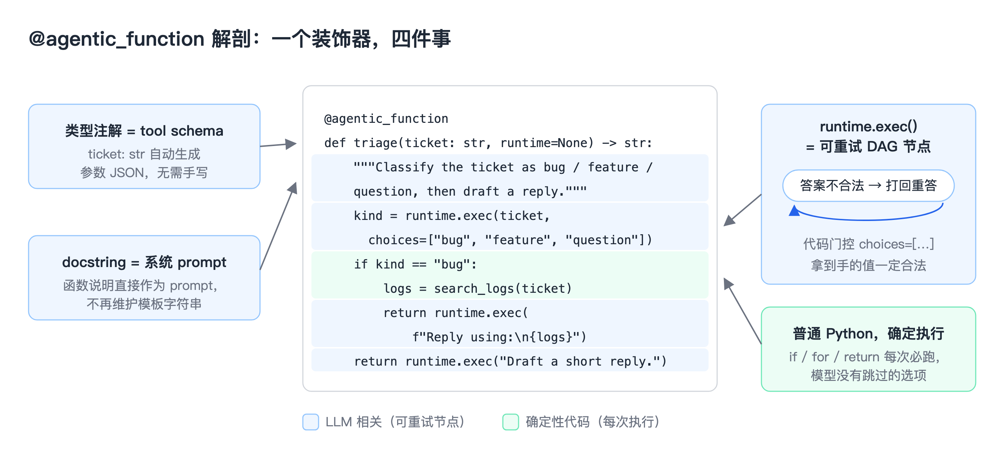
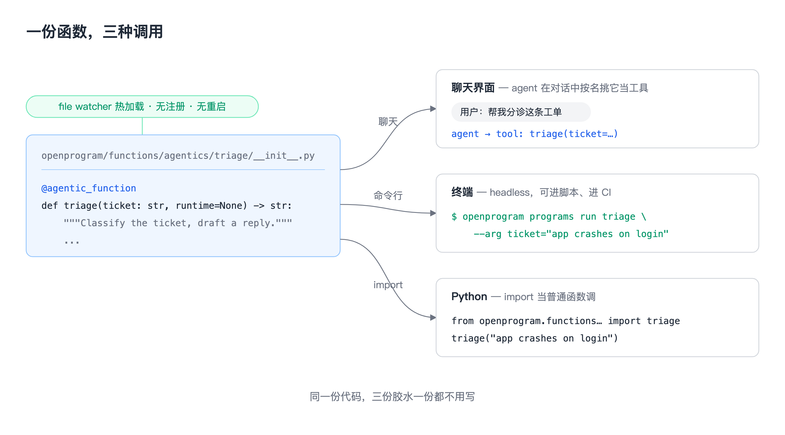
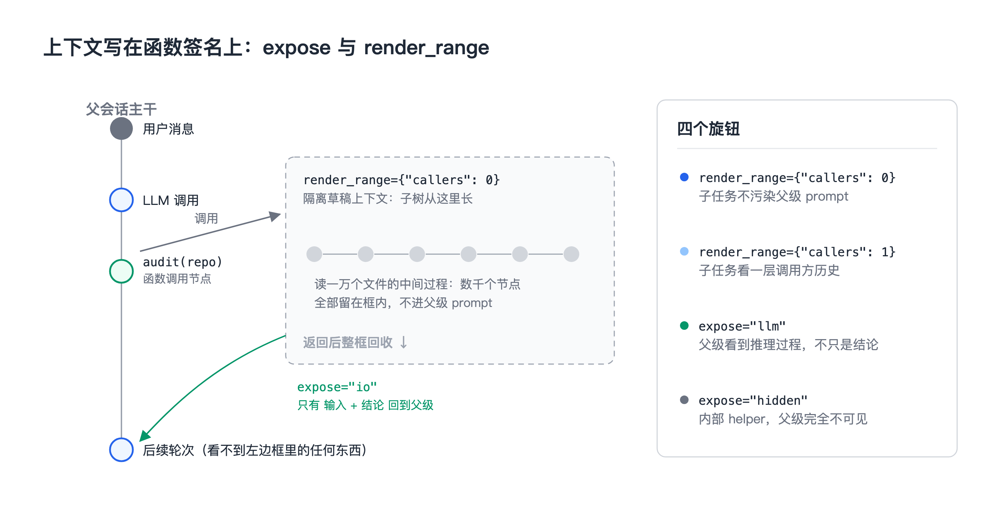

# 候选标题

1. OpenProgram 技术解析（一）：像调用函数一样调用大模型
2. 一个装饰器把 Python 函数变成 Agent：@agentic_function 是怎么工作的
3. Agentic Programming 的核心原语：docstring 是 prompt，类型注解是 schema

---

大模型生成的内容，很多时候不是终点——生成完还要接着处理：拿代码去分析它、按它的结果决定下一步、把它和数据库或日志里的东西对起来。但生成内容和代码之间的耦合度目前很低：模型的输出先取出来，再专门写一段代码去解析、分析、分发。生成和处理是两个割裂的阶段，来回搬运，效率不高。

于是我们想：能不能把大模型的输入输出直接接到函数调用里？函数体里既有普通语句也有模型调用，输入由代码拼出来，输出落回变量接着被代码处理——直接运行这个函数，就同时用上了代码的确定性和模型的能力。这就是 OpenProgram 的做法，载体是一个装饰器：`@agentic_function`。这篇文章讲它是怎么工作的。

## 同一个 agent，两种写法

需求：一个工单分诊 agent，把工单分成 bug / feature / question，然后起草回复。

常规写法：

```python
TRIAGE_PROMPT = """You are a triage
agent. Classify the ticket as bug,
feature, or question. Reply as JSON."""

TOOLS = [{"type": "function", "function": {
  "name": "triage",
  "parameters": {"type": "object",
    "properties": {"ticket": {"type": "string"}},
    "required": ["ticket"]}}}]

resp = client.chat(TRIAGE_PROMPT, tools=TOOLS)
kind = json.loads(resp)["kind"]     # 解析返回值
if kind not in ("bug", "feature"):
    ...                             # 需要时自己重问
```

再看 OpenProgram 下的写法：

```python
@agentic_function
def triage(ticket: str, runtime=None) -> str:
    """Classify the ticket as bug / feature /
    question, then draft a reply."""
    kind = runtime.exec(                    # 🤖 LLM 决定
        ticket, choices=["bug", "feature", "question"])
    if kind == "bug":                       # 🐍 你决定
        logs = search_logs(ticket)          # 🐍 普通 Python
        return runtime.exec(                # 🤖 LLM 写回复
            f"Reply using:\n{logs}")
    return runtime.exec("Draft a short reply.")
```


行为完全一样，三块东西各自找到了 Python 里现成的位置：

- **prompt 写进 docstring**——它本来就该写在函数上，Python 语法早就给了位置。
- **schema 来自类型注解**——`ticket: str` 这一行信息量和那七行 JSON 等价，框架替你生成。
- **解析变成返回值**——`choices=["bug", "feature", "question"]` 声明了合法输出，框架保证 `kind` 拿到手就是三个值之一，可以直接进 `if` 分支。

合并之后真正多出来的是灵活性：模型调用长在代码中间，输入输出两头都能自由配合。往前，`search_logs(ticket)` 这种前置逻辑用普通 Python 算好，结果直接拼进下一次 `runtime.exec()` 的输入；往后，模型的回答落回变量，立刻参与 `if`、`for`、`return`。想在两次模型调用之间插一段检索、一次数据库查询、一个正则清洗，就是写一行 Python 的事。**流程用代码组织，判断交给模型**——两边逐行交错，没有切换成本。



## 门控是怎么工作的

`choices=[...]` 是写在调用点上的输出约定：模型的回答要落进这几个值,框架负责校验。真实运行日志长这样：

```
llm  → "probably a feature request"
gate ✗ no parseable pick from ["bug", "feature", "question"]
llm  → {"call": "feature"}
gate ✓ → branch taken in Python
```

模型第一次回答含糊，校验没通过，框架带着失败原因再问一次；第二次给出合法值，Python 分支接着跑。重试由框架完成,你的代码只在拿到合法值之后开始执行——输出约定写在代码里,后面的控制流就可以放心依赖它。


## 写完之后，三种用法

一个 `@agentic_function` 放进 `openprogram/functions/agentics/<name>/__init__.py`，文件 watcher 热加载，不用注册不用重启。之后它同时是三样东西：

```bash
# 1. 聊天里,agent 按名字挑它当工具用
# 2. headless 跑,可以进脚本进 CI
openprogram programs run triage --arg ticket="app crashes on login"
```

```python
# 3. 直接 import,当普通函数调
from openprogram.functions.agentics.triage import triage
result = triage("app crashes on login")
```

同一份代码，是 agent 的工具，是 CLI 命令，也是库函数，三种场景直接复用。



## 上下文也是函数声明的一部分

Agent 跑长任务最大的成本是上下文膨胀：每个子任务都把中间过程塞进主对话，token 线性涨。OpenProgram 把每次调用记在一张扁平 DAG 上，装饰器给了两个旋钮控制每个函数在这张图上读什么、露什么：

```python
@agentic_function(expose="io", render_range={"callers": 0})
def audit(repo: str, runtime=None) -> str:
    """Read every file and report risky patterns."""
    ...
```

| 目标 | 写法 |
|---|---|
| 子任务不要污染父级 prompt | `render_range={"callers": 0}`——隔离草稿上下文，返回后回收 |
| 父级需要推理过程，不只是结论 | `expose="llm"`（或 `"full"`） |
| 内部 helper，父级完全不该看到 | `expose="hidden"` |
| 子任务需要看一层调用方历史 | `render_range={"callers": 1}` |

`audit` 读一万个文件产生的中间内容，返回时只有输入和结论留在父级上下文里。上下文管理从 prompt 拼接的体力活，变成写在函数签名上的属性。



## 为什么是"函数"

因为函数是软件工程五十年攒下的全部工具的接口：单元测试、类型检查、import、组合、版本管理，全都直接可用。agent 一旦写成函数，这些工具全部白拿。

我们把这个范式叫 Agentic Programming，正式表述在论文里（已被 KDD 2026 AgenticSE workshop 接收）。`@agentic_function` 是它的第一块砖，后面的 DAG 上下文、多 agent 协作、事件基础设施都建在这上面——那些是另外几篇的内容。

- 代码：https://github.com/Fzkuji/OpenProgram
- 论文：*LLM-as-Code: Agentic Programming for Agent Harness*，[arXiv:2606.15874](https://arxiv.org/abs/2606.15874)
