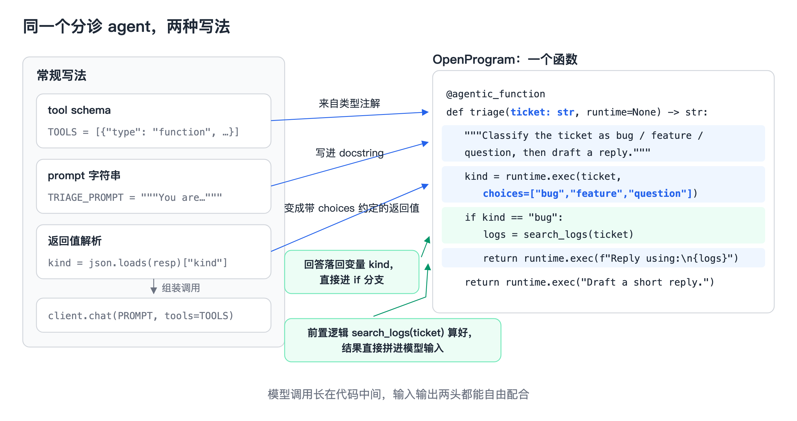
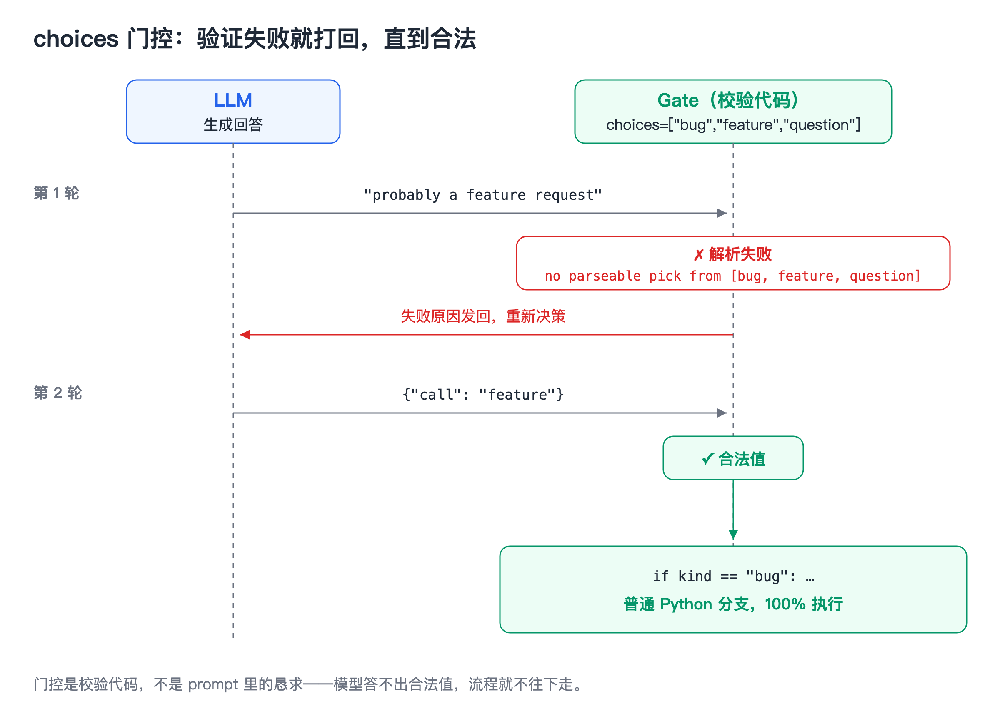

# 候选标题

1. OpenProgram 技术解析（一）：像调用函数一样调用大模型
2. 一个装饰器把 Python 函数变成 Agent：@agentic_function 是怎么工作的
3. Agentic Programming 的核心原语：docstring 是 prompt，参数是输入，返回值是输出

---

大模型生成的内容，很多时候不是终点——生成完还要接着处理：拿代码去分析它、按它的结果决定下一步、把它和数据库或日志里的东西对起来。但生成内容和代码之间的耦合度目前很低：模型的输出先取出来，再专门写一段代码去解析、分析、分发。生成和处理是两个割裂的阶段，来回搬运，效率不高。

于是我们想：能不能把大模型的输入输出直接接到函数调用里？函数体里既有普通语句也有模型调用，输入由代码拼出来，输出落回变量接着被代码处理——直接运行这个函数，就同时用上了代码的确定性和模型的能力。这就是我们开源的 [OpenProgram](https://github.com/Fzkuji/OpenProgram) 的做法。整个框架基于 Python 构建：agent 用原生 Python 函数来写，流程控制就是 Python 的 `if`/`for`，生态里的任何库都能直接 import 进函数体，载体是一个装饰器：`@agentic_function`。这篇文章讲它是怎么工作的。

## 方法：一个函数就是一个 agent

需求：一个工单分诊 agent，把工单分成 bug / feature / question，然后起草回复。

常规写法：

```python
TRIAGE_PROMPT = """You are a triage
agent. Classify the ticket as bug,
feature, or question. Reply as JSON."""

TOOLS = [{"type": "function", "function": {
  "name": "triage",
  "parameters": {"type": "object",
    "properties": {"ticket": {"type": "string"}},
    "required": ["ticket"]}}}]

resp = client.chat(TRIAGE_PROMPT, tools=TOOLS)
kind = json.loads(resp)["kind"]     # 解析返回值
if kind not in ("bug", "feature"):
    ...                             # 需要时自己重问
```

OpenProgram 下的写法：

```python
@agentic_function
def triage(ticket: str, runtime=None) -> str:
    """Classify the ticket as bug / feature /
    question, then draft a reply."""
    kind = runtime.exec(                    # 🤖 LLM 决定
        ticket, choices=["bug", "feature", "question"])
    if kind == "bug":                       # 🐍 你决定
        logs = search_logs(ticket)          # 🐍 普通 Python
        return runtime.exec(                # 🤖 LLM 写回复
            f"Reply using:\n{logs}")
    return runtime.exec("Draft a short reply.")
```



行为完全一样。对照着看，这个函数的每个部件都对应大模型调用的一个要素：

- **docstring ≈ system prompt。** 函数注释写的是这个 agent 的角色和任务的固定说明，框架把它作为系统提示。它本来就该写在函数上，Python 语法早就给了位置。
- **参数就是输入。** `ticket` 是每次调用时补充进来的任务相关信息——调用 `triage("app crashes on login")`，这条工单就成了这次模型调用的输入。函数体里还可以继续追加：`f"Reply using:\n{logs}"` 就是把代码算出来的中间结果拼成下一次的输入。
- **返回值是定义好的输出。** 模型的回答不是一段散着的文本，而是按约定落回变量：`kind` 一定是三个类别之一，最终 `return` 的是起草好的回复。输出从"取出来再处理"变成"本来就在变量里"。

其中 `choices` 值得单独说一句：它是我们在底层设计的一个功能，`runtime.exec()` 的一个参数，作用是给这一次模型调用加上输出约定——回答必须落进给出的选项里。下面门控一节详细展开。

## 用了之后的好处

- **输入更灵活。** 模型的输入由代码现场拼装：前置逻辑、检索结果、数据库查询、上一步模型的回答，都是普通 Python 变量，f-string 一拼就进了 prompt。不需要在"代码世界"和"prompt 世界"之间搬运。
- **输出直接可编程。** 回答落回变量，立刻参与 `if`、`for`、`return`。想在两次模型调用之间插一段分析、一次正则清洗，就是写一行 Python 的事。生成和处理不再是两个阶段。
- **agent 变成了普通函数。** 单元测试、类型检查、import、组合、版本管理，软件工程几十年攒下的工具全部直接可用。别的代码调它的时候，甚至不需要知道里面有大模型。

## 门控：最关键的一个机制

三个好处里，"输出直接可编程"依赖一个前提：模型的回答必须真的落进约定里，`if kind == "bug"` 才有意义。保证这件事的机制就是门控，入口是 `choices`：

```python
kind = runtime.exec(ticket, choices=["bug", "feature", "question"])
```

它写在调用点上——不在 docstring 里，也不用你写进输入。框架看到这个参数，会自动在这次调用的输入末尾附上选项菜单和一条收尾指令：先做该做的分析，但回复的最后必须是一个 JSON，从菜单里选出一项。回复拿回来后，框架按菜单解析。真实运行日志长这样：

```
llm  → "probably a feature request"
gate ✗ no parseable pick from ["bug", "feature", "question"]
llm  → {"call": "feature"}
gate ✓ → branch taken in Python
```

模型第一次回答含糊，解析不出合法选项，框架带着失败原因再问一次；第二次给出合法值，Python 分支接着跑。重试由框架完成，你的代码只在拿到合法值之后开始执行。效果是：输出约定写在代码里，后面的控制流可以放心依赖它——模型负责选择，代码保证这个选择一定合法。



## 其他几个顺手的优势

**写完即用，三种调用。** 一个 `@agentic_function` 放进 `openprogram/functions/agentics/<name>/__init__.py`，文件 watcher 热加载，不用注册不用重启。之后它同时是三样东西：

```bash
# 1. 聊天里,agent 按名字挑它当工具用
# 2. headless 跑,可以进脚本进 CI
openprogram programs run triage --arg ticket="app crashes on login"
```

```python
# 3. 直接 import,当普通函数调
from openprogram.functions.agentics.triage import triage
result = triage("app crashes on login")
```

同一份代码，是 agent 的工具，是 CLI 命令，也是库函数，三种场景直接复用。

**上下文自动管理。** 每次函数调用和模型调用都记在一张执行 DAG 上，函数可以声明自己读多少上下文、向调用方暴露多少——子任务读一万个文件的中间过程可以完全不进主对话，返回时只留结论。这是这套设计里我们认为最重要的部分，值得单独一篇，下一篇《DAG Context》详细讲。

## 为什么是"函数"

因为函数是软件工程五十年攒下的全部工具的接口：单元测试、类型检查、import、组合、版本管理，全都直接可用。agent 一旦写成函数，这些工具全部白拿。

我们把这个范式叫 Agentic Programming，正式表述在论文里（已被 KDD 2026 AgenticSE workshop 接收）。`@agentic_function` 是它的第一块砖，后面的 DAG 上下文、多 agent 协作、事件基础设施都建在这上面——那些是另外几篇的内容。

- 代码：https://github.com/Fzkuji/OpenProgram
- 论文：*LLM-as-Code: Agentic Programming for Agent Harness*，[arXiv:2606.15874](https://arxiv.org/abs/2606.15874)
