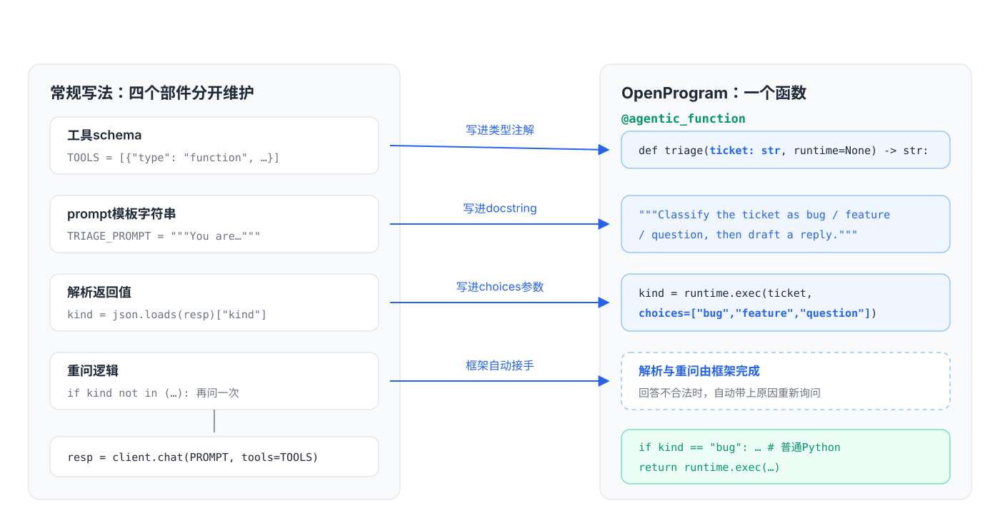
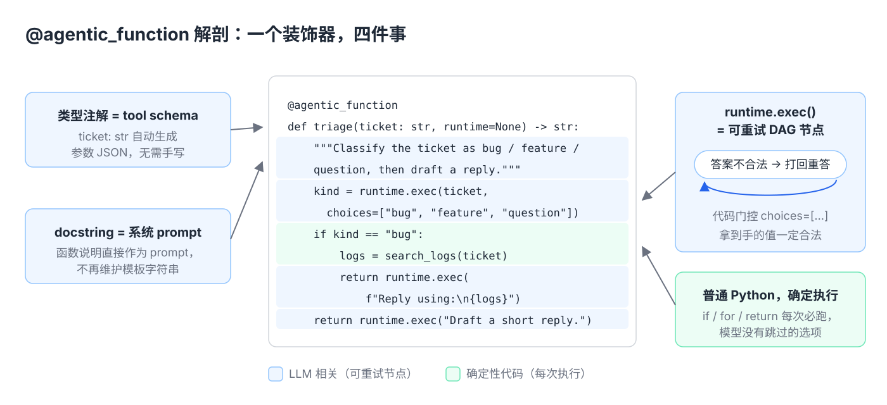
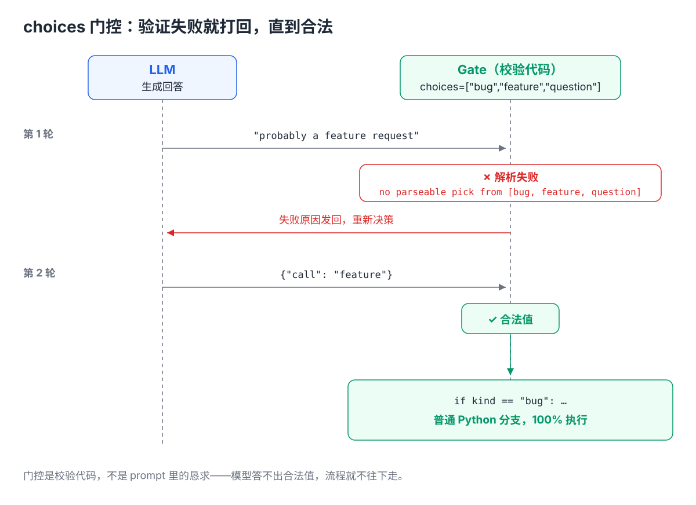
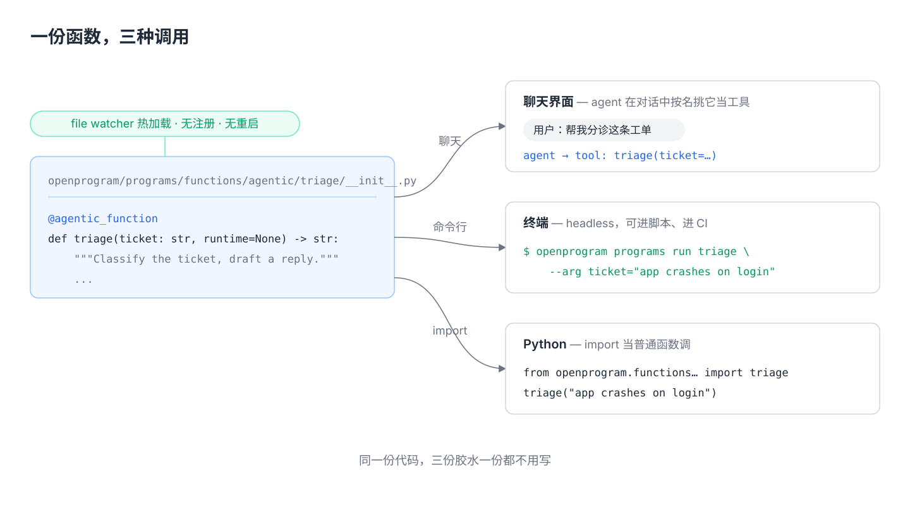
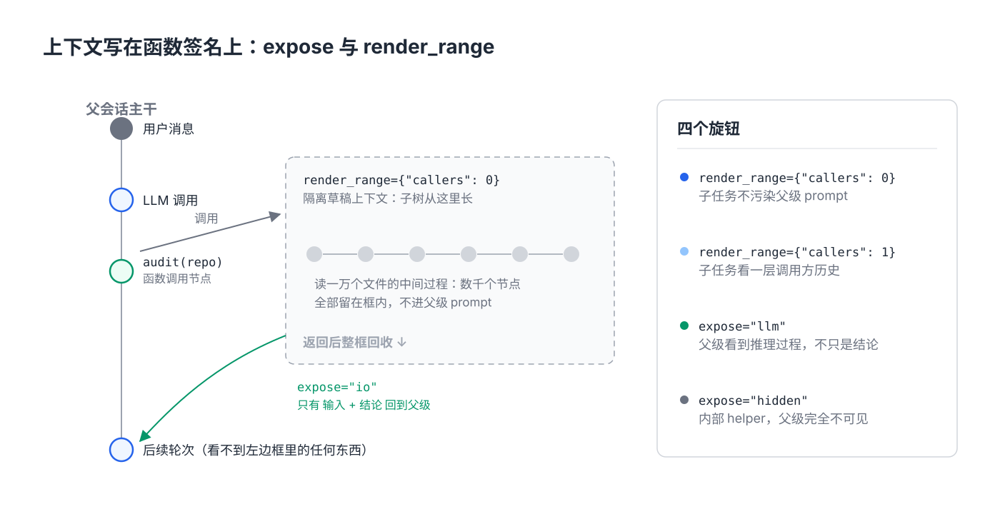

# 候选标题

1. OpenProgram 技术解析（一）：像调用函数一样调用大模型
2. 一个装饰器把 Python 函数变成 Agent：@agentic_function 是怎么工作的
3. 别再手写 prompt 模板和 tool JSON 了：Agent 就该是一个 Python 函数
4. Agentic Programming 的核心原语：docstring 是 prompt，类型注解是 schema

---

写 LLM Agent 的人都干过这些事：把 prompt 存成字符串常量，手写一份 tool 的 JSON schema，调完接口 `json.loads` 一下，祈祷能 parse 成功，parse 失败再手写重试逻辑。这些代码和业务逻辑没有关系，纯粹是在伺候模型接口。

我们在做 OpenProgram 的时候把这层东西整个删掉了。删掉的方式是一个装饰器：`@agentic_function`。这篇文章讲它是怎么工作的。

## 同一个 agent，两种写法

需求：一个工单分诊 agent，把工单分成 bug / feature / question，然后起草回复。

先看典型框架下的写法：

```python
TRIAGE_PROMPT = """You are a triage
agent. Classify the ticket as bug,
feature, or question. Reply as JSON."""

TOOLS = [{"type": "function", "function": {
  "name": "triage",
  "parameters": {"type": "object",
    "properties": {"ticket": {"type": "string"}},
    "required": ["ticket"]}}}]

resp = client.chat(TRIAGE_PROMPT, tools=TOOLS)
kind = json.loads(resp)["kind"]     # 祈祷能 parse
if kind not in ("bug", "feature"):
    ...                             # 手写重问逻辑
```

再看 OpenProgram 下的写法：

```python
@agentic_function
def triage(ticket: str, runtime=None) -> str:
    """Classify the ticket as bug / feature /
    question, then draft a reply."""
    kind = runtime.exec(                    # 🤖 LLM 决定
        ticket, choices=["bug", "feature", "question"])
    if kind == "bug":                       # 🐍 你决定
        logs = search_logs(ticket)          # 🐍 普通 Python
        return runtime.exec(                # 🤖 LLM 写回复
            f"Reply using:\n{logs}")
    return runtime.exec("Draft a short reply.")
```



行为完全一样，但左边那三样东西都没了：

- **prompt 模板没了**——docstring 就是 prompt。它本来就该写在函数上，Python 语法早就给了位置。
- **tool JSON 没了**——类型注解就是 schema。`ticket: str` 这一行信息量和那七行 JSON 完全等价，框架替你生成。
- **parse 和重试没了**——`choices=["bug", "feature", "question"]` 是一个代码门控：模型的回答落不进这三个值，框架自动把它送回去重新决策，直到合法为止。你的 `if kind == "bug"` 分支拿到的永远是合法值。

这里的关键不是"省了几行代码"，而是职责划分变清楚了：`runtime.exec()` 是模型调用，是一个可重试的 DAG 节点；除此之外的每一行——`if`、`for`、`return`、`search_logs(ticket)`——都是普通 Python，每次执行都确定地跑。**流程你写死，判断交给模型。** 模型没有机会跳过你的检查，也没有机会决定"这次不走这个分支了"。



## 门控为什么可靠

`choices=[...]` 不是 prompt 里的一句"请从以下选项中选择"。它是校验代码。真实运行日志长这样：

```
llm  → "probably a feature request"
gate ✗ no parseable pick from ["bug", "feature", "question"]
llm  → {"call": "feature"}
gate ✓ → branch taken in Python
```

模型第一次回答含糊，校验失败，被退回重答；第二次给出合法值，Python 分支才继续。这是"代码约束模型"和"prompt 恳求模型"的区别：前者不可能被绕过。



## 写完之后，三种用法

一个 `@agentic_function` 放进 `openprogram/functions/agentics/<name>/__init__.py`，文件 watcher 热加载，不用注册不用重启。之后它同时是三样东西：

```bash
# 1. 聊天里,agent 按名字挑它当工具用
# 2. headless 跑,可以进脚本进 CI
openprogram programs run triage --arg ticket="app crashes on login"
```

```python
# 3. 直接 import,当普通函数调
from openprogram.functions.agentics.triage import triage
result = triage("app crashes on login")
```

同一份代码，是 agent 的工具，是 CLI 命令，也是库函数。不用为三种场景写三份胶水。



## 上下文也是函数声明的一部分

Agent 跑长任务最大的成本是上下文膨胀：每个子任务都把中间过程塞进主对话，token 线性涨。OpenProgram 把每次调用记在一张扁平 DAG 上，装饰器给了两个旋钮控制每个函数在这张图上读什么、露什么：

```python
@agentic_function(expose="io", render_range={"callers": 0})
def audit(repo: str, runtime=None) -> str:
    """Read every file and report risky patterns."""
    ...
```

| 目标 | 写法 |
|---|---|
| 子任务不要污染父级 prompt | `render_range={"callers": 0}`——隔离草稿上下文，返回后回收 |
| 父级需要推理过程，不只是结论 | `expose="llm"`（或 `"full"`） |
| 内部 helper，父级完全不该看到 | `expose="hidden"` |
| 子任务需要看一层调用方历史 | `render_range={"callers": 1}` |

`audit` 读一万个文件产生的中间内容，返回时只有输入和结论留在父级上下文里。上下文管理从 prompt 拼接的体力活，变成写在函数签名上的属性。



## 为什么是"函数"

因为函数是软件工程五十年攒下的全部工具的接口：单元测试、类型检查、import、组合、版本管理，全都直接可用。一个 agent 如果是 prompt 模板加 JSON 加胶水，这些工具一个都用不上；一个 agent 如果就是函数，这些工具全都白拿。

我们把这个范式叫 Agentic Programming，正式表述在论文里（已被 KDD 2026 AgenticSE workshop 接收）。`@agentic_function` 是它的第一块砖，后面的 DAG 上下文、多 agent 协作、事件基础设施都建在这上面——那些是另外几篇的内容。

- 代码：https://github.com/Fzkuji/OpenProgram
- 论文：*LLM-as-Code: Agentic Programming for Agent Harness*，[arXiv:2606.15874](https://arxiv.org/abs/2606.15874)
